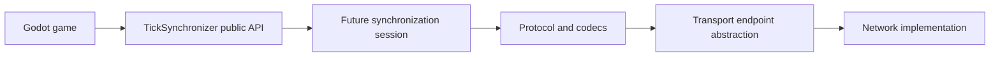
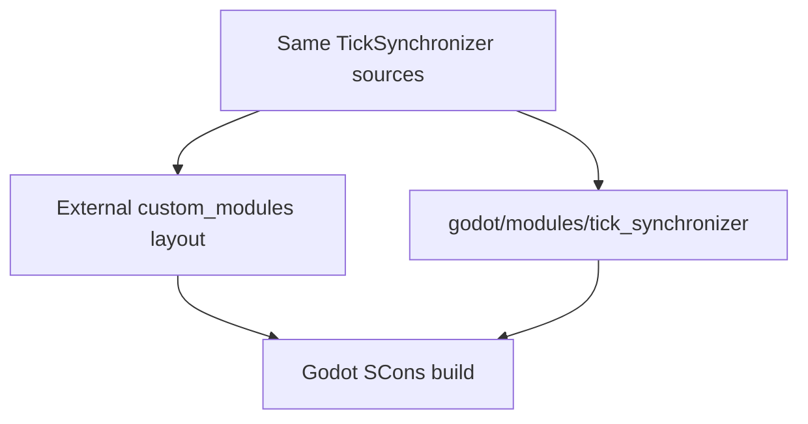
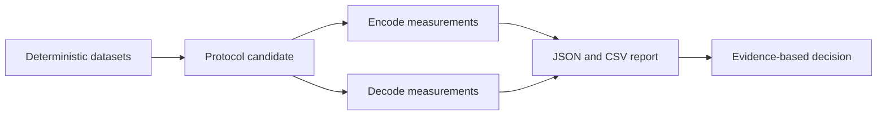

# TickSynchronizer

TickSynchronizer is a C++ module for Godot 4 that is being developed as a transport-independent, benchmark-driven foundation for deterministic real-time multiplayer synchronization.

The project currently provides a validated binary buffer, explicit integer and floating-point codecs, a fixed control envelope, a strict experimental handshake, resource limits, deterministic protocol benchmarks, and public diagnostic classes. Prediction, rollback, reconciliation, production transports, and editor tooling remain future work.

## Project identity

- **Module name:** `TickSynchronizer`
- **Module directory:** `tick_synchronizer`
- **Engine baseline:** Godot `4.7.1-stable`
- **Language baseline:** C++17
- **Build system:** SCons
- **License:** MIT, Copyright (c) 2026 Malkverbena
- **Default precision:** `double`
- **Supported precision:** `single` and `double`

The design is conceptually informed by the original `GameNetworking/NetworkSynchronizer` project, but this repository is a new implementation with an explicit wire contract, stronger validation, transport abstraction, and benchmark-driven protocol selection.



## Supported module layouts

TickSynchronizer supports both standard Godot module layouts.

### External custom module

Recommended during independent module development:

```text
workspace/
├── godot/
└── tick_synchronizer/
```

Build from the Godot tree:

```bash
scons platform=linuxbsd \
    target=editor \
    tests=yes \
    precision=double \
    custom_modules=../tick_synchronizer \
    module_tick_synchronizer_enabled=yes
```

### Conventional in-tree module

The repository may also be placed at:

```text
godot/modules/tick_synchronizer/
```

Then build normally from the Godot root:

```bash
scons platform=linuxbsd \
    target=editor \
    tests=yes \
    precision=double \
    module_tick_synchronizer_enabled=yes
```

No source file may assume that the module is necessarily outside the Godot tree.

The validation scripts detect both layouts automatically. In-tree builds omit `custom_modules`; external builds resolve the module path relative to the selected Godot tree.



## Current version contract

```text
script_api=5
api=4
wire=0
wire_revision=2
benchmark_suite=1
wire_stable=no
exact_build_match=yes
```

- API version 4 identifies the current public module contract.
- Wire version 0 means the protocol is experimental.
- Wire revision 2 identifies the current incompatible experimental layout.
- Benchmark suite version 1 identifies the comparison methodology.
- Report schema 3 records Linux, Windows, and Android provenance plus verified native CPU affinity.
- Client and server module builds, game builds, schemas, and precision must
  match exactly during the experimental period.
- The canonical complete Godot version must match exactly; a differing Godot
  commit is retained as diagnostic provenance and produces a warning.

Display the contract with:

```bash
./scripts/build_and_validate.sh --print-version-contract
```

## Cross-platform protocol benchmarks

The benchmark core is shared across Linux, Windows, and Android through one SCons compilation graph. Windows executables are cross-compiled from Linux with MinGW-w64 or LLVM-MinGW, and Android ARM64 executables use the Android NDK Clang driver. See `documentation/BENCHMARKS.md`.

```bash
./scripts/build_protocol_benchmarks.sh --precision all --jobs 45
./scripts/build_protocol_benchmarks_android.sh --precision all --jobs 45
```

```bash
./scripts/build_protocol_benchmarks_windows_cross.sh --precision all --jobs 45
```

Prebuilt execution-only packages can be exported for test machines that do not have compilers, SCons, target SDKs, Git, or project sources:

```bash
./scripts/build_protocol_benchmarks.sh --precision all --jobs 45 --export-package
./scripts/build_protocol_benchmarks_android.sh --precision all --jobs 45 --export-package
./scripts/build_protocol_benchmarks_windows_cross.sh --precision all --jobs 45 --toolchain mingw-gcc
```

Each execution-only runner verifies the package manifest before starting a benchmark.

Official reports require a clean source tree and verified native CPU affinity. Cross-platform backend availability does not count as protocol evidence until reports are produced on the actual target hardware and archived with hashes.

## Current source and validation status

Current source consistency passes with 41 public/documented methods and 140
C++ test cases. The complete wire revision 2 matrix passes in `single` and
`double`: 140 tests, 66,999 assertions, normal editor smoke, both templates,
and the accepted module-focused sanitizer profiles.

Preliminary quick qualification also passes on Linux and Windows x86_64 across
distinct L3 domains and on Android ARM64 across multiple core classes. Every
selected report validates schema 3, affinity, all seven datasets, and 27
rejected malformed packets with zero accepted. These dirty-tree reports
validate the infrastructure and current reference candidate but are not
official protocol-selection evidence.

A known UBSAN diagnostic in Godot's bundled SDL/HIDAPI initialization prevents
the full sanitized editor smoke test and is documented separately. It does not
affect the required module-focused sanitizer gate.

## Build and validation

Run consistency checks first:

```bash
./scripts/verify_source_consistency.sh
```

Run the complete validation matrix:

```bash
./scripts/build_and_validate.sh --mode all --precision double --jobs 45
./scripts/build_and_validate.sh --mode all --precision single --jobs 45
```

Run the focused sanitizer gate:

```bash
./scripts/run_sanitized_tests.sh double --jobs 45 --no-smoke
./scripts/run_sanitized_tests.sh single --jobs 45 --no-smoke
```

See [`documentation/BUILD.md`](documentation/BUILD.md), [`documentation/TESTING.md`](documentation/TESTING.md), and [`documentation/VALIDATION.md`](documentation/VALIDATION.md).

## Protocol benchmark suite

The standalone benchmark suite compares protocol candidates without initializing Godot, Java, JNI, rendering, or a network transport.

Build both precision variants:

```bash
./scripts/build_protocol_benchmarks.sh --precision all --jobs 45
```

Run a quick infrastructure check:

```bash
./scripts/run_protocol_benchmarks.sh --list-cpus
read -r -p "Linux logical CPU: " LINUX_CPU
./scripts/run_protocol_benchmarks.sh \
    --precision all --quick --cpu "$LINUX_CPU" --no-build
```

Run an official benchmark only from a clean Git tree:

```bash
./scripts/run_protocol_benchmarks.sh \
    --precision all --cpu "$LINUX_CPU" --no-build
```

The current candidate is a fixed-width reference codec. It is a baseline, not the selected production protocol. Decisions derived from benchmark evidence are recorded in [`documentation/BENCHMARK_DECISIONS.md`](documentation/BENCHMARK_DECISIONS.md).



## Public classes

The module currently registers:

- `TickSynchronizer`
- `TickSynchronizerBuffer`
- `TickSynchronizerObject`
- `TickSynchronizerSchema`
- `TickSynchronizerSettings`

`TickSynchronizer` exposes build and protocol diagnostics. `TickSynchronizerBuffer` implements the validated bitstream and scalar codecs. The remaining public classes are intentionally small placeholders for later phases.

## Source layout

```text
src/
├── public/      Public Godot-facing classes
├── protocol/    Wire codec and handshake components
└── internal/    Build and version contracts

benchmarks/      Standalone deterministic benchmark suite
doc_classes/     Godot class reference XML
documentation/   Architecture, protocol, roadmap, validation, and ADRs
scripts/         Build, validation, sanitizer, and benchmark tools
tests/           C++ tests, smoke project, and golden vectors
```

`register_types.*`, `SCsub`, and `config.py` remain at the repository root because they are conventional Godot module integration files.

## Documentation map

- [`documentation/PROJECT_STATE.md`](documentation/PROJECT_STATE.md): current implemented state.
- [`documentation/ARCHITECTURE.md`](documentation/ARCHITECTURE.md): architectural boundaries.
- [`documentation/PROTOCOL.md`](documentation/PROTOCOL.md): experimental control protocol.
- [`documentation/BINARY_BUFFER.md`](documentation/BINARY_BUFFER.md): binary buffer invariants.
- [`documentation/BENCHMARKS.md`](documentation/BENCHMARKS.md): benchmark methodology.
- [`documentation/BENCHMARK_DECISIONS.md`](documentation/BENCHMARK_DECISIONS.md): decisions derived from measurements.
- [`documentation/ROADMAP.md`](documentation/ROADMAP.md): phased development plan.
- [`documentation/adr/`](documentation/adr/): accepted architectural decisions.

Mermaid diagrams remain embedded where they clarify architecture or control flow. The repository intentionally does not contain a general Mermaid tutorial because diagram-tool documentation is outside the module's scope.

## Contribution policy

AI-assisted contributions are welcome only when the responsible developer understands and can maintain the resulting code. Read [`AGENTS.md`](AGENTS.md) before contributing.

## License

TickSynchronizer is licensed under the MIT License. See [`LICENSE`](LICENSE).
