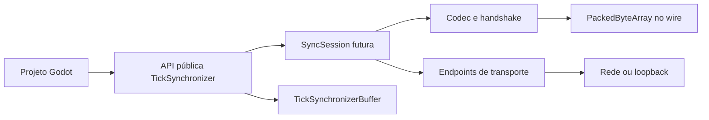
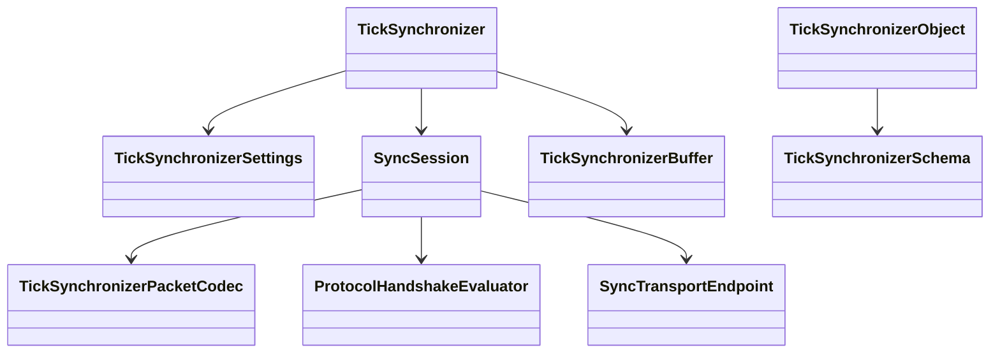

# TickSynchronizer

**TickSynchronizer** é um módulo customizado em C++ para Godot 4, compilado diretamente com SCons, destinado a netcode multiplayer em tempo real com protocolo binário compacto, múltiplos endpoints de transporte, snapshots, prediction, rollback, reconciliation, autoridade flexível, mesh/híbrida, métricas, benchmark e depuração integrados.


## Identidade do projeto

- **Nome:** TickSynchronizer
- **Diretório do módulo:** repositório externo `tick_synchronizer/`
- **Namespace C++ planejado:** `tick_synchronizer`
- **Build:** módulo estático externo compilado com `custom_modules=../tick_synchronizer`
- **Godot:** `4.7.1-stable`, commit `a13da4feb8d8aefc283c3763d33a2f170a18d541`, sem alterações locais na engine

Este projeto é baseado conceitualmente no projeto original [GameNetworking/NetworkSynchronizer](https://github.com/GameNetworking/NetworkSynchronizer), que implementa um modelo de **Prediction & Rewinding**.

## Visão geral




## Continuidade do trabalho

Qualquer pessoa ou agente deve começar por [`AGENTS.md`](AGENTS.md) e [`documentation/PROJECT_STATE.md`](documentation/PROJECT_STATE.md). Decisões arquiteturais aceitas ficam em [`documentation/adr/`](documentation/adr/). Um resumo compacto para novas sessões pode ser gerado com:

```bash
./scripts/generate_context.sh
```

A configuração Markdown reproduzível do VS Code está versionada em `.vscode/`. O preview integrado das versões atuais renderiza Mermaid sem extensão adicional; consulte [`documentation/VSCODE.md`](documentation/VSCODE.md) e [`documentation/MERMAID.md`](documentation/MERMAID.md).


## Convenção de compilação

O repositório do módulo fica como irmão da árvore do Godot:

```text
workspace/
├── godot/
└── tick_synchronizer/
```

O módulo suporta `precision=double` e `precision=single`. O padrão operacional é `double`. Todos os peers de uma mesma sessão devem usar a mesma precisão; o `HELLO` já transporta esse modo e o codec produz `PRECISION_MISMATCH` estruturado. A futura camada de sessão fará a recusa antes de aceitar dados de gameplay.

O ciclo diário usa o editor, os testes C++ e o smoke test automatizado:

```bash
./scripts/build_and_validate.sh --mode quick --precision double
```

Os dois templates podem ser compilados juntos quando necessário:

```bash
./scripts/build_and_validate.sh --mode templates
```

Para compilar editor e templates:

```bash
./scripts/build_and_validate.sh --mode all
```

Nos modos `quick`, `editor` e `all`, o script executa automaticamente o smoke test GDScript usando o editor. O procedimento manual permanece disponível para diagnóstico em [`documentation/SMOKE_TEST.md`](documentation/SMOKE_TEST.md).


## Build automatizado

O modo padrão `quick` compila `target=editor` com `dev_build=yes`, `tests=yes` e `precision=double`; depois executa os testes C++ filtrados por `*TickSynchronizer*` e o smoke test GDScript.

```bash
./scripts/build_and_validate.sh --clean-first
```

Para precisão simples:

```bash
./scripts/build_and_validate.sh --precision single
```

Para os templates já aprovados anteriormente em precisão dupla:

```bash
./scripts/build_and_validate.sh --mode templates
```

O script registra ambiente, commits, comandos, logs, tempos, artefatos e hashes SHA-256 em `build_reports/`. Consulte [`documentation/BUILD.md`](documentation/BUILD.md) para todas as opções.

## Esqueleto atual

A fundação do buffer, o envelope de controle e a negociação estrita do handshake foram validados em Linux com editor, `template_debug` e `template_release`, tanto em `precision=double` quanto em `precision=single`:

```text
TICKSYNCHRONIZER_BUILD_PRECISION=<double|single>
TICKSYNCHRONIZER_BUFFER_SMOKE_TEST_OK
TICKSYNCHRONIZER_INTEGER_CODEC_SMOKE_TEST_OK
TICKSYNCHRONIZER_FLOAT_CODEC_SMOKE_TEST_OK
TICKSYNCHRONIZER_RESOURCE_LIMIT_SMOKE_TEST_OK
TICKSYNCHRONIZER_PROTOCOL_SMOKE_TEST_OK
TICKSYNCHRONIZER_SMOKE_TEST_OK
```

A estrutura contém as classes públicas fundamentais:

- `TickSynchronizer : Node`;
- `TickSynchronizerSettings : Resource`;
- `TickSynchronizerBuffer : RefCounted`;
- `TickSynchronizerObject : Node`;
- `TickSynchronizerSchema : Resource`.

Todas são registradas no `ClassDB` em `MODULE_INITIALIZATION_LEVEL_SCENE`. `TickSynchronizer` expõe precisão, magic e versão do protocolo; `TickSynchronizerBuffer` fornece o bitstream e os codecs escalares.

A suíte C++ contém 98 casos: 47 da fundação, 28 do packet codec e 23 da negociação de handshake. O script exige ao menos 98 casos descobertos, evitando aceitar uma compilação que não incluiu os componentes de protocolo.

O smoke test exercita o buffer e valida os diagnósticos públicos `TSYN`, protocolo `1.1` e modo de precisão. O protocolo interno já possui envelope de controle, identidade estrita, capabilities e avaliador puro do handshake; prediction, rollback, transporte, métricas e ferramentas de editor ainda não foram implementados.

O código C++ próprio está organizado em `src/public`, `src/protocol` e
`src/internal`. O glue convencional do módulo Godot (`register_types.*`,
`SCsub` e `config.py`) permanece na raiz. A documentação usa Mermaid e é
validada pelo preflight de consistência.

A normalização de compatibilidade com o Godot foi aplicada:

- headers próprios usam `#pragma once`;
- `SCsub` usa `env_modules`;
- includes usados diretamente são declarados explicitamente;
- `config.py` registra as classes e o caminho da documentação;
- cinco XMLs iniciais foram adicionados em `doc_classes/`;
- `GODOT_VERSION` e `GODOT_COMMIT` fixam a release e o hash exato;
- o script rejeita por padrão uma engine divergente ou com alterações locais;
- os relatórios registram branch, hash completo, tag, remote, estado dirty e correspondência com a baseline;
- a política do projeto proíbe alterações no código da engine.

Consulte [`documentation/GODOT_COMPATIBILITY.md`](documentation/GODOT_COMPATIBILITY.md).

## Sanitizers

O perfil sanitizado padrão executa **duas passagens independentes**:

1. **ASAN com Clang + LLD**;
2. **UBSAN com GCC + LLD**.

```bash
./scripts/run_sanitized_tests.sh double
```

Ambas usam `dev_build=no`, `optimize=debug`, símbolos de depuração,
`module_raycast_enabled=no`, `accesskit=no` e `use_static_cpp=no`.

A separação é intencional. No toolchain observado, o Clang instrumentou as
verificações C++ de UBSAN, mas o runtime `ubsan_standalone_cxx` não estava
disponível no link, produzindo símbolos indefinidos como
`__ubsan_vptr_type_cache`. O GCC fornece seu próprio runtime UBSAN, enquanto
Clang/LLD continua sendo o perfil mais confiável para ASAN nessa versão
monolítica do Godot.

Para executar somente uma passagem:

```bash
./scripts/run_sanitized_tests.sh double --asan-only
./scripts/run_sanitized_tests.sh double --ubsan-only
```

O modo combinado continua disponível apenas para diagnóstico:

```bash
./scripts/run_sanitized_tests.sh double --combined
```

O pipeline não executa um probe separado `--version` em artefatos sanitizados.
Neles, a validação de execução da fundação foi feita pelos 47 testes C++ então existentes e pelo smoke test; antes
disso, o script verifica o ELF e dependências dinâmicas ausentes.

A verificação opcional de pares de ponteiros do ASAN fica desabilitada por padrão
com `detect_invalid_pointer_pairs=0`. O Godot 4.7.1 ordena `StringName` comparando
os endereços de seus dados internados; ativar essa verificação aborta durante
`register_core_settings()`, antes de qualquer teste do TickSynchronizer. As
verificações normais de memória do ASAN permanecem habilitadas. Para reproduzir
o diagnóstico da engine:

```bash
./scripts/run_sanitized_tests.sh double --asan-only --invalid-pointer-pairs
```

Para investigar use-after-return explicitamente:

```bash
./scripts/run_sanitized_tests.sh double --asan-only --stack-use-after-return
```

Na passagem UBSAN, o perfil de aceitação usa uma supressão estrita para
`nonnull-attribute` somente em `core/string/ustring.cpp`. Durante `--test`, o
Godot 4.7.1 cria `ProjectSettings` sem carregar um projeto; uma `String` vazia
chega a `memcpy(dst, nullptr, 0)` no setup da engine, antes da suíte do módulo.
Relatórios em qualquer outro arquivo, inclusive no TickSynchronizer, continuam
fatais. Para reproduzir o diagnóstico da engine:

```bash
./scripts/run_sanitized_tests.sh double --ubsan-only --no-godot-ubsan-suppressions
```

Ele exige uma instalação Clang com `compiler-rt` C++ completo e não é requisito
de aceitação do módulo.

### Política atual de gate

A fundação do buffer está aprovada com ASAN completo nas duas precisões e UBSAN
dos 47 testes C++ da fundação nas duas precisões. O smoke UBSAN completo da engine encontra
um diagnóstico em SDL/HID durante a inicialização do joystick, fora do módulo.

Essa pendência foi movida para o **Gate de Segurança P1**, após existir um
packet decoder e antes de qualquer endpoint externo entregar bytes não
confiáveis. Nesse marco também serão obrigatórios fuzzing do decoder, corpus de
pacotes malformados e regressões sanitizadas.

Os scripts possuem um contrato de interface. Para conferir a revisão instalada:

```bash
./scripts/build_and_validate.sh --print-api-version
```

Antes de iniciar o SCons, o pipeline também verifica se header, implementação,
bindings, XML, smoke test e suíte pertencem à mesma revisão:

```bash
./scripts/verify_source_consistency.sh
```

Resultado esperado:

```text
TICKSYNCHRONIZER_SOURCE_CONSISTENCY_OK methods=41 tests=98
```

## Fundação do buffer binário

`TickSynchronizerBuffer` usa `PackedByteArray`, cursor em bits e modos explícitos de leitura/escrita. A implementação atual oferece:

- `begin_write()` com reserva opcional em bytes;
- `begin_read()` com tamanho lógico opcional em bits;
- `write_bits()` e `read_bits()` para campos de 1 a 64 bits;
- alinhamento explícito por byte com padding zero validado;
- `write/read_u8`, `u16`, `u32` e `u64`;
- inteiros fixos little-endian, inclusive desalinhados;
- `varuint` canônico de até 64 bits;
- ZigZag `varint` para toda a faixa `int64_t`;
- `float32` e `float64` IEEE 754 explícitos e independentes de `real_t`;
- preservação de padrões especiais no codec de baixo nível;
- limite máximo configurável, com padrão defensivo de 1 MiB;
- crescimento e cópia verificados antes da alocação;
- representação canônica de leitura, sem bytes excedentes;
- igualdade e hash baseados em bytes lógicos e `bit_size`;
- rejeição atômica de truncamento, overflow, excesso de limite e formas redundantes;
- golden vectors e estresse determinístico em `tests/`.

A especificação e os limites estão em [`documentation/BINARY_BUFFER.md`](documentation/BINARY_BUFFER.md).

## Estado

O projeto está em definição arquitetural. A primeira entrega será um laboratório de transporte, não o sistema completo de sincronização.

Ela validará:

- integração como módulo nativo da baseline registrada do Godot;
- build exclusivo por SCons;
- `PackedByteArray` como buffer canônico;
- wire format binário próprio;
- interface `SyncTransportEndpoint`;
- endpoints candidatos;
- métricas de ENet e métricas próprias;
- integração inicial com profiler e debugger;
- benchmark reproduzível em Linux, Windows e Android.

Não entram na primeira entrega:

- prediction e rollback completos;
- schemas de jogo completos;
- compressão;
- criptografia;
- suporte macOS/iOS;
- documentação detalhada de APIs ainda não implementadas.

## Objetivos

### Eficiência de transmissão

- schemas conhecidos pelos dois lados;
- IDs numéricos estáveis;
- bit-packing;
- varints;
- quantização por propriedade;
- máscaras de propriedades;
- snapshots diferenciais;
- mensagens agregadas;
- frequência configurável;
- relevância e prioridade por peer;
- remoção de nomes do hot path em release.

### Netcode

- servidor autoritativo;
- autoridade configurável;
- client-side prediction;
- histórico de inputs;
- snapshots previstos e autoritativos;
- rollback;
- reconciliation;
- correção visual;
- replay;
- diagnóstico da primeira divergência;
- mesh e topologias híbridas;
- vários endpoints por sessão.

### Integração com o Godot

- `ClassDB`;
- `ObjectID`;
- `StringName`;
- `Variant`;
- `PackedByteArray`;
- `Vector`, `LocalVector`, `HashMap`;
- `Ref<T>`;
- `EngineDebugger`;
- `Performance`;
- framework de testes do Godot;
- sem CMake;
- sem Godot 3;
- sem GDExtension.

## Plataformas

Escopo inicial:

- Linux;
- Windows;
- Android.

Futuro:

- macOS;
- iOS.

Fora do escopo:

- Web.

## Princípios arquiteturais

1. Uma instância de `TickSynchronizer` representa uma sessão lógica.
2. Uma sessão pode possuir vários endpoints.
3. Um endpoint pode administrar vários peers ou conexões.
4. O sincronizador depende somente de `SyncTransportEndpoint`.
5. Topologia física e autoridade lógica são independentes.
6. `PackedByteArray` é o container canônico do pacote pronto.
7. O wire format não depende do layout de memória do C++.
8. O protocolo usa little-endian explícito.
9. O runtime principal segue os padrões do engine.
10. Métricas e benchmark fazem parte da fundação.
11. Criptografia será adicionada posteriormente por backend mbedTLS.
12. A primeira versão usará compatibilidade estrita.

## Por que o remake ainda faz sentido

O multiplayer moderno do Godot já possui cache de caminhos, IDs compactos para RPC, replicação `ALWAYS` e `ON_CHANGE`, intervalos, visibilidade e envio raw. Portanto, o projeto não se justifica apenas por remover nomes ou caminhos.

Ele se justifica por acrescentar:

- codec semântico;
- quantização específica;
- bit-packing;
- máscaras adaptativas;
- snapshots especializados;
- prediction e rollback;
- reconciliation;
- autoridade configurável;
- múltiplos endpoints;
- mesh híbrida;
- replay e state hash;
- métricas de protocolo e simulação;
- benchmark comparativo;
- futura segurança autenticada.

## Arquitetura da primeira versão

### Endpoints a comparar

#### `SceneMultiplayerRpcEndpoint`

Baseline usando RPC convencional com um único `PackedByteArray`.

#### `SceneMultiplayerRawEndpoint`

Usa `SceneMultiplayer.send_bytes()`.

#### `MultiplayerPeerEndpoint`

Usa diretamente `MultiplayerPeer.put_packet()` e `get_packet()`.

#### `ENetDirectEndpoint`

Usa `ENetConnection` e `ENetPacketPeer` diretamente.

#### `LoopbackEndpoint`

Endpoint em memória para testes determinísticos e simulação de rede.

### Contrato de transporte

```cpp
class SyncTransportEndpoint {
public:
    virtual ~SyncTransportEndpoint() = default;

    virtual Error start(const SyncEndpointConfig &p_config) = 0;
    virtual void stop() = 0;
    virtual Error poll() = 0;

    virtual Error send_packet(
            int p_target_peer,
            const PackedByteArray &p_packet,
            const SyncSendOptions &p_options) = 0;

    virtual bool has_packet() const = 0;
    virtual Error receive_packet(SyncReceivedPacket &r_packet) = 0;

    virtual SyncEndpointCapabilities get_capabilities() const = 0;
    virtual SyncEndpointMetrics get_metrics_snapshot() const = 0;
};
```

O endpoint não conhece objetos, propriedades, snapshots ou rollback. Ele conhece peers, rotas, canais, confiabilidade, pacotes, polling e métricas de transporte.

## Árvore de arquivos

```text
tick_synchronizer/
├── .markdownlint.json
├── .vscode/
│   ├── extensions.json
│   └── settings.json
├── documentation/
│   ├── adr/
│   ├── ARCHITECTURE.md
│   ├── MERMAID.md
│   ├── PROTOCOL.md
│   ├── ROADMAP.md
│   └── VSCODE.md
├── doc_classes/
├── scripts/
├── src/
│   ├── internal/
│   │   └── tick_synchronizer_build_config.h
│   ├── protocol/
│   │   ├── tick_synchronizer_handshake.cpp
│   │   ├── tick_synchronizer_handshake.h
│   │   ├── tick_synchronizer_packet_codec.cpp
│   │   └── tick_synchronizer_packet_codec.h
│   ├── public/
│   │   ├── tick_synchronizer.cpp
│   │   ├── tick_synchronizer.h
│   │   ├── tick_synchronizer_buffer.cpp
│   │   └── tick_synchronizer_buffer.h
│   └── README.md
├── tests/
├── register_types.cpp
├── register_types.h
├── SCsub
└── config.py
```

## Mapa de classes



```text
TickSynchronizer : Node
│
├── Ref<TickSynchronizerSettings>
├── SyncSession
│   ├── SyncClock
│   ├── SyncPeerRegistry
│   ├── SyncTopologyManager
│   ├── SyncRegistry
│   ├── SyncControllerManager
│   ├── SyncSnapshotHistory
│   ├── SyncGroupManager
│   ├── SyncMetrics
│   └── SyncDebugger
│
├── Vector<SyncTransportEndpoint *>
│   ├── SceneMultiplayerRpcEndpoint
│   ├── SceneMultiplayerRawEndpoint
│   ├── MultiplayerPeerEndpoint
│   ├── ENetDirectEndpoint
│   └── LoopbackEndpoint
│
├── TickSynchronizerPacketCodec
│   ├── control header v1
│   ├── HELLO / HELLO_ACK
│   ├── DISCONNECT_REASON
│   └── future SyncSchemaManifest
│
├── SyncCompressionBackend
└── SyncSecurityBackend
```

Classes públicas atuais:

```text
TickSynchronizer : Node
TickSynchronizerObject : Node
TickSynchronizerSchema : Resource
TickSynchronizerSettings : Resource
TickSynchronizerBuffer : RefCounted
```

## Estrutura lógica

```text
Jogo / GDScript / C#
        │
        ▼
TickSynchronizer
        │
        ├── sessão
        ├── objetos e schemas
        ├── authority policy
        ├── inputs
        ├── snapshots
        ├── prediction
        ├── rollback
        ├── relevância
        └── métricas
        │
        ▼
SyncPacketCodec
        │
        ├── IDs
        ├── varints
        ├── bit-packing
        ├── quantização
        ├── máscaras
        └── mensagens agregadas
        │
        ▼
PackedByteArray
        │
        ├── compressão futura
        └── criptografia futura
        │
        ▼
SyncTransportEndpoint
        │
        ├── RPC
        ├── SceneMultiplayer raw
        ├── MultiplayerPeer
        ├── ENet direto
        └── loopback
        │
        ▼
Rede
```

## Mapeamento das classes antigas

| Classe antiga | Substituição |
|---|---|
| `GdSceneSynchronizer` | `TickSynchronizer` |
| `SceneSynchronizerBase` | `SyncSession` + modos |
| template `SceneSynchronizer` | removido |
| `SynchronizerManager` | removido |
| `NoNetSynchronizer` | `SyncOfflineMode` |
| `ServerSynchronizer` | `SyncServerMode` |
| `ClientSynchronizer` | `SyncClientMode` |
| `NetworkInterface` | `SyncTransportEndpoint` |
| `GdNetworkInterface` | endpoints concretos |
| `DataBuffer` e `GdDataBuffer` | `TickSynchronizerBuffer` |
| `BitArray` | bit writer/reader |
| `VarData` | `Variant` + codec especializado |
| `ObjectData` | `SyncObjectRecord` |
| `ObjectDataStorage` | `SyncRegistry` |
| `SchemeId` | schema + manifesto |
| `VarDescriptor` | `SyncPropertyRuntime` |
| `Snapshot` | `SyncSnapshot` |
| `RollingUpdateSnapshot` | delta/flags em `SyncSnapshot` |
| `PeerNetworkedController` | `SyncControllerManager` |
| `PeerData` | controller + métricas |
| `SyncGroup` | `SyncGroupManager` |
| `SceneSynchronizerDebugger` | `SyncDebugger` |
| `GdFileSystem` | `FileAccess`, `DirAccess`, `Time` |
| `nlohmann::json` | `JSON` do Godot |

## Datatypes do runtime

| STL/antigo | Runtime novo |
|---|---|
| `std::string` | `String` / `StringName` |
| `std::vector<T>` | `Vector<T>` / `LocalVector<T>` |
| bytes | `PackedByteArray` |
| `std::unordered_map` | `HashMap` |
| `std::map` | `RBMap` quando ordenação for necessária |
| `std::set` | `HashSet` / `RBSet` |
| `std::optional<T>` | `{ bool valid; T value; }` |
| `std::variant` | `Variant` |
| callback público | `Callable` |
| `std::shared_ptr` | `Ref<T>` |
| ponteiro persistente de `Object` | `ObjectID` |
| filesystem | `FileAccess` / `DirAccess` |
| JSON externo | `JSON` |
| `std::thread` | `Thread` / `WorkerThreadPool` |
| `std::mutex` | `Mutex` |
| `std::chrono` | `Time` / contadores do `Engine` |
| `std::cout` | `print_line`, `WARN_PRINT`, `ERR_PRINT` |
| RTTI | `Object::cast_to` / IDs/tipos explícitos |
| exceções | `Error` e resultados explícitos |

Tipos permitidos no wire:

```text
uint8_t, uint16_t, uint32_t, uint64_t
int8_t, int16_t, int32_t, int64_t
float32 explícito
float64 explícito
varuint/varint
inteiros quantizados
```

Tipos proibidos no wire:

```text
long, size_t, real_t
ponteiros
ObjectID e RID
bool por layout nativo
enum sem tamanho definido
struct serializada por memcpy
```

## Protocolo binário

### Regras

- little-endian;
- bit 0 é o menos significativo;
- sem layout nativo;
- limites validados antes de ler ou alocar;
- versão e capabilities;
- hash de schema;
- handshake obrigatório;
- cabeçalhos diferentes para controle e realtime.

### Compatibilidade inicial

Durante v0.x, a conexão exige:

- mesmo commit fixado da baseline do Godot;
- mesmos `protocol_major` e `protocol_minor`;
- mesmo schema compatibility ID;
- mesmo `module_build_id`;
- mesmo `game_build_id`;
- mesma `float_precision` (`single` ou `double`).

Durante v0.x, capabilities não relaxam versão ou identidade. Essa política só poderá ser revista após existir histórico real de compatibilidade entre releases. A precisão continuará sendo validada enquanto a simulação baseada em `real_t` puder divergir entre builds.

O `module_build_id` possui 20 bytes. Em uma árvore limpa ele é o Git HEAD exato; em uma árvore suja pode ser calculado deterministicamente com:

```bash
./scripts/compute_module_build_id.py --format json
```

O `game_build_id` e o `schema_compatibility_id` são identificadores opacos de 16 bytes fornecidos pela aplicação nesta fase.

### Handshake implementado

O protocolo 1.1 implementa:

```text
HELLO v2: nonce, precisão, commits/IDs e capabilities suportadas/obrigatórias
HELLO_ACK v2: nonce correlacionado, perfil do responder e máscara negociada
DISCONNECT_REASON: razão, identidade divergente, versões e detalhe/máscara
```

`ProtocolHandshakeEvaluator` compara precisão, commit do Godot, module build ID, game build ID, schema compatibility ID e requirements de capabilities sem depender de transporte. Textos humanos serão formatados pela futura camada de sessão/UI. Consulte [`documentation/PROTOCOL.md`](documentation/PROTOCOL.md).

### Mensagens atuais e planejadas

Implementadas:

```text
HELLO
HELLO_ACK
DISCONNECT_REASON
```

Planejadas:

```text
PING
PONG
ACK
INPUT_BATCH
SNAPSHOT_FULL
SNAPSHOT_DELTA
OBJECT_SPAWN
OBJECT_DESPAWN
AUTHORITY_CHANGE
RESYNC_REQUEST
RESYNC_RESPONSE
METRICS_DEBUG
```

### Cabeçalho de controle v1

```text
u32 magic = TSYN
u8  protocol_major = 1
u8  protocol_minor = 1
u8  packet_type
u8  header_size = 40
u16 flags = 0
u16 reserved = 0
u64 session_id
u32 sequence
u64 tick
u32 payload_size_bytes
u32 payload_bit_size
payload
```

O limite padrão é 64 KiB e o máximo aceito pelo codec é 1 MiB. O payload só é copiado depois da validação de todos os tamanhos, padding e campos reservados.

### Cabeçalho realtime compacto

```text
byte 0: packet_type + flags
varuint sequence_delta
varuint tick_delta
payload específico
```

O cabeçalho compacto só é usado após handshake e validação de sessão/schema/capabilities.

### Agregação

```text
message_count
message_type
message_bit_length
message_payload
...
```

O agregador respeitará MTU configurável.

## Autoridade e mesh

O Godot fornece mesh física e autoridade por nó. O projeto fornecerá políticas explícitas:

```text
CENTRAL_SERVER
HOST_AUTHORITY
OBJECT_OWNER
REGION_AUTHORITY
CUSTOM
LOCKSTEP_FUTURE
```

Mesh física não resolve automaticamente:

- concessão de autoridade;
- transferência;
- conflitos;
- peer desconectado;
- host migration;
- validação;
- segurança.

## Determinismo futuro

### Nível 0

Servidor autoritativo, física normal, prediction aproximada e reconciliation.

### Nível 1

Tick fixo, ordem estável, RNG com seed, inputs gravados e efeitos separados.

### Nível 2

Ilhas determinísticas, fixed-point, cinemática controlada e state hashes.

### Nível 3

Rollback distribuído, autoridade por objeto/região, checkpoints e resync seletivo.

### Nível 4

Lockstep opcional com simulação totalmente determinística.

A física padrão do Godot não será tratada como determinística entre plataformas.

## Fluxo de execução

### Cliente

```text
physics tick
    ↓
SyncClock
    ↓
coleta de input
    ↓
TickSynchronizerBuffer
    ↓
histórico de input
    ↓
prediction
    ↓
snapshot previsto
    ↓
SyncPacketCodec
    ↓
PackedByteArray
    ↓
SyncTransportEndpoint
```

### Servidor/autoridade

```text
recebe pacote
    ↓
valida versão, sessão, sequência e limites
    ↓
decodifica input
    ↓
valida autoridade
    ↓
simula
    ↓
cria snapshot autoritativo
    ↓
aplica relevância
    ↓
gera delta/máscara
    ↓
codec
    ↓
endpoint
```

### Reconciliação

```text
snapshot autoritativo N
    ↓
localiza snapshot previsto N
    ↓
compara com tolerância
    ├── igual: confirma e descarta histórico antigo
    └── divergente:
            restaura N
            reaplica inputs N+1..atual
            recria snapshots
            suaviza correção visual
```

### Mesh híbrida

```text
SyncTopologyManager
    ↓
resolve autoridade
    ↓
resolve rota primária/reserva
    ↓
envia pelo endpoint
    ↓
receptor valida origem, sequência e autoridade
```

## Métricas

### Transporte

- RTT ENet;
- variância de RTT;
- perda ENet;
- throttle;
- bytes e pacotes do host;
- estado da conexão.

### Protocolo

- RTT próprio;
- jitter;
- perda própria;
- duplicados;
- fora de ordem;
- expirados;
- inválidos;
- bytes lógicos e serializados;
- encode/decode;
- poll/dispatch.

### Simulação

- snapshot age;
- input age;
- rollbacks/s;
- frames reaplicados;
- maior rewind;
- divergências;
- resyncs;
- tempo de simulação e reconciliation.

### Pipeline

```text
eventos do hot path
    ↓
SyncMetricsAccumulator
    ↓
contadores e janelas móveis
    ↓
EWMA, mínimo, máximo, p50/p95/p99
    ↓
SyncMetricsSnapshot
    ├── profiler
    ├── custom monitors
    ├── dock do editor
    ├── JSON/CSV
    └── políticas adaptativas futuras
```

## Profiler e depuração

### Profiler

Nome:

```text
network_sync
```

Categorias:

```text
network_sync:transport
network_sync:codec
network_sync:packet
network_sync:snapshot
network_sync:rollback
network_sync:metrics
```

### Performance monitors

```text
network_sync/bytes_sent
network_sync/bytes_received
network_sync/packets_sent
network_sync/packets_received
network_sync/rtt_ms
network_sync/jitter_ms
network_sync/rollbacks_per_second
network_sync/encode_usec
network_sync/decode_usec
```

### Debugger

- ring buffer de eventos;
- packet inspector;
- snapshot diff;
- state hash;
- replay recorder/player;
- exportação JSON/CSV/binária;
- simulador de rede;
- nomes apenas em debug/tools.

## Benchmark

### Camadas

1. Microbenchmark do buffer e codec.
2. Benchmark dos endpoints.
3. End-to-end entre processos.
4. Escalabilidade com vários peers.
5. Replay de payloads reais.

### Payloads

```text
8, 16, 32, 64, 128, 256, 512, 1024 e 1200 bytes
```

Padrões:

- aleatório;
- repetitivo;
- input sintético;
- snapshot sintético;
- traces reais.

### Cenários

- reliable;
- unreliable ordered;
- unreliable;
- 10/20/30/60/120 Hz;
- 1/2/4/8/16 peers;
- latência;
- jitter;
- perda;
- duplicação;
- reordenação;
- burst loss;
- Linux ↔ Linux;
- Windows ↔ Linux;
- Android ↔ Linux.

### Resultados

- bytes de aplicação;
- bytes do endpoint;
- bytes ENet;
- bytes externos por pcap opcional;
- CPU;
- alocações;
- memória;
- throughput;
- RTT p50/p95/p99;
- jitter;
- perda;
- poll e dispatch.

### Reprodutibilidade

Todo relatório registra:

- commit do Godot;
- commit do módulo;
- compilador;
- flags;
- target;
- arquitetura;
- SO;
- hardware;
- seed;
- cenário;
- warm-up;
- duração;
- repetições.

## Limitações iniciais

- branches upstream são mutáveis e cada baseline precisa fixar um commit;
- a API interna pode mudar;
- o protocolo v0.x poderá quebrar compatibilidade;
- física padrão não é determinística entre plataformas;
- mesh não fornece política de autoridade completa;
- Apple será posterior;
- Web não será suportado;
- criptografia depende da futura estabilização do backend mbedTLS/`cripter`.

## Licença

A licença do remake ainda deve ser escolhida. O projeto original usa MIT; qualquer código reutilizado diretamente deve preservar os avisos e cumprir a licença original.

## Documentação

- [Build e testes C++](documentation/BUILD.md)
- [Compatibilidade e baseline do Godot](documentation/GODOT_COMPATIBILITY.md)
- [Protocolo e compatibilidade de precisão](documentation/PROTOCOL.md)
- [Estado atual](documentation/PROJECT_STATE.md)
- [Arquitetura](documentation/ARCHITECTURE.md)
- [Estratégia de testes](documentation/TESTING.md)
- [Smoke test e diagnóstico](documentation/SMOKE_TEST.md)
- [VS Code — configuração adiada](documentation/VSCODE.md)
- [Roadmap](documentation/ROADMAP.md)
