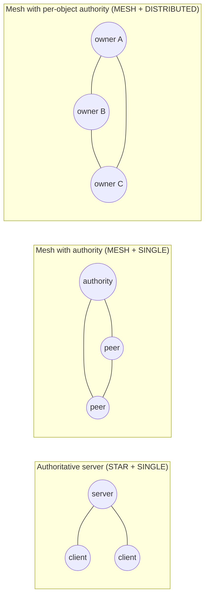
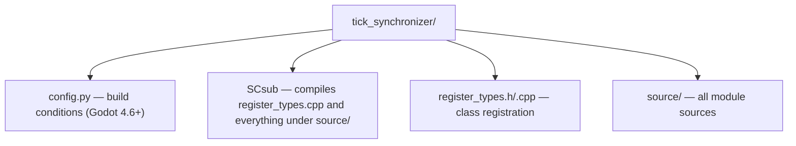

# TickSynchronizer

**TickSynchronizer** is a C++ module for Godot 4 that provides **tick-based, real-time network
synchronization**: fixed simulation ticks, client-side prediction, server reconciliation (rewind and
replay), interpolation, lag compensation and per-object authority, over ENet.

It is a rewrite, inspired by [NetworkSynchronizer](https://github.com/GameNetworking/NetworkSynchronizer)
(MIT), whose ideas it reuses and extends.

> **Status:** branch `0.1` — empty module skeleton. Nothing is usable yet; see [Roadmap](#roadmap).

## Purpose

Godot's high-level multiplayer (`SceneMultiplayer`, `MultiplayerSynchronizer`, `MultiplayerSpawner`) replicates
state and RPCs, but it has **no notion of a network tick**. It offers no prediction, no rollback/reconciliation,
no snapshot interpolation and no lag compensation. Fast-paced games (shooters, action, sports, racing) need all
of those to feel responsive and stay consistent across peers.

TickSynchronizer fills that gap. It builds on the engine's networking layer: ENet transport, `SceneMultiplayer`
authentication, `MultiplayerSpawner`. Game code is written once, and the module decides how each object is
predicted, validated, corrected and replicated.

## What it provides

| Feature | Description |
|---|---|
| **Fixed network tick** | Shared frame index, time bank and sub-ticks; clients speed up or slow down to keep the server input buffer healthy. |
| **Client-side prediction** | Local inputs are simulated immediately; the server simulates the same inputs authoritatively. |
| **Reconciliation** | Snapshots are compared per frame; on divergence the client resets to the authoritative state and replays pending inputs. Corrections that do not need a replay are applied directly. |
| **Remote entities** | Other players are simulated from their inputs ("dolls") or interpolated from state. |
| **Interpolation** | Objects that are not predicted are interpolated between authoritative states. |
| **Per-variable quantization** | Each synchronized variable declares a codec (bit width, range, precision) and a comparison tolerance derived from it; the authority quantizes its own state so prediction and validation agree. |
| **Bandwidth control** | Bit-level encoding, delta state with acknowledged baselines, relevancy groups, partial updates. |
| **Reliable full snapshots** | Late join, resynchronization and recovery use full snapshots on a dedicated reliable channel. |
| **Events and scheduled actions** | Reliable, frame-stamped events delivered to the object's authority; actions scheduled on a shared frame with latency compensation. |
| **Security** | Every message has a sender rule, and the sender is identified by the transport, never by the payload. Optional validation hooks for untrusted peers. |
| **Diagnostics** | Desync detection with client/server values, network statistics (latency, jitter, packet loss). |

## Network models

A network is configured along four axes (topology, authority, trust, transport). The same game code runs
in every configuration:


```mermaid
flowchart LR
    subgraph star["Authoritative server (STAR + SINGLE)"]
        s((server)) --- c1((client))
        s --- c2((client))
    end
    subgraph meshA["Mesh with authority (MESH + SINGLE)"]
        a((authority)) --- p1((peer))
        a --- p2((peer))
        p1 --- p2
    end
    subgraph meshD["Mesh with per-object authority (MESH + DISTRIBUTED)"]
        o1((owner A)) --- o2((owner B))
        o2 --- o3((owner C))
        o1 --- o3
    end
```

| Model | Source of truth | Typical use |
|---|---|---|
| **Authoritative server** | One server for every object | Server ↔ players |
| **Mesh with authority** | One configurable node for every object; inputs travel peer-to-peer | Server clusters, or player meshes with a host |
| **Mesh with per-object authority** | Each object's owner (by default, whoever spawned it), with authority transfer through a configurable registry node | Server clusters that split the simulation, peer-to-peer games |

A process can join several networks at once (for example a star with its clients and a mesh with other
servers). How a game combines them, and which node owns which objects, is up to the game. The module
provides the mechanisms: authority assignment and transfer, orphaned-authority signals, and a configurable
clock master and registry node.

The module does **not** rely on deterministic simulation. There is always a single source of truth per object,
so physics engines that are not deterministic across platforms (such as Jolt or GodotPhysics) are fine.

## Requirements

| Requirement | Value |
|---|---|
| Godot | **4.6 or newer** (the module disables itself on older versions) |
| Build system | **SCons only** (the module is compiled together with the engine) |
| Language | C++17, no exceptions (engine flags) |
| Precision | Both `precision=single` and `precision=double` builds are supported and tested |
| Transport | ENet |
| Platforms | Portable to every platform supported by Godot; validated on **linuxbsd, android and windows** |

GDExtension support is planned for a later version.

## Building

The module is compiled as part of the engine using `custom_modules`:

```sh
cd /path/to/godot
scons platform=linuxbsd target=editor custom_modules=/path/to/tick_synchronizer precision=single
scons platform=linuxbsd target=editor custom_modules=/path/to/tick_synchronizer precision=double
```

Double-precision binaries get a `.double` suffix. Servers and clients must use the same precision.

## Layout


```mermaid
flowchart TB
    m["tick_synchronizer/"] --> cfg["config.py — build conditions (Godot 4.6+)"]
    m --> scsub["SCsub — compiles register_types.cpp and everything under source/"]
    m --> reg["register_types.h/.cpp — class registration"]
    m --> src["source/ — all module sources"]
```

## Roadmap

| Phase | Scope |
|---|---|
| F0 | Module skeleton, builds on linuxbsd (single and double) |
| F1 | Core: data buffer, tick clock, transport abstraction |
| F2 | Prediction and reconciliation, replication, codecs, ENet star transport, public API |
| F3 | Spawning, events, sender rules and validation |
| F4–F5 | Mesh networks between servers, per-object authority transfer |
| F6–F7 | Peer-to-peer meshes between players (direct inputs, NAT traversal, relay) |
| F8 | Relevancy, history and lag compensation, optimizations |
| F9 | Validation on android and windows, compatibility check with Godot 4.6 |

## Credits and license

Based on ideas and code from [NetworkSynchronizer](https://github.com/GameNetworking/NetworkSynchronizer) by
Andrea Catania and contributors. Released under the MIT license (see `LICENSE`).
