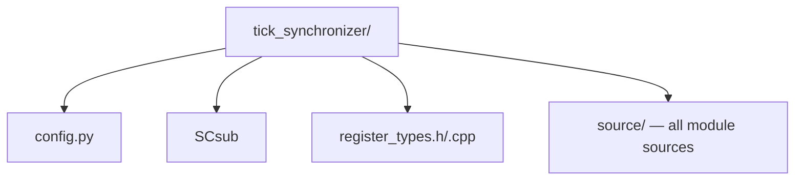

# TickSynchronizer

Tick-based real-time network synchronization module for Godot 4, built from the ideas of
[NetworkSynchronizer](https://github.com/GameNetworking/NetworkSynchronizer).

> Status: branch `0.1` — empty module skeleton.

## Layout


```mermaid
flowchart TB
    m["tick_synchronizer/"] --> cfg["config.py"]
    m --> scsub["SCsub"]
    m --> reg["register_types.h/.cpp"]
    m --> src["source/ — all module sources"]
```

## Building

The module is compiled together with the engine (SCons only; GDExtension support is planned):

```sh
scons platform=<platform> target=editor custom_modules=/path/to/tick_synchronizer precision=single
scons platform=<platform> target=editor custom_modules=/path/to/tick_synchronizer precision=double
```

Supported platforms: every platform supported by Godot (android, ios, linuxbsd, macos, visionos, web, windows).
Both `precision=single` and `precision=double` builds are required.

## License

MIT (see `LICENSE`).
