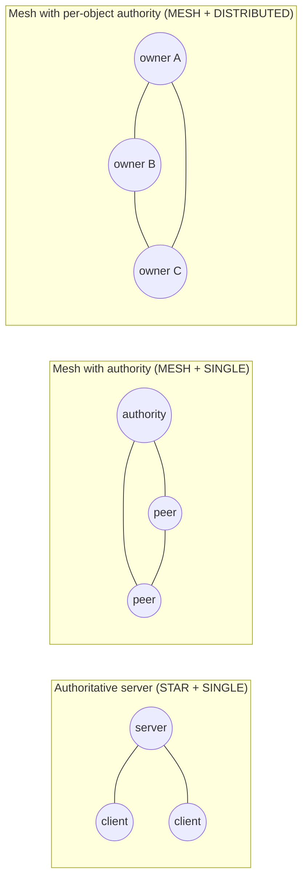
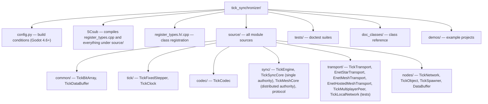

# TickSynchronizer

**TickSynchronizer** is a C++ module for Godot 4 that provides **tick-based, real-time network
synchronization**: fixed simulation ticks, client-side prediction, server reconciliation (rewind and
replay), interpolation, lag compensation and per-object authority, over ENet, between a server and its
clients, between servers, and between players.

It is a rewrite, inspired by [NetworkSynchronizer](https://github.com/GameNetworking/NetworkSynchronizer)
(MIT), whose ideas it reuses and extends.

> **Status:** every phase of the 0.x roadmap is done (see [Roadmap](#roadmap)): server-authoritative star networks,
> meshes between servers with one authority or with an owner per object, and meshes between players over the internet
> (NAT traversal, relay, DTLS, host migration). Branch `0.1` is closed; development continues on branch `0.2`.

## Purpose

Godot's high-level multiplayer (`SceneMultiplayer`, `MultiplayerSynchronizer`, `MultiplayerSpawner`) replicates
state and RPCs, but it has **no notion of a network tick**. It offers no prediction, no rollback/reconciliation,
no snapshot interpolation and no lag compensation. Fast-paced games (shooters, action, sports, racing) need all
of those to feel responsive and stay consistent across peers.

TickSynchronizer fills that gap. It builds on the engine's ENet, and `SceneMultiplayer` keeps working next to it:
RPCs, authentication, spawners and synchronizers share the connection of a star or of a players' mesh. Game code is
written once, and the module decides how each object is predicted, validated, corrected and replicated.

## What it provides

| Feature | Description |
|---|---|
| **Fixed network tick** | Shared frame index and a clock synchronized with the authority, corrected gradually instead of in jumps; clients speed up or slow down to keep the server's input buffer healthy. |
| **Client-side prediction** | Local inputs are simulated immediately; the server simulates the same inputs authoritatively. |
| **Reconciliation** | Snapshots are compared per frame; on divergence the client resets to the authoritative state and replays pending inputs. Corrections that do not need a replay are applied directly. |
| **Remote entities** | Other players are interpolated from state or, in a mesh, simulated from the inputs they send directly to every player ("dolls"). |
| **Interpolation** | Objects that are not predicted are interpolated between authoritative states. |
| **Per-variable quantization** | Each synchronized variable declares a codec (bit width, range, precision) and a comparison tolerance derived from it; the authority quantizes its own state so prediction and validation agree. |
| **Bandwidth control** | Bit-level encoding, delta state against acknowledged baselines, deltas split across datagrams, and relevance per client decided by the game (interest filter). |
| **Reliable full snapshots** | Late join, resynchronization and recovery use full snapshots on a dedicated reliable channel. |
| **Spawning** | `TickSpawner` replicates the creation and removal of nodes, also to peers that join later. |
| **Events and scheduled actions** | Reliable, frame-stamped events delivered to the object's authority; actions scheduled on a shared frame with latency compensation. |
| **History and lag compensation** | The state of any object at a past frame (`get_state_at`), and the frame a client was seeing (`get_view_frame`), to validate an action where the client saw it. |
| **Per-object authority** | In a mesh of servers, every object has an owner, and ownership is requested, released and assigned through a versioned registry; the registry and the clock master move to another node when theirs leaves. |
| **Players' meshes** | A host introduces the players, which punch direct links through their NATs or are relayed by the host; admission by the host, optional DTLS, and host migration when the host leaves. |
| **Security** | Every message has a sender rule, and the sender is identified by the transport, never by the payload. What untrusted peers send is limited in rate and size and checked, with validation hooks for events and for joining a mesh. |
| **Diagnostics** | Statistics per network (rewinds, late and missing inputs, dropped snapshots, doll delays, round trip), a signal for each rewind, and simulated latency, jitter and packet loss on the star transport (latency on the servers' mesh). |

## Network models

A network is configured by its transport (the topology), its authority mode and how much it trusts its peers. The
same game code runs in every configuration:


```mermaid
flowchart LR
    subgraph star["Authoritative server (STAR + SINGLE)"]
        s((server)) --- c1((client))
        s --- c2((client))
    end
    subgraph meshA["Mesh with authority (MESH + SINGLE)"]
        a((authority)) --- p1((peer))
        a --- p2((peer))
        p1 --- p2
    end
    subgraph meshD["Mesh with per-object authority (MESH + DISTRIBUTED)"]
        o1((owner A)) --- o2((owner B))
        o2 --- o3((owner C))
        o1 --- o3
    end
```

| Model | Transport | Source of truth | Typical use |
|---|---|---|---|
| **Authoritative server** | `EnetStarTransport` | One server for every object | Server ↔ players |
| **Mesh with authority** | `EnetMeshTransport` (servers, fixed ids) or `EnetHostedMeshTransport` (players, through a host) | One configurable node for every object; inputs travel peer-to-peer | Server clusters, or peer-to-peer games with a host |
| **Mesh with per-object authority** | `EnetMeshTransport` | Each object's owner (by default, whoever spawned it), with authority transfer through a registry node | Clusters of trusted servers that split the simulation |

A process can join several networks at once (for example a star with its clients and a mesh with other
servers). How a game combines them, and which node owns which objects, is up to the game. The module
provides the mechanisms: authority assignment and transfer, orphaned-authority signals, and a clock master and a
registry node that the game chooses and that move by themselves when their node leaves.

Per-object authority has no prediction and trusts every node, so it is meant for servers the game controls. Games
between players use a mesh with one authority (the host), where every player predicts its own objects.

The module does **not** rely on deterministic simulation. There is always a single source of truth per object,
so physics engines that are not deterministic across platforms (such as Jolt or GodotPhysics) are fine.

## Requirements

| Requirement | Value |
|---|---|
| Godot | **4.6 or newer** (the module disables itself on older versions) |
| Build system | **SCons only** (the module is compiled together with the engine) |
| Language | C++17, no exceptions (engine flags) |
| Precision | Both `precision=single` and `precision=double` builds are supported and tested |
| Transport | ENet, optionally encrypted with DTLS (star and players' mesh) |
| Platforms | Portable to every platform supported by Godot; validated on **linuxbsd, android and windows** |

Every peer of a network must run the same version of the module and the same precision build: a peer of another
version is refused when it joins. GDExtension support is planned for a later version.

## Usage

```gdscript
# Server (peer 1) or client, sharing the same scene.
var transport := EnetStarTransport.create_server(7000, 32)            # or create_client("127.0.0.1", 7000)
$TickNetwork.start(transport)
```

```gdscript
# player_sync.gd — a TickObject child of the synchronized body.
extends TickObject

func _setup_sync():
	declare_var("position", TickCodec.vector3(TickCodec.PRECISION_HALF))

func _collect_input(input: DataBuffer):
	input.add_vector2(Input.get_vector("left", "right", "up", "down"), DataBuffer.COMPRESSION_LEVEL_2)

func _process_tick(delta: float, input: DataBuffer):
	var direction := Vector2()
	if input.get_size() > 0:
		direction = input.read_vector2(DataBuffer.COMPRESSION_LEVEL_2)
	get_root_node().position += Vector3(direction.x, 0.0, direction.y) * 5.0 * delta
```

Set `controller_peer` to the id of the client that controls the object (1 for the server), or let a
`TickSpawner` do it:

```gdscript
# Server: create the player of each client that joins; the clients create the same node.
func _on_peer_ready(peer: int):
	$Players/TickSpawner.spawn("res://player.tscn", "Player_%d" % peer, peer)
	# Run something at the same frame on every peer.
	$TickNetwork.send_event(&"round_start", null, $TickNetwork.get_event_frame(0.5))
```

Events sent by clients (`TickObject.send_event()`) run on the server at the frame the client predicted, after
`_validate_event()`; with the default untrusted setting, only the controller of an object can send it events,
and the rate and size of what clients send are limited. The class reference
is in `doc_classes/`; a runnable client/server example is in [`demos/star_headless`](demos/star_headless).

### Clusters of servers

A game server can take part in a mesh with other servers and in a star with its own clients at the same time:

```gdscript
# Mesh between servers: node 1 is the authority and clock master.
var mesh := EnetMeshTransport.create(my_id, 9000 + my_id)
for id in other_ids:
	mesh.add_node(id, addresses[id], 9000 + id)
$Cluster.trust = TickNetwork.TRUST_TRUSTED
$Cluster.interpolate_remote = false          # only the final clients interpolate
$Cluster.start(mesh)

# The star with this server's clients follows the cluster's timeline.
$Edge.clock_network = NodePath("../Cluster")
$Edge.start(EnetStarTransport.create_server(7000))
```

A body relayed from the cluster to the clients has a `TickObject` in each network (`network_path`). See
[`demos/cluster_headless`](demos/cluster_headless).

### Distributed authority

In a mesh of trusted servers, every object can have its own owner, which simulates it; ownership changes through a
registry node, with a version per object so late packets from a former owner are discarded:

```gdscript
$Mesh.authority_mode = TickNetwork.AUTHORITY_DISTRIBUTED
$Mesh.registry_peer = 1       # keeps the owners
$Mesh.clock_master = 1        # the timeline the other nodes follow
$Mesh.start(mesh_transport)

$Crate/TickObject.request_authority()           # the owner may refuse (_approve_authority_request)
$Crate/TickObject.release_authority(3)          # give it to node 3 (0: leave it orphaned)
$Mesh.authority_orphaned.connect(func(object, last_owner, last_frame): object.assign_authority(2))
```

When the node with the registry or the clock leaves, the lowest node left takes its roles: the objects keep their ids
and owners, and those of the node that left become orphans. Both properties can also be set while the mesh runs, which
moves the role for every node; `roles_changed` tells the game. See
[`demos/distributed_headless`](demos/distributed_headless).

### Players in a mesh

Players join through a host, which gives them their ids and introduces them: each pair connects directly through its
NATs, or is relayed by the host. The host is the authority; with `REMOTE_MODE_DOLL`, the other players' bodies are
simulated from the inputs they send directly.

```gdscript
var mesh := EnetHostedMeshTransport.create_host(9500)             # or create_player("203.0.113.7", 9500)
multiplayer.multiplayer_peer = mesh.get_multiplayer_peer()         # optional: RPCs on the same mesh
$Game.start(mesh)

# The host decides who joins, from the data each player sends when joining.
mesh.join_validator = func(peer: int, join_data: PackedByteArray, address: String) -> bool:
	return join_data.get_string_from_utf8() == password

# When the host leaves or stops answering, the next player takes over, with the same objects and timeline.
$Game.host_migrated.connect(func(old_host: int, new_host: int): print("new host: ", new_host))
```

The host's port must be reachable from the internet. `TLSOptions` passed to `create_host` and `create_player` encrypt
every link with DTLS. A player with a `takeover_port` takes new players if it becomes the host. See
[`demos/hosted_mesh_headless`](demos/hosted_mesh_headless), [`demos/p2p_headless`](demos/p2p_headless) and
[`demos/nat_test`](demos/nat_test).

### Interest and lag compensation

```gdscript
# Server: each client only gets what is near its player.
$TickNetwork.interest_filter = func(peer: int, object: TickObject) -> bool:
	return players[peer].position.distance_to(object.get_root_node().position) < 50.0

# Client: send the frame it was seeing along with the action...
$Gun/TickObject.send_event(&"shoot", {"view": $TickNetwork.get_view_frame()})
# ...and the server checks the target where that client saw it.
var past: Dictionary = $TickNetwork.get_state_at(target_sync, payload.view)
```

## Demos

Headless projects under `demos/`, each with its own README:

| Demo | Shows |
|---|---|
| [`star_headless`](demos/star_headless) | A server and a client, with simulated latency, jitter and packet loss: prediction, interpolation, spawns and events |
| [`cluster_headless`](demos/cluster_headless) | Three servers in a mesh with one authority, relayed to each server's clients |
| [`distributed_headless`](demos/distributed_headless) | Three servers with an owner per object: transfers, orphans, and the loss of the registry and clock node |
| [`p2p_headless`](demos/p2p_headless) | Three players in a mesh, with dolls driven by direct inputs |
| [`hosted_mesh_headless`](demos/hosted_mesh_headless) | A host and players: direct links or relay, RPCs on the same mesh, admission and host migration |
| [`nat_test`](demos/nat_test) | The players' mesh over the internet, also on phones |
| [`selftest`](demos/selftest) | Checks the module's main paths on the current platform (how it is validated on Android) |

## Building

The module is compiled as part of the engine using `custom_modules`:

```sh
cd /path/to/godot
scons platform=linuxbsd target=editor custom_modules=/path/to/tick_synchronizer precision=single
scons platform=linuxbsd target=editor custom_modules=/path/to/tick_synchronizer precision=double
```

Double-precision binaries get a `.double` suffix. Servers and clients must use the same precision.

Tests (doctest, built with `tests=yes`):

```sh
bin/godot.linuxbsd.editor.x86_64 --headless --test --test-case="*TickSynchronizer*"
```

## Layout


```mermaid
flowchart TB
    m["tick_synchronizer/"] --> cfg["config.py — build conditions (Godot 4.6+)"]
    m --> scsub["SCsub — compiles register_types.cpp and everything under source/"]
    m --> reg["register_types.h/.cpp — class registration"]
    m --> src["source/ — all module sources"]
    src --> common["common/ — TickBitArray, TickDataBuffer"]
    src --> tick["tick/ — TickFixedStepper, TickClock"]
    src --> codec["codec/ — TickCodec"]
    src --> sync["sync/ — TickEngine, TickSyncCore (single authority), TickMeshCore (distributed authority), protocol"]
    src --> transport["transport/ — TickTransport, EnetStarTransport, EnetMeshTransport, EnetHostedMeshTransport, TickMultiplayerPeer, TickLocalNetwork (tests)"]
    src --> nodes["nodes/ — TickNetwork, TickObject, TickSpawner, DataBuffer"]
    m --> tests["tests/ — doctest suites"]
    m --> docs["doc_classes/ — class reference"]
    m --> demos["demos/ — example projects"]
```

## Roadmap

Every phase of the 0.x roadmap is done:

| Phase | Scope |
|---|---|
| F0 | Module skeleton, builds on linuxbsd (single and double) |
| F1 | Core: data buffer, tick clock, transport abstraction |
| F2 | Prediction and reconciliation, replication, codecs, ENet star transport, public API |
| F3 | Spawning, events, sender rules and validation |
| F4–F5 | Mesh networks between servers, per-object authority transfer |
| F6–F7 | Peer-to-peer meshes between players (direct inputs, NAT traversal, relay) |
| F8 | Relevancy, history and lag compensation, optimizations |
| F9 | Validation on android and windows, compatibility check with Godot 4.6 |

After the roadmap, branch `0.1` also got DTLS and host migration in the players' mesh, admission by the host, limits
and checks on what peers send, joins after a migration, gradual clock corrections, and the automatic move of the
registry and the clock master in a distributed mesh. GDExtension support is the main item left for later versions.

## Credits and license

Based on ideas and code from [NetworkSynchronizer](https://github.com/GameNetworking/NetworkSynchronizer) by
Andrea Catania and contributors. Released under the MIT license (see `LICENSE`).
