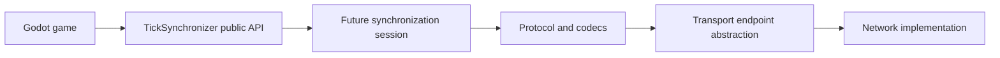
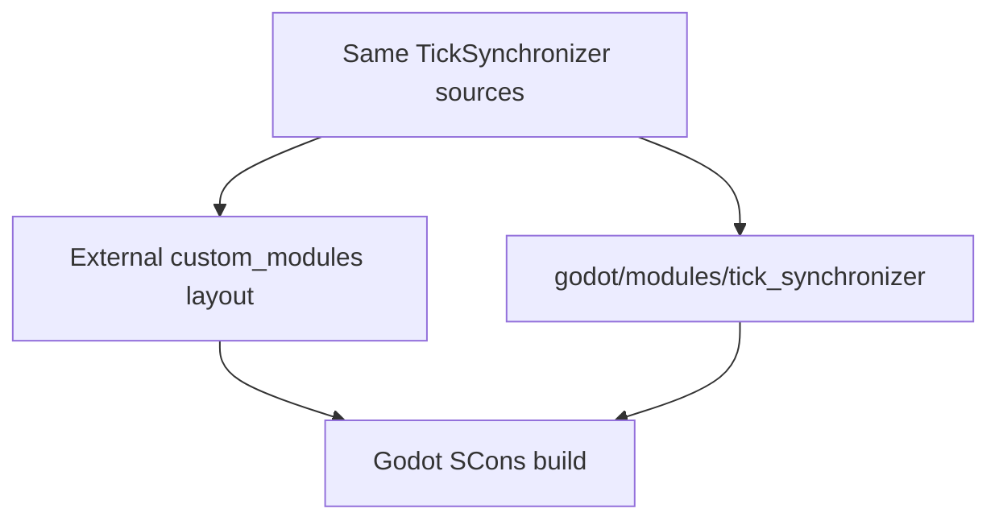
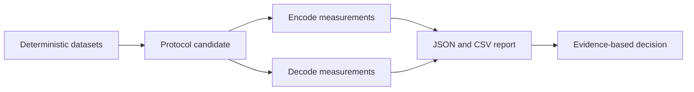

# TickSynchronizer

TickSynchronizer is a C++ module for Godot 4 that is being developed as a transport-independent, benchmark-driven foundation for deterministic real-time multiplayer synchronization.

The project currently provides a validated binary buffer, explicit integer and floating-point codecs, a fixed control envelope, a strict experimental handshake, resource limits, deterministic protocol benchmarks, and public diagnostic classes. Prediction, rollback, reconciliation, production transports, and editor tooling remain future work.

## Project identity

- **Module name:** `TickSynchronizer`
- **Module directory:** `tick_synchronizer`
- **Supported engine range:** Godot 4.x, version `4.4.0` or newer
- **Qualified engine baseline:** Godot `4.7.1-stable`
- **Language baseline:** C++17
- **Build system:** SCons
- **License:** MIT, Copyright (c) 2026 Malkverbena
- **Default precision:** `double`
- **Supported precision:** `single` and `double`

The design is conceptually informed by the original `GameNetworking/NetworkSynchronizer` project, but this repository is a new implementation with an explicit wire contract, stronger validation, transport abstraction, and benchmark-driven protocol selection.


```mermaid
flowchart LR
    Game[Godot game] --> API[TickSynchronizer public API]
    API --> Session[Future synchronization session]
    Session --> Protocol[Protocol and codecs]
    Protocol --> Endpoint[Transport endpoint abstraction]
    Endpoint --> Network[Network implementation]
```

## Supported module layouts

TickSynchronizer supports both standard Godot module layouts.

### External custom module

Recommended during independent module development:

```text
workspace/
├── godot/
└── tick_synchronizer/
```

Build from the Godot tree:

```bash
scons platform=linuxbsd \
    target=editor \
    tests=yes \
    precision=double \
    custom_modules=../tick_synchronizer \
    module_tick_synchronizer_enabled=yes
```

### Conventional in-tree module

The repository may also be placed at:

```text
godot/modules/tick_synchronizer/
```

Then build normally from the Godot root:

```bash
scons platform=linuxbsd \
    target=editor \
    tests=yes \
    precision=double \
    module_tick_synchronizer_enabled=yes
```

No source file may assume that the module is necessarily outside the Godot tree.

The validation scripts detect both layouts automatically. In-tree builds omit `custom_modules`; external builds resolve the module path relative to the selected Godot tree.


```mermaid
flowchart TB
    Source[Same TickSynchronizer sources]
    Source --> External[External custom_modules layout]
    Source --> InTree[godot/modules/tick_synchronizer]
    External --> GodotBuild[Godot SCons build]
    InTree --> GodotBuild
```

## Current version contract

```text
script_api=6
api=4
wire=0
wire_revision=2
benchmark_suite=2
wire_stable=no
exact_build_match=yes
```

- API version 4 identifies the current public module contract.
- Wire version 0 means the protocol is experimental.
- Wire revision 2 identifies the current incompatible experimental layout.
- Benchmark suite version 2 identifies the current corpus and comparison methodology.
- Report schema 3 records Linux, Windows, Android, and macOS provenance plus
  the platform CPU execution policy.
- Client and server module builds, game builds, schemas, and precision must
  match exactly during the experimental period.
- The canonical complete Godot version must match exactly; a differing Godot
  commit is retained as diagnostic provenance and produces a warning.

Display the contract with:

```bash
./scripts/build_and_validate.sh --print-version-contract
```

## Cross-platform protocol benchmarks

The benchmark core is shared across Linux, Windows, Android, and macOS through
one SCons compilation graph. Windows executables are cross-compiled from Linux
with MinGW-w64 or LLVM-MinGW, Android ARM64 executables use the Android NDK
Clang driver, and local Apple Clang thin builds produce macOS Universal 2
binaries. See `documentation/BENCHMARKS.md`.

```bash
./scripts/build_protocol_benchmarks.sh --precision all --jobs 45
./scripts/build_protocol_benchmarks_android.sh --precision all --jobs 45
```

```bash
./scripts/build_protocol_benchmarks_windows_cross.sh --precision all --jobs 45
```

On a macOS build host:

```bash
./scripts/build_protocol_benchmarks_macos.sh \
    --precision all \
    --clean-first
```

Private execution-only packages can be exported for qualification machines that
do not have compilers, SCons, target SDKs, Git, or project sources:

```bash
./scripts/build_protocol_benchmarks.sh --precision all --jobs 45 --export-package
./scripts/build_protocol_benchmarks_android.sh --precision all --jobs 45 --export-package
./scripts/build_protocol_benchmarks_windows_cross.sh --precision all --jobs 45 --toolchain mingw-gcc
./scripts/build_protocol_benchmarks_macos.sh --precision all --clean-first
```

Each execution-only runner verifies the package manifest before starting a benchmark.

GitHub distribution is source-only. Generated benchmark executables and
deployment packages are not published. macOS users build from source with their
own locally licensed Apple toolchain and SDK on Apple-branded hardware running
macOS; Apple SDK files are never vendored or copied into this repository.

Official reports require a clean source tree. Linux, Windows, and Android also
require verified native CPU affinity. ADR 0039 closes the candidate-selection
stage with 14 measured passing pairs and an explicit informed waiver for the
two unmeasured Redmi performance-core pairs. The waiver is not recorded as
measurement evidence. macOS uses the exact scheduler-managed representative
policy from ADR 0032 and remains the blocking final portability gate.

## Development status

The wire protocol remains experimental. ADR 0039 adopts
`varint_zigzag_fixed_float` as the default scalar-encoding profile for
subsequent gameplay protocol design. This selects canonical ULEB128/ZigZag
integers with fixed-width canonical floats; it does not select stateful framing,
masks, quantization, recovery policy, transport behavior, or the complete
production realtime packet format.
Version-bound implementation state, pending work, and accepted evidence are maintained in
[`documentation/development/`](documentation/development/). The permanent
manual describes module behavior and the gates that every accepted source state
must satisfy.

## Build and validation

Run consistency checks first:

```bash
./scripts/verify_source_consistency.sh
```

Normal builds accept clean Godot 4.x source at version 4.4.0 or newer. The
complete accepted validation and version-specific sanitizer policies remain
qualified on the exact Godot version and commit recorded in `GODOT_VERSION` and
`GODOT_COMMIT`.

Module-linked C++ follows Godot's restricted subset without STL containers,
`auto`, avoidable lambdas, exceptions, or RTTI. The engine-independent benchmark
may use STL containers, but SCons compiles it with exceptions and RTTI disabled.

Run the complete validation matrix:

```bash
./scripts/build_and_validate.sh --mode all --precision double --jobs 45
./scripts/build_and_validate.sh --mode all --precision single --jobs 45
```

Run the focused sanitizer gate:

```bash
./scripts/run_sanitized_tests.sh all --jobs 45
```

The accepted ASAN profile keeps leak detection enabled. Its one version-locked
Godot 4.7.1 SDL joypad rule and the existing three-rule UBSAN policy are each
protected by SCons-built unrelated negative controls.
The two precisions run serially, and the full unrelated LSAN control runs once
per uninterrupted acceptance batch.

See [`documentation/BUILD.md`](documentation/BUILD.md),
[`documentation/TESTING.md`](documentation/TESTING.md), and the current
[`validation record`](documentation/development/VALIDATION.md).

## Protocol benchmark suite

The standalone benchmark suite compares protocol candidates without initializing Godot, Java, JNI, rendering, or a network transport.

Build both precision variants:

```bash
./scripts/build_protocol_benchmarks.sh --precision all --jobs 45
```

Run a quick infrastructure check:

```bash
./scripts/run_protocol_benchmarks.sh --list-cpus
read -r -p "Linux logical CPU: " LINUX_CPU
./scripts/run_protocol_benchmarks.sh \
    --precision all --quick --cpu "$LINUX_CPU" --no-build
```

Run an official benchmark only from a clean Git tree:

```bash
./scripts/run_protocol_benchmarks.sh \
    --precision all --cpu "$LINUX_CPU" --no-build
```

The suite compares the fixed-width reference with
`varint_zigzag_fixed_float`. The latter is now the accepted default scalar
profile, but this does not stabilize the complete production protocol.
Decisions, waivers, and evidence boundaries are recorded in
[`documentation/BENCHMARK_DECISIONS.md`](documentation/BENCHMARK_DECISIONS.md).


```mermaid
flowchart LR
    Datasets[Deterministic datasets] --> Candidate[Protocol candidate]
    Candidate --> Encode[Encode measurements]
    Candidate --> Decode[Decode measurements]
    Encode --> Report[JSON and CSV report]
    Decode --> Report
    Report --> Decision[Evidence-based decision]
```

## Public classes

The module currently registers:

- `TickSynchronizer`
- `TickSynchronizerBuffer`
- `TickSynchronizerObject`
- `TickSynchronizerSchema`
- `TickSynchronizerSettings`

`TickSynchronizer` exposes build and protocol diagnostics. `TickSynchronizerBuffer` implements the validated bitstream and scalar codecs. The remaining public classes are intentionally small placeholders for later phases.

## Source layout

```text
src/
├── public/      Public Godot-facing classes
├── protocol/    Wire codec and handshake components
└── internal/    Build and version contracts

benchmarks/      Standalone deterministic benchmark suite
doc_classes/     Godot class reference XML
documentation/   Module manual, architecture decisions, and development records
scripts/         Build, validation, sanitizer, and benchmark tools
tests/           C++ tests, smoke project, and golden vectors
```

`register_types.*`, `SCsub`, and `config.py` remain at the repository root because they are conventional Godot module integration files.

## Documentation map

[`documentation/README.md`](documentation/README.md) separates the permanent
module manual, versioned architecture decisions, and stage-specific development
records. Module behavior and contracts remain in the permanent manual; current
status and qualification evidence are kept under `documentation/development/`.
The publication and artifact-handling rules are in
[`documentation/PRIVACY.md`](documentation/PRIVACY.md).
The GitHub Project owns operational planning. After source acceptance and the
complete final portability gate close, the Wiki may publish derived user guides, while versioned
contracts, evidence, and ADRs remain authoritative in the repository.

## Contribution policy

AI-assisted contributions are welcome only when the responsible developer understands and can maintain the resulting code. Read [`AGENTS.md`](AGENTS.md) before contributing.

## License

TickSynchronizer is licensed under the MIT License. See [`LICENSE`](LICENSE).
