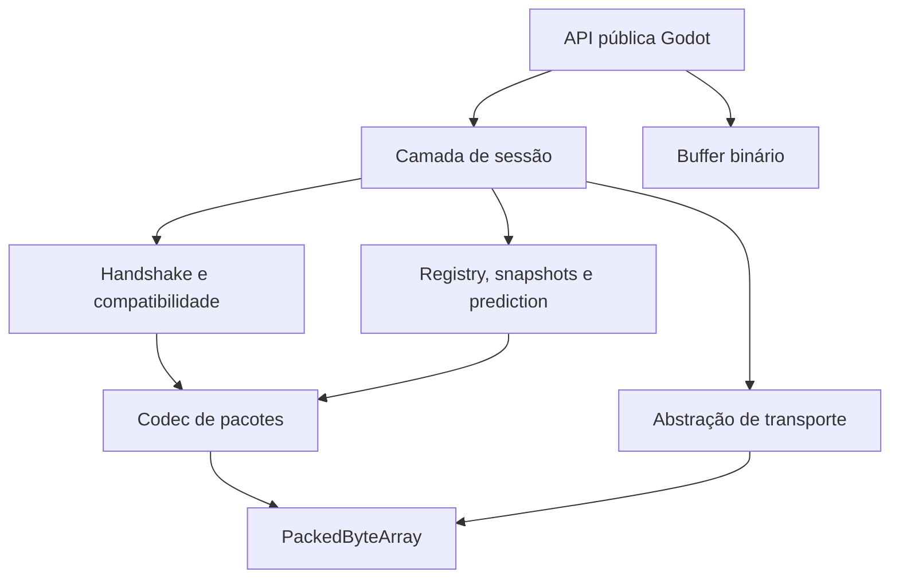
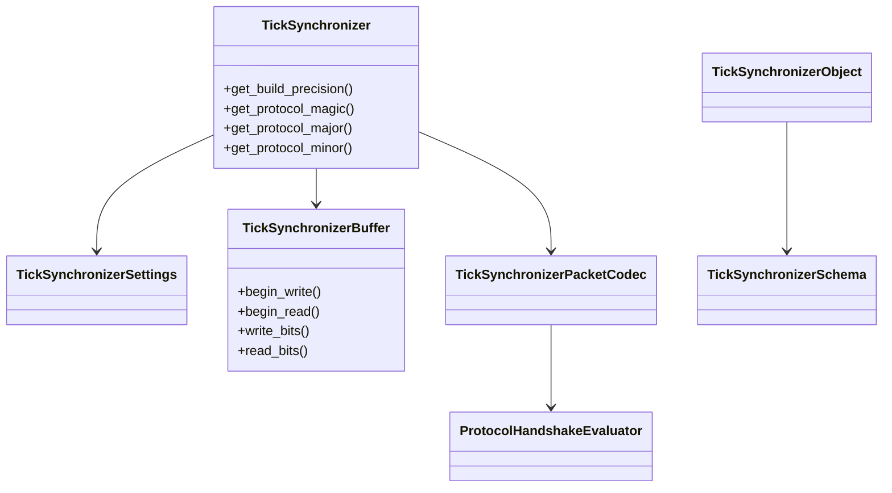
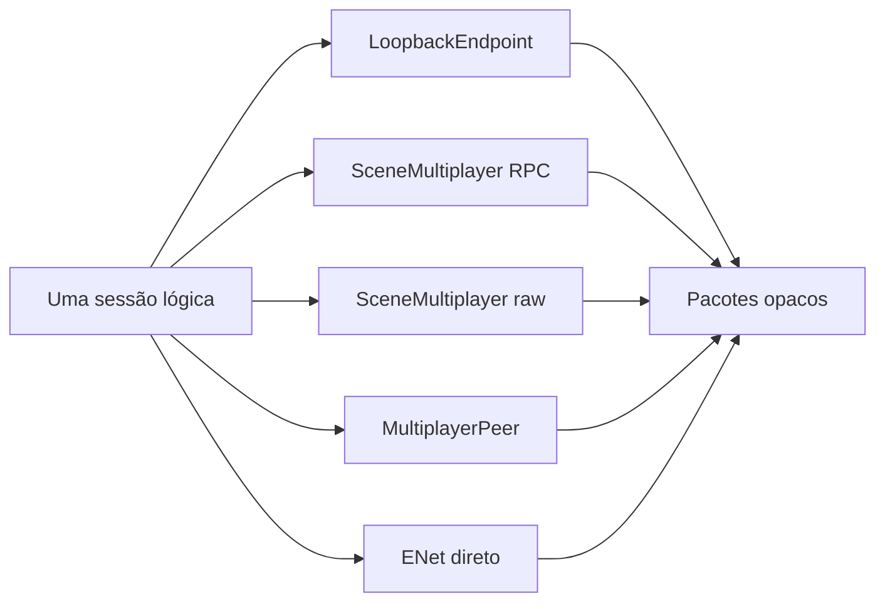

# Arquitetura do TickSynchronizer

## Objetivo

O TickSynchronizer é um módulo nativo para Godot 4.7.1 destinado a sincronização multiplayer orientada a ticks, protocolo binário compacto, prediction, rollback, reconciliation, topologias configuráveis, telemetria e benchmark.



## Limites arquiteturais

- O módulo é externo à árvore do Godot.
- O código da engine não é modificado.
- SCons é o único sistema de build.
- O runtime não depende de uma implementação específica de transporte.
- `PackedByteArray` é o armazenamento canônico de pacotes prontos.
- O wire format é independente de `real_t`, ABI e layout de structs C++.

## Classes públicas iniciais

- `TickSynchronizer : Node`: representa uma sessão lógica.
- `TickSynchronizerObject : Node`: ponto de integração futuro para objetos sincronizados.
- `TickSynchronizerSettings : Resource`: configuração serializável futura.
- `TickSynchronizerSchema : Resource`: descrição futura de schema.
- `TickSynchronizerBuffer : RefCounted`: bitstream e codecs escalares.



`TickSynchronizer` também expõe magic, versão e modo de precisão do protocolo para diagnóstico.

## Componentes internos planejados

```text
TickSynchronizer
├── SyncSession
├── SyncClock
├── SyncRegistry
├── SyncSnapshotHistory
├── SyncControllerManager
├── SyncGroupManager
├── SyncTopologyManager
├── TickSynchronizerPacketCodec — envelope e payloads de controle
├── ProtocolHandshakeEvaluator — identidade, capabilities e decisões puras
├── SyncTransportEndpoint
├── SyncMetrics
├── SyncDebugger
└── SyncBenchmarkRunner
```

## Sessões, peers e endpoints

- Uma instância de `TickSynchronizer` representa uma sessão lógica.
- Uma sessão pode possuir vários endpoints.
- Um endpoint pode administrar vários peers ou conexões.
- Autoridade lógica não é equivalente à topologia física.
- O sincronizador depende apenas do contrato `SyncTransportEndpoint`.



## Precisão

- O módulo compila em `single` e `double`.
- `double` é o padrão operacional.
- Todos os peers de uma sessão devem usar a mesma precisão.
- O `HELLO` carrega precisão, nonce, identidade de build/schema e capabilities.
- O wire format usa larguras explícitas (`float32`, `float64` ou inteiros quantizados), nunca `real_t`.

## Codec de pacotes atual

- interno e independente de transporte;
- cabeçalho de controle fixo de 40 bytes;
- magic `TSYN`, versão estrita `1.1`;
- `HELLO`/`HELLO_ACK` v2 e `DISCONNECT_REASON`;
- inspeção segura de header incompatível;
- avaliador puro de compatibilidade e capabilities;
- limite validado antes de copiar payload;
- saída atômica em falhas;
- cabeçalho realtime compacto ainda não definido.

## Pipeline futuro

```text
input local
→ histórico de input
→ simulação prevista
→ snapshot previsto
→ codec binário
→ endpoint
→ autoridade remota
→ snapshot autoritativo
→ comparação
→ rollback/replay quando necessário
→ suavização visual
```

## Determinismo

O projeto busca disciplina determinística, não promete determinismo bit a bit da física padrão do Godot entre todas as plataformas. Sistemas que exigirem rollback distribuído mais forte deverão usar ordem estável, RNG controlado, quantização e ilhas de simulação adequadas.

## Segurança futura

Criptografia será adicionada por uma interface de backend. Primitivas próprias são proibidas; o backend planejado utiliza mbedTLS, AEAD, nonces únicos e proteção contra replay.
