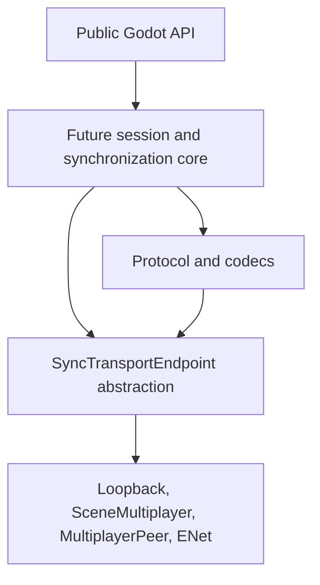
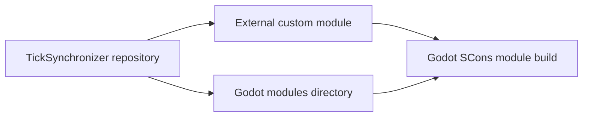
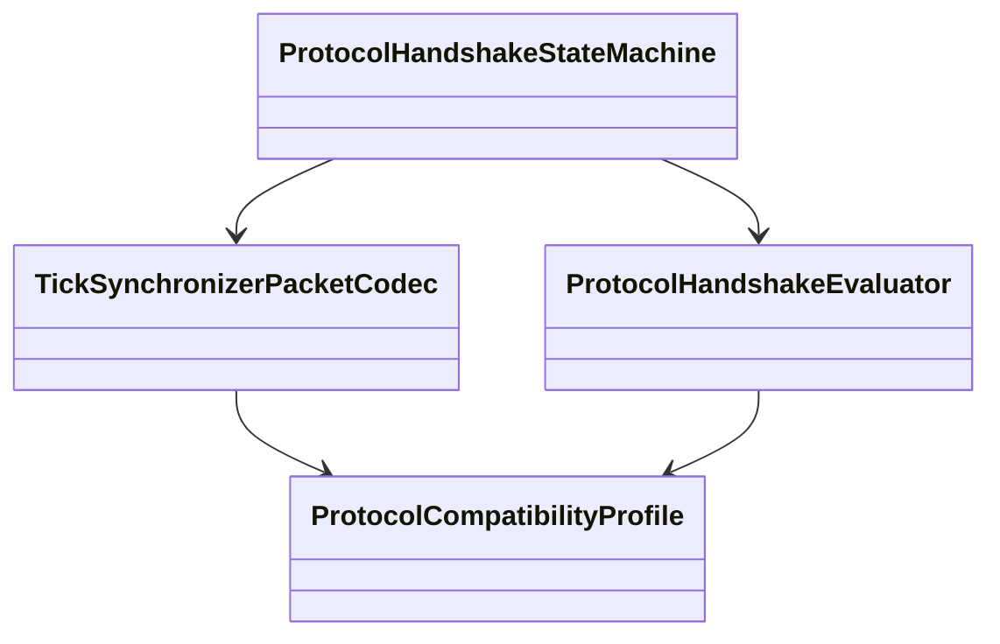
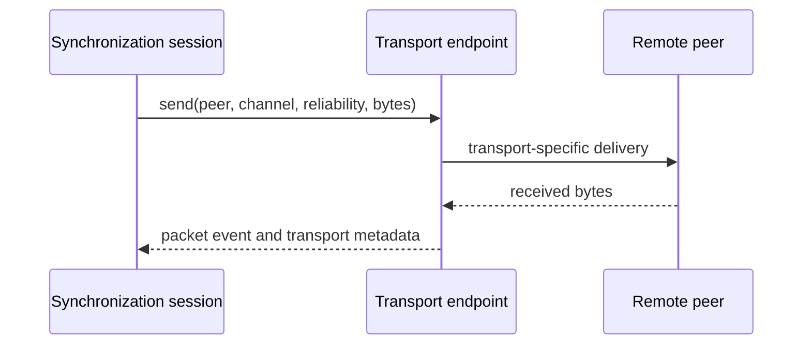

# TickSynchronizer architecture

## Purpose

TickSynchronizer is being built as a deterministic, transport-independent multiplayer synchronization module. The architecture separates Godot-facing APIs, wire serialization, session logic, and transport endpoints so each layer can be tested and benchmarked independently.



## Architectural boundaries

- `src/public` owns Godot classes and bindings.
- `src/protocol` owns byte-level contracts and handshake state.
- `src/internal` owns build-only constants and generated compatibility information.
- `benchmarks` reuses protocol semantics but does not initialize Godot.
- future transport endpoints must not know synchronized object internals.
- future prediction and rollback logic must not know the concrete transport.

## Supported build layouts

The same repository must compile in both layouts:

```text
workspace/godot + workspace/tick_synchronizer
```

with `custom_modules=../tick_synchronizer`, or:

```text
godot/modules/tick_synchronizer
```

as a conventional in-tree module. The external layout is recommended for independent history and engine cleanliness, but it is not the only supported layout.



## Current public classes

| Class | Current responsibility |
|---|---|
| `TickSynchronizer` | Exposes build precision and protocol diagnostics. |
| `TickSynchronizerBuffer` | Owns canonical bitstream storage and scalar codecs. |
| `TickSynchronizerObject` | Placeholder for synchronized-node registration. |
| `TickSynchronizerSchema` | Placeholder for schema resources. |
| `TickSynchronizerSettings` | Placeholder for configuration resources. |

## Current internal components

- `TickSynchronizerPacketCodec`: fixed control envelope and payload codecs.
- `ProtocolHandshakeEvaluator`: pure compatibility decision logic.
- `ProtocolHandshakeStateMachine`: pure legal-message-order state machine.
- build/version headers: API, wire, benchmark, precision, and build identity contracts.

Fatal handshake compatibility uses the canonical complete Godot version,
module build, game build, schema, precision, API, wire contract, and required
capabilities. The Godot commit remains in the compatibility profile as
diagnostic provenance; a mismatch becomes a structured warning carried by the
handshake action and established-session metadata. The pure evaluator and state
machine do not print or depend on global logging state. The future session layer
is responsible for emitting the warning.



## Session, peer, and endpoint model

The future session layer will own logical peers, object registries, schemas, tick history, relevance, and synchronization policy. A `SyncTransportEndpoint` will expose peer discovery, channels, reliability, send/receive operations, and transport metrics without understanding snapshots or rollback.



## Precision

Godot can be compiled with `precision=single` or `precision=double`. TickSynchronizer supports both, but all peers in one session must match. The low-level wire format uses explicit integer widths and explicit `float32`/`float64`; it never serializes `real_t` directly.

## Determinism

Determinism requires more than matching packet bytes. Future systems must define canonical ordering, stable object identity, tick rules, finite numeric policies, quantization, and rollback side-effect control. The current codecs establish deterministic byte representations and error behavior as a foundation.

## Security boundary

No external endpoint may deliver untrusted gameplay data before the packet-security gate is complete. Lengths, counts, capabilities, and identities must be validated before allocation or state mutation. Cryptography is deferred and will use an established mbedTLS-based backend.

## Benchmark boundary

Protocol candidates are evaluated by a standalone harness with deterministic semantic messages. Benchmark code is intentionally isolated from Godot startup, rendering, JNI, Java, and network transports so results reflect codec behavior.

One SCons graph compiles the harness for native Linux, Windows x86_64 cross-targets, and Android ARM64 cross-targets. Execution-only deployment packages separate compilation provenance from physical-machine measurement, so test environments never need project sources or target development toolchains.

The current preliminary cross-platform matrix is:

- Linux x86_64 across distinct L3 domains — completed;
- Windows x86_64 across distinct L3 domains — completed;
- Android ARM64 on recent and older devices across multiple core classes under
  controlled power settings — completed;
- a second Windows x86_64 machine — deferred until available.

## Planned components

1. clean-tree official benchmark qualification and deferred second-machine coverage;
2. additional protocol candidates;
3. transport endpoint abstraction and loopback endpoint;
4. session and registry layer;
5. offline simulation;
6. client/server synchronization;
7. prediction, rollback, and reconciliation;
8. relevance, frequency control, metrics, and tooling.
