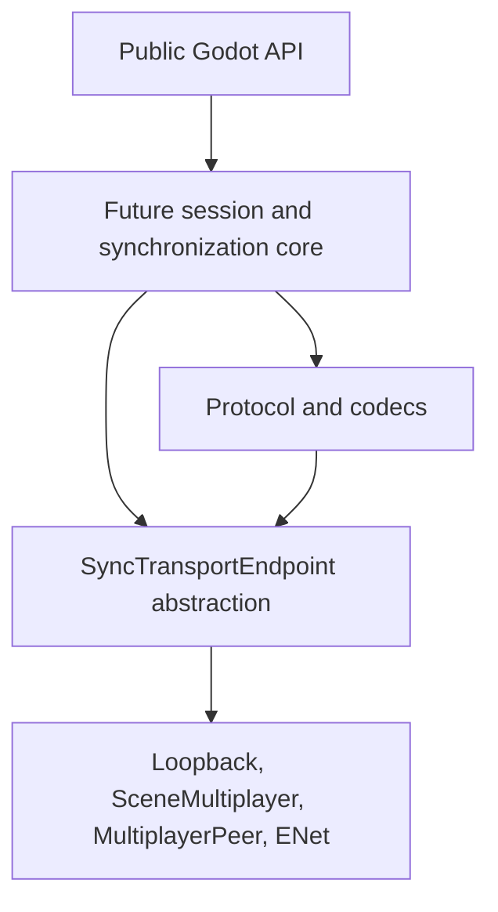
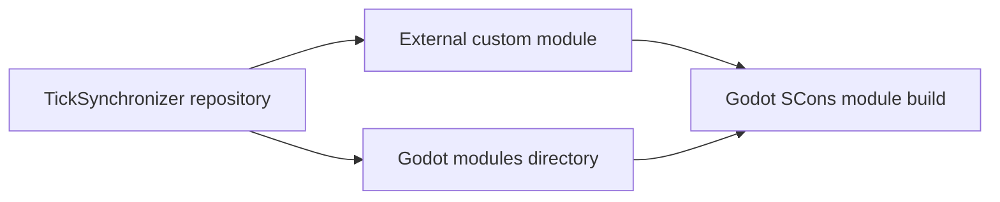
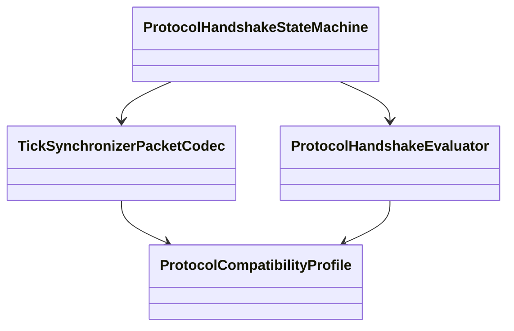
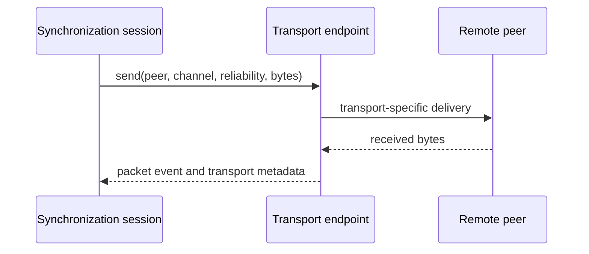

# TickSynchronizer architecture

## Purpose

TickSynchronizer is being built as a deterministic, transport-independent multiplayer synchronization module. The architecture separates Godot-facing APIs, wire serialization, session logic, and transport endpoints so each layer can be tested and benchmarked independently.


```mermaid
flowchart TB
    Public[Public Godot API] --> Session[Future session and synchronization core]
    Session --> Protocol[Protocol and codecs]
    Session --> Endpoint[SyncTransportEndpoint abstraction]
    Protocol --> Endpoint
    Endpoint --> Implementations[Loopback, SceneMultiplayer, MultiplayerPeer, ENet]
```

## Architectural boundaries

- `src/public` owns Godot classes and bindings.
- `src/protocol` owns byte-level contracts and handshake state.
- `src/internal` owns build-only constants and generated compatibility information.
- `benchmarks` reuses protocol semantics but does not initialize Godot.
- future transport endpoints must not know synchronized object internals.
- future prediction and rollback logic must not know the concrete transport.

## Supported build layouts

The module supports clean Godot 4.x source at version 4.4.0 or newer. The exact
version and commit in `GODOT_VERSION` and `GODOT_COMMIT` remain qualified
validation provenance rather than a single-commit compilation restriction.

The same repository must compile in both layouts:

```text
workspace/godot + workspace/tick_synchronizer
```

with `custom_modules=../tick_synchronizer`, or:

```text
godot/modules/tick_synchronizer
```

as a conventional in-tree module. The external layout is recommended for independent history and engine cleanliness, but it is not the only supported layout.


```mermaid
flowchart LR
    Repository[TickSynchronizer repository]
    Repository --> External[External custom module]
    Repository --> ModuleDir[Godot modules directory]
    External --> SCons[Godot SCons module build]
    ModuleDir --> SCons
```

## Current public classes

| Class | Current responsibility |
|---|---|
| `TickSynchronizer` | Exposes build precision and protocol diagnostics. |
| `TickSynchronizerBuffer` | Owns canonical bitstream storage and scalar codecs. |
| `TickSynchronizerObject` | Placeholder for synchronized-node registration. |
| `TickSynchronizerSchema` | Placeholder for schema resources. |
| `TickSynchronizerSettings` | Placeholder for configuration resources. |

## Current internal components

- `TickSynchronizerPacketCodec`: fixed control envelope and payload codecs.
- `ProtocolHandshakeEvaluator`: pure compatibility decision logic.
- `ProtocolHandshakeStateMachine`: pure legal-message-order state machine.
- build/version headers: API, wire, benchmark, precision, and build identity contracts.

Fatal handshake compatibility uses the canonical complete Godot version,
module build, game build, schema, precision, API, wire contract, and required
capabilities. The Godot commit remains in the compatibility profile as
diagnostic provenance; a mismatch becomes a structured warning carried by the
handshake action and established-session metadata. The pure evaluator and state
machine do not print or depend on global logging state. The future session layer
is responsible for emitting the warning.


```mermaid
classDiagram
    class TickSynchronizerPacketCodec
    class ProtocolHandshakeEvaluator
    class ProtocolHandshakeStateMachine
    class ProtocolCompatibilityProfile
    TickSynchronizerPacketCodec --> ProtocolCompatibilityProfile
    ProtocolHandshakeEvaluator --> ProtocolCompatibilityProfile
    ProtocolHandshakeStateMachine --> ProtocolHandshakeEvaluator
    ProtocolHandshakeStateMachine --> TickSynchronizerPacketCodec
```

## Session, peer, and endpoint model

The future session layer will own logical peers, object registries, schemas, tick history, relevance, and synchronization policy. A `SyncTransportEndpoint` will expose peer discovery, channels, reliability, send/receive operations, and transport metrics without understanding snapshots or rollback.


```mermaid
sequenceDiagram
    participant S as Synchronization session
    participant E as Transport endpoint
    participant P as Remote peer
    S->>E: send(peer, channel, reliability, bytes)
    E->>P: transport-specific delivery
    P-->>E: received bytes
    E-->>S: packet event and transport metadata
```

## Precision

Godot can be compiled with `precision=single` or `precision=double`. TickSynchronizer supports both, but all peers in one session must match. The low-level wire format uses explicit integer widths and explicit `float32`/`float64`; it never serializes `real_t` directly.

## Determinism

Determinism requires more than matching packet bytes. Future systems must define canonical ordering, stable object identity, tick rules, finite numeric policies, quantization, and rollback side-effect control. The current codecs establish deterministic byte representations and error behavior as a foundation.

## Security boundary

No external endpoint may deliver untrusted gameplay data before the packet-security gate is complete. Lengths, counts, capabilities, and identities must be validated before allocation or state mutation. Cryptography is deferred and will use an established mbedTLS-based backend.

## Benchmark boundary

Protocol candidates are evaluated by a standalone harness with deterministic semantic messages. Benchmark code is intentionally isolated from Godot startup, rendering, JNI, Java, and network transports so results reflect codec behavior.

Suite 2 centralizes canonical scalar semantics outside candidate
implementations. IEEE binary32/binary64 bytes are little-endian, NaNs have one
accepted payload, and binary64-to-binary32 rounding is defined independently of
the host floating-point environment. Candidate-independent semantic hashing and
atomic decode gates prevent an encoding from changing the workload it measures.

The module side follows Godot's restricted C++ subset. The standalone harness
keeps STL containers for engine independence, but its SCons graph disables
exceptions and RTTI and propagates operational failures explicitly.

One SCons graph compiles the harness for native Linux, Windows x86_64
cross-targets, Android ARM64 cross-targets, and local macOS Universal 2 thin
targets. Private execution-only deployment packages separate compilation
provenance from physical-machine measurement, so qualification environments
never need project sources or target development toolchains. Public GitHub
distribution remains source-only.

ADR 0039 closes the Linux, Windows, and Android scalar-profile selection stage
with 14 measured passing pairs and two explicitly waived, unmeasured Redmi
performance pairs. It adopts `varint_zigzag_fixed_float` as the default scalar
profile without selecting the complete realtime packet format. Native macOS
execution is intentionally deferred to the final blocking portability gate;
its Apple Clang, Universal 2, scheduler, packaging, and Gatekeeper results
cannot be inferred from another backend.

Platform qualification status and future implementation phases are maintained
in [`development/`](development/), outside the architectural contract.
