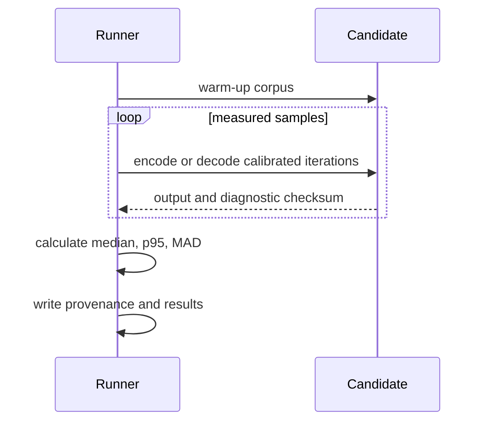

# Protocol benchmarks

## Status

Benchmark suite version 1 is implemented as a standalone C++17 executable. It currently contains one fixed-width reference candidate and seven deterministic datasets. The suite is the measurement foundation; it does not imply that the reference candidate is the final protocol.


## Version contract

- `BENCHMARK_SUITE_VERSION = 1` identifies datasets and methodology.
- report `schema_version = 3` identifies the cross-platform provenance JSON layout.
- adding a candidate does not increment the suite version.
- changing datasets, timed regions, warm-up policy, statistics, or correctness semantics requires a suite-version review.

## Reference candidate

`reference_fixed_width` uses explicit fixed-width little-endian fields and fixed `float32` or `float64` values according to the benchmark build. Its purpose is to provide a simple, predictable baseline for size and CPU cost.

## Deterministic datasets

1. `control_minimal`
2. `player_input`
3. `snapshot_sparse`
4. `snapshot_medium`
5. `snapshot_dense`
6. `numeric_extremes`
7. `sequential_flow`

The same seed and semantic inputs must be used for every candidate.

## Methodology v1

Official configuration:

- 5 warm-up rounds;
- 30 measured samples;
- at least 10,000 messages per sample;
- at least 100 ms per sample;
- fixed seed `0x5449434B53594E43`;
- encode and decode timed separately;
- correctness validated outside timed regions;
- median, p95, minimum, maximum, and MAD reported;
- output consumed through a volatile diagnostic sink;
- official execution pinned by the native executable to an explicit logical CPU;
- official execution rejected when the Git tree is dirty.

Official eligibility additionally requires the complete seven-dataset suite and
an exact match for every methodology field above. It also requires a full
module commit identifier and the qualified Godot baseline commit. CLI overrides
and `--only` runs remain useful diagnostics, but they cannot produce official
reports. Every benchmark build wrapper runs source consistency before SCons.



## Correctness gates

A candidate is not eligible for performance comparison if it:

- fails any semantic round-trip;
- produces nondeterministic bytes for deterministic input;
- accepts malformed packets that should be rejected;
- performs an unbounded allocation based on input;
- depends on native struct padding, endianness, or ABI;
- changes output semantics across repeated executions.

## Metrics

Per dataset and operation:

- calibrated iterations;
- nanoseconds per message;
- messages per second;
- MiB per second;
- allocation count and allocated bytes;
- encoded size distribution;
- diagnostic checksum;
- round-trip and determinism failures.

## Build

```bash
./scripts/build_protocol_benchmarks.sh --precision all --jobs 45
```

The build produces independent `single` and `double` executables and runs their self-tests.

## Execution

Quick infrastructure validation:

```bash
./scripts/run_protocol_benchmarks.sh --list-cpus
read -r -p "Linux logical CPU: " LINUX_CPU
./scripts/run_protocol_benchmarks.sh \
    --precision all \
    --quick \
    --cpu "$LINUX_CPU" \
    --no-build
```

Official execution from a clean tree:

```bash
./scripts/run_protocol_benchmarks.sh \
    --precision all \
    --cpu "$LINUX_CPU" \
    --no-build
```

### Directed Linux L3-domain runs

Linux exposes CPU topology through sysfs. List the topology before selecting a
processor:

```bash
./scripts/run_protocol_benchmarks.sh --list-cpus
```

Distinct `l3_id` values identify cache domains. Do not assume that a domain
always owns the same logical CPU range or infer an architecture-specific role
without hardware documentation. Select one primary hardware thread from each
relevant L3 domain and record an explicit class label:

```bash
read -r -p "First L3 domain ID: " FIRST_L3_ID
read -r -p "Second L3 domain ID: " SECOND_L3_ID

./scripts/run_protocol_benchmarks.sh \
    --precision all \
    --l3-cache-id "$FIRST_L3_ID" \
    --cpu-class l3-domain-a \
    --quick \
    --no-build

./scripts/run_protocol_benchmarks.sh \
    --precision all \
    --l3-cache-id "$SECOND_L3_ID" \
    --cpu-class l3-domain-b \
    --quick \
    --no-build
```

The L3 selector chooses the first online primary thread in the requested
domain. An explicit `--cpu N` may be supplied together with `--l3-cache-id ID`;
the runner rejects a mismatched pair.

## Provenance

Schema 3 records:

- module commit and source state;
- executable SHA-256;
- compiler command, path, and flags;
- optimization and LTO state;
- operating system, build, architecture, runtime backend, device, and SoC;
- requested and actual logical CPU, processor group, affinity result, core class, package, NUMA node, L3 domain, and SMT siblings;
- frequency driver, governor, and frequency limits;
- thermal information when exposed by the platform.

## Windows backend

Windows binaries are cross-compiled on Linux. The supported toolchains are:

- MinGW-w64 GCC, available from common Linux package repositories;
- LLVM-MinGW, supplied as a standalone cross-toolchain.

On Debian or Ubuntu, install SCons, the GCC-based cross toolchain, and packaging dependencies:

```bash
sudo apt install \
    scons zip \
    gcc-mingw-w64-x86-64 g++-mingw-w64-x86-64
```

Build and package both precisions on Linux:

```bash
./scripts/build_protocol_benchmarks_windows_cross.sh \
    --toolchain mingw-gcc \
    --precision all \
    --jobs 45 \
    --clean-first
```

The first official Windows baseline uses `mingw-gcc` explicitly. A standalone LLVM-MinGW installation may later be selected for a separate compiler-sensitivity study:

```bash
./scripts/build_protocol_benchmarks_windows_cross.sh \
    --toolchain llvm-mingw \
    --toolchain-root /opt/llvm-mingw \
    --precision all \
    --jobs 45
```

The script generates native PE x86_64 executables and a deployment ZIP under `benchmark_dist/windows/`. It links the C++ compiler runtime statically and rejects dependencies on `libstdc++`, `libgcc`, `libwinpthread`, `libc++`, or `libunwind` DLLs when an object inspector is available. Wine self-tests are optional; the physical Windows quick run remains mandatory.

The Windows machine is execution-only. It does not require Visual Studio, a compiler, SCons, Git, Python, an SDK, or a project checkout. Extract the deployment ZIP and run:

```powershell
./run_protocol_benchmarks_windows.ps1 -ListCpus

[int]$FirstDomainCpu = Read-Host "First L3-domain primary-thread flat CPU index"
[int]$SecondDomainCpu = Read-Host "Second L3-domain primary-thread flat CPU index"

./run_protocol_benchmarks_windows.ps1 `
    -Precision all `
    -Cpu $FirstDomainCpu `
    -CpuClass l3-domain-a `
    -Quick

./run_protocol_benchmarks_windows.ps1 `
    -Precision all `
    -Cpu $SecondDomainCpu `
    -CpuClass l3-domain-b `
    -Quick
```

The native topology table reports flat CPU index, processor group and number,
core, package, NUMA node, L3 identity and size, and SMT siblings. Choose a
primary thread from each relevant L3 domain and use hardware documentation
before assigning architecture-specific class labels. After qualification,
omit `-Quick` for official reports. Source commit and cleanliness are embedded
at cross-compilation time; processor-group-aware affinity and the selected
topology are applied and verified inside the native executable.

## Android backend

Use OpenJDK 17, Android SDK platform 35, build tools 35.0.1, current platform
tools, and Android NDK r28b (`28.1.13356709`). The project uses only the NDK
Clang driver through SCons for this standalone benchmark. On Ubuntu, keep the
SDK on a native Linux filesystem when practical and keep project host
temporary files under `../tick_synchronizer_tmp`:

```bash
sudo apt install openjdk-17-jdk scons curl unzip zip file python3

export ANDROID_SDK_ROOT="$HOME/Android/Sdk"
export ANDROID_HOME="$ANDROID_SDK_ROOT"
export ANDROID_NDK_HOME="$ANDROID_SDK_ROOT/ndk/28.1.13356709"
export ANDROID_NDK_ROOT="$ANDROID_NDK_HOME"
export JAVA_HOME="$(dirname "$(dirname "$(readlink -f "$(command -v javac)")")")"
export PATH="$ANDROID_SDK_ROOT/cmdline-tools/latest/bin:$ANDROID_SDK_ROOT/platform-tools:$PATH"
export TICKSYNC_TEMP_DIR="$(realpath -m -- "$PWD/../tick_synchronizer_tmp")"
```

Install the pinned SDK packages with the official `sdkmanager` after the
command-line tools have been bootstrapped:

```bash
sdkmanager --sdk_root="$ANDROID_SDK_ROOT" \
    "platform-tools" \
    "build-tools;35.0.1" \
    "platforms;android-35" \
    "ndk;28.1.13356709"

sdkmanager --sdk_root="$ANDROID_SDK_ROOT" --licenses
```

Build and export ARM64 binaries on the Linux host:

```bash
./scripts/build_protocol_benchmarks_android.sh \
    --precision all \
    --abi arm64-v8a \
    --api-level 24 \
    --jobs 45 \
    --export-package
```

Inspect the selected device and run through adb:

```bash
./scripts/run_protocol_benchmarks_android.sh --serial SERIAL --list-cpus

./scripts/run_protocol_benchmarks_android.sh \
    --serial SERIAL \
    --precision all \
    --cpu-class prime \
    --quick \
    --no-build
```

Official Android evidence requires an explicit `--cpu N` after topology inspection. `--cpu-class` is a convenience selector based on exposed maximum frequencies and is accepted only for quick diagnostics. The runner pushes a static-libc++ executable to `/data/local/tmp`, requires a matching remote SHA-256, executes the native self-test, captures thermal and battery state, and pulls JSON/CSV reports.

## Comparing reports

The comparator keeps `single` and `double` reports in separate groups and uses
the first report of each precision as that precision's baseline. Report IDs are
mapped to the report directory, OS build, device, CPU class, logical CPU, L3
domain, and executable hash so files named `results.json` remain unambiguous.

```bash
./scripts/compare_protocol_benchmarks.py \
    --allow-preliminary \
    --output comparison.md \
    REPORT_DIRECTORY_1/results.json \
    REPORT_DIRECTORY_2/results.json
```

`--allow-preliminary` is diagnostic only and must be omitted for official
comparisons.

## Execution-only deployment packages

Prebuilt benchmark packages decouple compilation from measurement. Build hosts own SCons, cross-compilers, and the Android NDK; test machines receive only target executables, runners, integrity hashes, metadata, and instructions.

```bash
./scripts/build_protocol_benchmarks.sh \
    --precision all \
    --jobs 45 \
    --export-package

./scripts/build_protocol_benchmarks_windows_cross.sh \
    --toolchain mingw-gcc \
    --precision all \
    --jobs 45

./scripts/build_protocol_benchmarks_android.sh \
    --precision all \
    --jobs 45 \
    --export-package
```

After extraction, Linux and Android packages use `--execution-only`. This disables all source-tree and build actions; cleanliness and commit provenance come from metadata embedded in the binaries at build time. Every package runner verifies its SHA-256 manifest before execution. A full run from a dirty build remains diagnostic and cannot become `official_eligible`.

Runtime-only requirements are:

| Package | Test environment requirements |
|---|---|
| Linux x86_64 | Bash, Python 3, `sha256sum`, and standard system utilities |
| Windows x86_64 | Windows PowerShell 5.1 or newer |
| Android ARM64 | No development tools on the device; the Linux controller needs Bash, ADB, Python 3, and `sha256sum` |

Deployment archives are written under `benchmark_dist/`. Package creation uses `../tick_synchronizer_tmp` by default and accepts a safe `TICKSYNC_TEMP_DIR` override.

## Platform matrix

The suite is compiled without methodology changes for the following qualification matrix:

| Platform | Architecture | Role |
|---|---|---|
| Available Linux system | x86_64 | Quick qualification complete across distinct L3 domains |
| Available Windows system | x86_64 | Quick qualification complete across distinct L3 domains |
| Second Windows machine | x86_64 | Deferred until available |
| Recent Android device | ARM64 | Controlled quick qualification complete across exposed core classes |
| Older Android device | ARM64 | Quick qualification complete across exposed core classes |

Android runs distinguish efficiency, performance, and prime core classes when
the kernel exposes usable affinity information. Windows and Android backends
and the available quick device matrix are qualified. Clean-tree official
baselines remain pending.

## Current preliminary qualification

The selected quick matrix uses report schema 3 and the
`reference_fixed_width` candidate:

- Linux and Windows x86_64 cover distinct L3 domains;
- Android ARM64 covers recent and older devices across exposed efficiency,
  performance, and prime core classes under controlled power settings.

Every selected report passed the self-test, all seven datasets, explicit
affinity, JSON/CSV validation, and the malformed corpus with 27 rejected and
zero accepted packets. Runs without confirmed environmental controls are
excluded from qualified performance comparisons.

The quick reports record dirty source provenance and `official=no`; they
validate execution, portability, topology discovery, and platform sensitivity
but cannot select the production protocol. The second Windows machine and all
clean-tree official runs remain pending.

## Decision process

Absolute speed is not sufficient. Candidate selection weighs wire size, encode/decode cost, allocation behavior, validation strength, evolution cost, and consistency across architectures. See `BENCHMARK_DECISIONS.md`.
