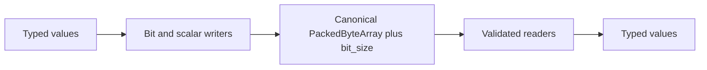

# TickSynchronizerBuffer binary foundation

## Scope

`TickSynchronizerBuffer` provides canonical bit storage, explicit scalar codecs, sticky error handling, atomic failure behavior, and resource limits. It is a low-level primitive, not a complete gameplay packet format.

## Storage and state

The buffer stores physical bytes plus a separate logical bit size. The final byte may contain padding, but unused bits are canonicalized to zero. Mode, cursor, error state, and size limit are runtime state and are not part of logical content identity.

## Bit convention

Fields consume bits least-significant-bit first. Byte-aligned fixed-width integers are little-endian. Varints must begin at a byte boundary and use their minimal canonical representation.

## Error behavior

The first error remains active until `clear()`, `begin_write()`, or `begin_read()` resets the operation. A failed operation must not partially move the cursor, partially mutate output, or expose a partial value.

This atomicity also covers language binding limits. A canonical `uint64_t`
varuint above `INT64_MAX` remains readable through C++, while the GDScript
wrapper reports `ERR_PARAMETER_RANGE_ERROR` and restores its cursor.

## Resource limits

Each buffer has a configurable byte limit. The default is 1 MiB, which is a safety ceiling rather than an approved network packet size. Protocol layers and transports must apply much smaller message-specific budgets.

## Float codecs

`float32` and `float64` encode explicit IEEE 754 bit patterns. The low-level codec preserves bit representations, while higher-level schemas are responsible for rejecting or canonicalizing non-finite values where deterministic simulation requires it.

## Identity

Equality and content hashing use only canonical bytes and logical bit size. The hash is non-cryptographic and must not replace equality or become part of the wire protocol.

## Golden vectors

Golden files cover bit fields, unaligned data, fixed integers, varint boundaries, ZigZag boundaries, and IEEE 754 values. They protect cross-platform byte identity.

## Future work

Potential zero-copy or segmented storage paths may be considered only after benchmarks show material benefit without weakening canonicalization, isolation, or resource accounting.
