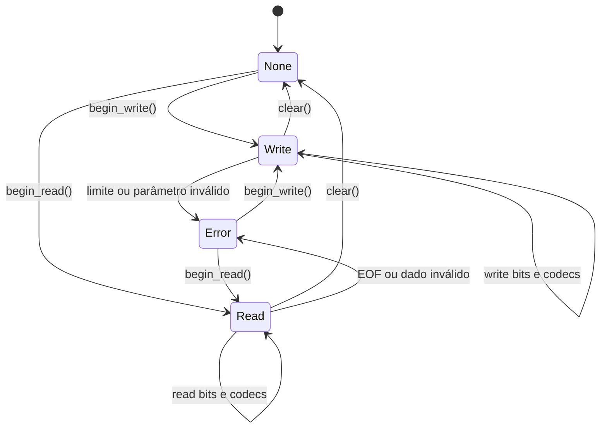

# TickSynchronizerBuffer — fundação binária

## Escopo desta alteração

`TickSynchronizerBuffer` é a fundação binária consolidada do módulo. Ele implementa bitstream, inteiros fixos, varints, floats IEEE 754, limites de recursos, canonicalização, igualdade lógica e hash local. Quantização de domínio, compressão e criptografia permanecem em camadas posteriores.

## Armazenamento e estado




- armazenamento canônico: `PackedByteArray`;
- modos: `MODE_NONE`, `MODE_READ` e `MODE_WRITE`;
- cursor e tamanho lógico medidos em bits;
- capacidade inicial opcional medida em bytes;
- erro persistente até `clear()`, `begin_write()` ou `begin_read()`;
- nenhuma sincronização interna: uma instância não deve ser usada simultaneamente por várias threads.

`begin_write()` usa `reserve()` para capacidade antecipada, sem aumentar o tamanho lógico. Quando a escrita cresce, bytes novos são criados com `resize_initialized()`, garantindo padding zero no último byte.

## Convenção de bits

Cada campo é escrito e lido do bit menos significativo para o mais significativo (**LSB-first**). Dentro de cada byte, o primeiro bit ocupa a posição 0.

Consequência: um inteiro alinhado a byte aparece em ordem little-endian.

Exemplo:

```text
write_bits(0x0123456789ABCDEF, 64)
→ EF CD AB 89 67 45 23 01
```

Os bits acima de `bit_count` em `value` são ignorados.

## Contagem válida

`write_bits()` e `read_bits()` aceitam de 1 a 64 bits. Uma contagem zero é rejeitada deliberadamente para detectar erros de schema ou cálculo de largura, em vez de aceitar silenciosamente uma operação sem efeito.

## Tamanho lógico de leitura

`begin_read(data, bit_size)` aceita um tamanho lógico menor que `data.size() * 8`. Isso impede que padding do último byte seja interpretado como dados válidos.

Quando `bit_size` é omitido ou igual a `-1`, todos os bits dos bytes são considerados legíveis.

## Erros

| Situação | Erro |
|---|---|
| operação antes de `begin_read()`/`begin_write()` | `ERR_UNCONFIGURED` |
| `bit_count` fora de 1–64 | `ERR_INVALID_PARAMETER` |
| capacidade inicial ou tamanho lógico inválido | `ERR_INVALID_PARAMETER` |
| leitura além do tamanho lógico | `ERR_FILE_EOF` |
| overflow ou impossibilidade de expansão | erro de alocação correspondente |

O primeiro erro fica armazenado. Operações posteriores retornam o mesmo erro e não avançam o cursor. Reiniciar o buffer limpa esse estado.

## API C++ e GDScript

A API C++ lê em `uint64_t &r_value`:

```cpp
uint64_t value = 0;
Error error = buffer->read_bits(17, value);
```

O método exposto ao GDScript retorna `int`, que no Godot possui 64 bits com sinal. O padrão de bits é preservado, mas uma leitura de 64 bits com o bit mais alto ativo aparece como número negativo no script.

## Golden vectors

Os arquivos em `tests/golden/` são artefatos canônicos para futuras verificações entre plataformas:

| Arquivo | Operações | Hex |
|---|---|---|
| `bit_fields_3_5.bin` | `101/3`, `11011/5` | `DD` |
| `unaligned_1_8.bin` | `1/1`, `A5/8` | `4B 01` |
| `uint64_little_endian.bin` | `0123456789ABCDEF/64` | `EF CD AB 89 67 45 23 01` |

Os mesmos valores são verificados diretamente pelos testes C++, evitando dependência do diretório de trabalho durante o doctest.

## Próxima extensão

O próximo lote funcional deve adicionar codecs explícitos sobre esta fundação:

1. `u8`, `u16`, `u32` e `u64`;
2. `varuint`;
3. zigzag para inteiros com sinal;
4. golden vectors de valores-limite e entradas malformadas.
