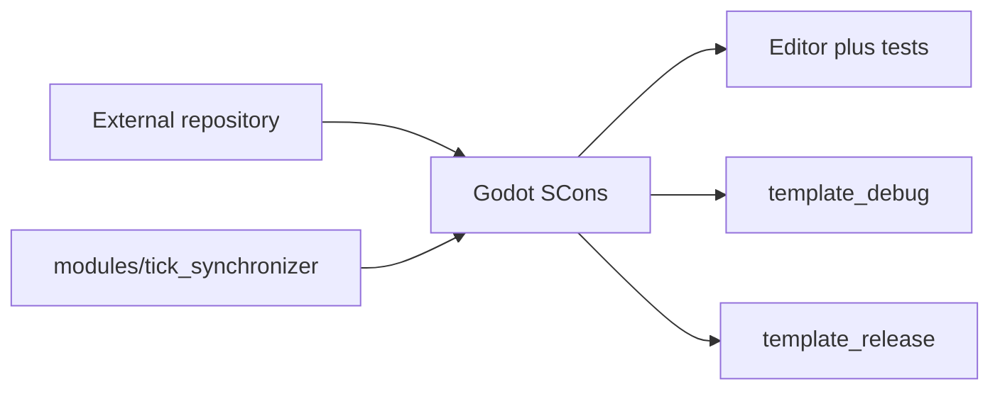

# Building TickSynchronizer

## Supported layouts

TickSynchronizer supports two equivalent Godot module layouts.

### External custom module

```text
workspace/
├── godot/
└── tick_synchronizer/
```

Use `custom_modules=../tick_synchronizer` from the Godot source tree.

### In-tree module

```text
godot/modules/tick_synchronizer/
```

Build normally without `custom_modules`. `SCsub`, `config.py`, includes, and scripts must remain valid in both layouts.

`build_and_validate.sh` auto-detects this layout from its own location, selects the Godot root two directories above the module, and omits the `custom_modules` SCons argument. In the external layout it computes the relative custom-module path automatically. `--godot-dir` and `--custom-modules` remain available for explicit overrides.



## Baseline checks

The build scripts verify:

- Godot `4.7.1-stable` and the exact `GODOT_COMMIT`;
- a clean engine source tree unless explicitly overridden for diagnosis;
- in the in-tree layout, changes under `modules/tick_synchronizer` are treated as module sources while all other engine changes remain forbidden;
- the central version contract;
- source, binding, XML, test, manifest, and documentation consistency;
- the requested precision and artifact identity.

## Version queries

```bash
./scripts/build_and_validate.sh --print-script-api-version
./scripts/build_and_validate.sh --print-api-version
./scripts/build_and_validate.sh --print-wire-protocol-version
./scripts/build_and_validate.sh --print-wire-protocol-revision
./scripts/build_and_validate.sh --print-benchmark-suite-version
./scripts/build_and_validate.sh --print-version-contract
```

## Main validation commands

Fast editor cycle:

```bash
./scripts/build_and_validate.sh --mode quick --precision double --jobs 45
```

Complete matrix:

```bash
./scripts/build_and_validate.sh --mode all --precision double --jobs 45
./scripts/build_and_validate.sh --mode all --precision single --jobs 45
```

`--mode all` builds the editor, runs filtered C++ tests, runs the GDScript smoke project, and builds both templates.

## Manual SCons examples

External editor build:

```bash
cd ../godot
scons platform=linuxbsd \
    target=editor \
    dev_build=yes \
    tests=yes \
    precision=double \
    custom_modules=../tick_synchronizer \
    module_tick_synchronizer_enabled=yes \
    -j45
```

In-tree editor build:

```bash
cd godot
scons platform=linuxbsd \
    target=editor \
    dev_build=yes \
    tests=yes \
    precision=double \
    module_tick_synchronizer_enabled=yes \
    -j45
```

## Current validated baseline

The wire revision 2 baseline passes in both `single` and `double`:

- 140 C++ test cases;
- 66,999 assertions;
- normal editor smoke test;
- `template_debug`;
- `template_release`.

The module-focused ASAN and UBSAN suites also pass all 140 tests and 66,999
assertions in both precisions with the accepted `--no-smoke` profile.

## Sanitizers

Use the wrapper to keep the accepted Clang/LLD and suppression contracts consistent:

```bash
./scripts/run_sanitized_tests.sh double --jobs 45 --no-smoke
./scripts/run_sanitized_tests.sh single --jobs 45 --no-smoke
```

The module C++ suites pass. The sanitized full editor smoke remains blocked by a known UBSAN diagnostic in Godot 4.7.1 bundled SDL/HIDAPI startup. The diagnostic occurs outside TickSynchronizer and does not permit broad suppressions.

## Module build ID

A clean tree uses the exact module Git commit as its compatibility identity. A dirty tree receives a deterministic fingerprint based on HEAD, the diff, and unignored untracked files. The handshake requires this exact module build identity while wire version 0 remains experimental. Godot source qualification still uses the exact baseline commit, while peer compatibility requires the canonical complete Godot version and reports a commit mismatch as a warning.

## Standalone benchmarks

```bash
./scripts/build_protocol_benchmarks.sh --precision all --jobs 45
./scripts/run_protocol_benchmarks.sh --list-cpus
read -r -p "Linux logical CPU: " LINUX_CPU
./scripts/run_protocol_benchmarks.sh \
    --precision all --quick --cpu "$LINUX_CPU" --no-build
```

Official runs require a clean tree:

```bash
./scripts/run_protocol_benchmarks.sh \
    --precision all --cpu "$LINUX_CPU" --no-build
```

## Cross-platform benchmark builds

`benchmarks/SConstruct` is the only standalone benchmark compilation graph. Its explicit platform and toolchain arguments keep Linux, Windows, and Android outputs isolated while compiling the same sources, datasets, candidate, and methodology.

Windows x86_64 cross-build on Linux:

```bash
sudo apt install scons gcc-mingw-w64-x86-64 g++-mingw-w64-x86-64 zip
./scripts/build_protocol_benchmarks_windows_cross.sh \
    --toolchain mingw-gcc \
    --precision all \
    --jobs 45 \
    --clean-first
```

The cross-build automatically creates an execution-only deployment ZIP. Copy it to the Windows machine, where only PowerShell is required:

```powershell
powershell -ExecutionPolicy Bypass -File .\run_protocol_benchmarks_windows.ps1 `
    -ListCpus
[int]$WindowsCpu = Read-Host "Primary-thread flat CPU index"
powershell -ExecutionPolicy Bypass -File .\run_protocol_benchmarks_windows.ps1 `
    -Precision all `
    -Cpu $WindowsCpu `
    -Quick
```

Android ARM64:

```bash
export ANDROID_SDK_ROOT="$HOME/Android/Sdk"
export ANDROID_NDK_HOME="$ANDROID_SDK_ROOT/ndk/28.1.13356709"
export ANDROID_NDK_ROOT="$ANDROID_NDK_HOME"
export PATH="$ANDROID_SDK_ROOT/platform-tools:$PATH"
./scripts/build_protocol_benchmarks_android.sh \
    --precision all \
    --jobs 45 \
    --export-package
./scripts/run_protocol_benchmarks_android.sh --serial SERIAL --list-cpus
```

The pinned Ubuntu SDK and NDK bootstrap procedure is documented in
`BENCHMARKS.md`. The Android build uses the target-specific NDK Clang driver
for `arm64-v8a`, produces a PIE executable, and links static libc++. The
Windows build uses MinGW-w64 or LLVM-MinGW and links compiler runtimes
statically. Binary inspection rejects incorrect architectures and shared
compiler runtimes.

Native Linux packages can be exported at build time:

```bash
./scripts/build_protocol_benchmarks.sh \
    --precision all \
    --jobs 45 \
    --export-package
```

Linux and Android packages contain the execution-only shell runner and report verifier. The Windows package contains prebuilt PE executables and its PowerShell runner. Each runner verifies the package SHA-256 manifest before execution. Test machines never need a compiler, SCons, target SDK/NDK, Git checkout, or project source. An Android controller still requires ADB, but the Android device receives only the native executable and generated launcher.

## Host temporary directories

Scripts that require host-side temporary storage use the sibling `../tick_synchronizer_tmp` directory. Set `TICKSYNC_TEMP_DIR` to select another safe host location. `/tmp` and its descendants are rejected. `/data/local/tmp` remains reserved for remote ADB deployment on Android devices.

## I/O failure policy

An I/O or filesystem error invalidates the affected build or qualification
run. Discard its generated objects, executables, reports, and SCons state, then
rebuild cleanly on healthy writable storage. A source-only archive has no Git
provenance and cannot produce an official benchmark report by itself.

## Reports

Build reports are written under `build_reports/`; benchmark reports are written under `benchmark_reports/`. Generated reports and binaries are not source files and must remain ignored.

## Cleanup

Use `--clean-first` when stale artifacts could affect identification. Do not routinely clean every target when incremental compilation is valid and artifact selection is unambiguous.
