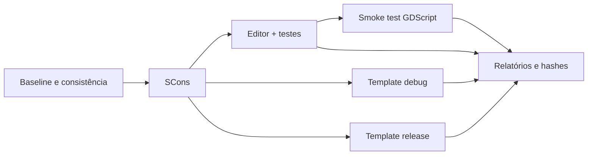

# Compilação do TickSynchronizer

## Organização




```text
workspace/
├── godot/
└── tick_synchronizer/
```

O código compilável do módulo está sob `src/`; somente o glue convencional de
registro e SCons permanece na raiz. `SCsub` compila explicitamente
`src/public/*.cpp` e `src/protocol/*.cpp`.

O módulo é carregado com:

```text
custom_modules=../tick_synchronizer
```

A baseline é validada por `GODOT_VERSION`, `GODOT_COMMIT` e pelo estado limpo
da árvore da engine.

## Verificação de consistência do source

Antes de compilar, execute quando estiver substituindo arquivos ou extraindo um
novo pacote:

```bash
./scripts/verify_source_consistency.sh
```

O `build_and_validate.sh` também executa essa verificação automaticamente. Ela
impede que testes/documentação de uma revisão sejam compilados contra headers ou
fontes de outra revisão.

Resultado esperado:

```text
TICKSYNCHRONIZER_SOURCE_CONSISTENCY_OK methods=41 tests=98
TICKSYNCHRONIZER_MERMAID_OK diagrams=<N> files=<N> renderer=static
```


## Module build ID

Para calcular a identidade determinística de 20 bytes usada pelo handshake:

```bash
./scripts/compute_module_build_id.py --format json
```

Em uma árvore limpa, o ID é o Git HEAD exato. Em uma árvore suja, o script usa
HEAD, diff binário e arquivos não ignorados, sem timestamp, hostname ou caminho
absoluto. O valor será consumido pela futura camada de sessão.

## Pipeline rápido

```bash
cd /mnt/DATA/COMPILATIONS/tick_synchronizer
./scripts/build_and_validate.sh --mode quick --precision double
```

Executa:

- editor com `tests=yes`;
- testes C++ do módulo;
- smoke test GDScript;
- relatório e hashes.

## Pipeline completo

```bash
./scripts/build_and_validate.sh --mode all --precision double
```

Executa também `template_debug` e `template_release`.

Para precisão simples:

```bash
./scripts/build_and_validate.sh --mode all --precision single
```

## Builds manuais

### Editor

```bash
cd ../godot
scons \
  platform=linuxbsd \
  target=editor \
  dev_build=yes \
  tests=yes \
  precision=double \
  custom_modules=../tick_synchronizer \
  module_tick_synchronizer_enabled=yes \
  -j"$(nproc)"
```

### Template debug

```bash
scons \
  platform=linuxbsd \
  target=template_debug \
  precision=double \
  custom_modules=../tick_synchronizer \
  module_tick_synchronizer_enabled=yes \
  -j"$(nproc)"
```

### Template release

```bash
scons \
  platform=linuxbsd \
  target=template_release \
  precision=double \
  custom_modules=../tick_synchronizer \
  module_tick_synchronizer_enabled=yes \
  -j"$(nproc)"
```

## Sanitizers

O perfil padrão executa duas passagens independentes:

```bash
./scripts/run_sanitized_tests.sh double
```

### Passagem ASAN

```text
target=editor
tests=yes
dev_build=no
optimize=debug
debug_symbols=yes
use_llvm=yes
linker=lld
use_asan=yes
use_ubsan=no
use_static_cpp=no
module_raycast_enabled=no
accesskit=no
```

### Passagem UBSAN

```text
target=editor
tests=yes
dev_build=no
optimize=debug
debug_symbols=yes
use_llvm=no
linker=lld
use_asan=no
use_ubsan=yes
use_static_cpp=no
module_raycast_enabled=no
accesskit=no
```

A separação evita dois problemas independentes do Godot 4.7.1 e do toolchain:

- ASAN+UBSAN com GCC/GNU BFD pode exceder a faixa de relocações do editor
  monolítico;
- Clang pode estar instalado sem o componente C++ do runtime UBSAN, gerando
  símbolos indefinidos como `__ubsan_vptr_type_cache`.

O script faz preflight real de compilação, link e execução para cada runtime
antes de iniciar o SCons.

Para precisão simples:

```bash
./scripts/run_sanitized_tests.sh single
```

Opções:

```text
--split            duas passagens independentes; padrão
--asan-only        somente ASAN/Clang/LLD
--ubsan-only       somente UBSAN/GCC/LLD
--combined         ASAN+UBSAN juntos com Clang/LLD; diagnóstico
--llvm             força Clang/LLD para todas as passagens; diagnóstico
--gcc              força GCC/LLD para todas as passagens; diagnóstico
--full-engine      inclui raycast/Embree
--dev-build        restaura dev_build=yes
--static-cpp       restaura o runtime C++ estático
--clean-first      limpa cada configuração antes do build
--no-godot-ubsan-suppressions
                   desativa a supressão engine-level estrita; diagnóstico
```

## Compatibilidade entre scripts

Antes de chamar o pipeline, `run_sanitized_tests.sh` exige a API `4` de
`build_and_validate.sh`:

```bash
./scripts/build_and_validate.sh --print-api-version
```

Resultado esperado:

```text
4
```

Se a versão for diferente ou a opção não existir, substitua os dois scripts ou
extraia novamente o ZIP completo. Não copie apenas um wrapper isoladamente.


### Validação do artefato sanitizado

Para builds normais, o pipeline executa `--version` como prova rápida de inicialização.
Para builds sanitizados, essa execução separada foi removida: inicialização de um editor
monolítico instrumentado pode exceder o timeout curto ou produzir diagnósticos de
encerramento sem relação com o módulo. O pipeline valida estruturalmente o ELF e suas
dependências dinâmicas e usa os testes C++ filtrados e o smoke test como validação
obrigatória de execução. Falhas estruturais imprimem automaticamente as últimas linhas
do log de validação.

A opção `--stack-use-after-return` do wrapper habilita
`detect_stack_use_after_return=1` somente quando essa investigação adicional for
necessária, pois aumenta o custo de execução do ASAN.

O wrapper acrescenta `detect_invalid_pointer_pairs=0` ao `ASAN_OPTIONS` padrão.
O build do Godot habilita instrumentação `pointer-compare` e `pointer-subtract`,
mas a engine 4.7.1 usa comparação de endereços para ordenar `StringName`. Ativar
a checagem em runtime aborta no setup central da engine antes da suíte filtrada.
Isso não desabilita detecção de OOB, use-after-free, double-free ou demais erros
normais do ASAN. Para reproduzir a incompatibilidade deliberadamente:

```bash
./scripts/run_sanitized_tests.sh double --asan-only --invalid-pointer-pairs
```

### Supressão UBSAN específica do Godot 4.7.1

O setup interno de testes não carrega um projeto antes de inicializar extensões.
Com `project_data_dir_name` vazio, `String::append_utf32_unchecked()` chama
`memcpy` com origem nula e tamanho zero. GCC UBSAN reporta
`nonnull-attribute` antes de qualquer teste TickSynchronizer. O perfil padrão
usa:

```text
scripts/sanitizer_suppressions/godot-4.7.1-ubsan.supp
nonnull-attribute:core/string/ustring.cpp
```

A supressão não cobre outros checks, outros arquivos da engine ou qualquer
arquivo do módulo. Todos permanecem fatais com `halt_on_error=1`. Para reproduzir
a ocorrência sem supressão:

```bash
./scripts/run_sanitized_tests.sh double --ubsan-only --no-godot-ubsan-suppressions
```

## Relatórios

Cada execução cria:

```text
build_reports/<data>-<plataforma>-<precisão>-<modo>/
```

Os relatórios incluem ambiente, commit, branch, comandos, logs, tempos,
artefatos, versões e SHA-256.

## Limpeza

Use `--clean-first` apenas quando opções globais, headers ou toolchain mudarem:

```bash
./scripts/build_and_validate.sh --mode quick --precision double --clean-first
```

Builds incrementais são preferíveis para alterações comuns em `.cpp`.
