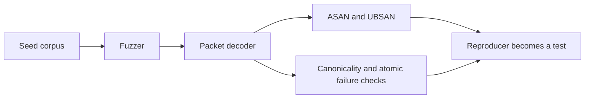

# Fuzzing and sanitizers

## Current state

The binary buffer and control packet decoder have deterministic unit tests, malformed-input tests, golden vectors, ASAN coverage, and UBSAN coverage for module code. A dedicated fuzz target is still pending.

## Activation point

The packet-security gate must be complete before an external transport can deliver untrusted bytes to gameplay logic. Fuzzing becomes mandatory at that boundary.

## Future fuzz target requirements

- run without `SceneTree`, rendering, SDL, or network initialization;
- decode bounded byte spans directly;
- exercise header inspection, packet decoding, handshake payloads, and canonical scalar codecs;
- apply strict per-input resource limits;
- preserve output objects on failure;
- expose stable reproducer files.

## Initial corpus

The corpus should include:

- every golden vector;
- empty and one-byte inputs;
- truncated headers and payloads;
- oversized length declarations;
- non-zero reserved fields;
- invalid precision and packet types;
- non-canonical varints;
- invalid padding;
- capability and identity mismatches;
- previously discovered regressions.

## Priority invariants

- no out-of-bounds access;
- no integer overflow in size calculations;
- no allocation before validated limits;
- no partial output mutation on error;
- no acceptance of non-canonical encodings;
- deterministic result for identical input.
