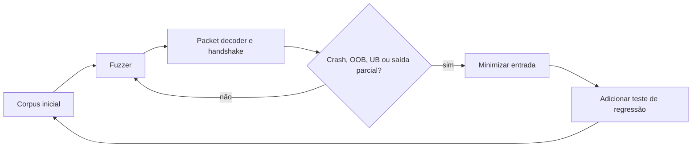

# Fuzzing e sanitizers

## Estado atual

A suíte inclui um teste de estresse determinístico com seed fixa. Ele executa
milhares de escritas e leituras com larguras de 1 a 64 bits e verifica
round-trip, limites, igualdade e hash.

Esse teste melhora cobertura e reprodutibilidade, mas não substitui um fuzzer
geracional.

## Resultado sanitizado da fundação

- ASAN completo aprovado em `single` e `double`.
- UBSAN dos testes C++ do módulo aprovado em `single` e `double`.
- O smoke UBSAN completo da engine encontra diagnósticos em SDL/HID, fora do
  TickSynchronizer.

A fundação não fica bloqueada por esse caminho externo.

## Momento correto para o fuzzing




O packet decoder e o avaliador puro de handshake agora existem. Um fuzz-smoke
local auxilia a revisão, mas o fuzz target versionado torna-se obrigatório no
Gate P1, antes de bytes fornecidos por outro processo ou máquina chegarem ao
protocolo.

Antes desse ponto, um fuzzer exercitaria principalmente primitivas já cobertas
por golden vectors e pelo estresse determinístico. Depois desse ponto, ele passa
a proteger limites de alocação, campos de tamanho, varints, versões e tipos de
pacote controlados por peers.

## Requisitos do futuro fuzz target

O harness deverá:

1. receber bytes arbitrários e tamanho lógico em bits;
2. aplicar limite pequeno e fixo antes de iniciar a leitura;
3. decodificar header, HELLO, HELLO_ACK e payload length sem rede ou relógio;
4. nunca alocar proporcionalmente a valor ainda não validado;
5. tratar entrada inválida como resultado normal;
6. falhar apenas em crash, OOB, UB, leak ou violação de invariantes;
7. armazenar corpus mínimo e regressões no repositório;
8. executar em `single` e `double` quando o formato depender da precisão;
9. executar com ASAN e UBSAN em passagens independentes;
10. preservar seed e entrada que reproduzem cada falha.

## Corpus inicial obrigatório

- headers válidos mínimos;
- todos os packet types conhecidos;
- packet type desconhecido;
- cada truncamento possível do header;
- payload declarado maior que o disponível;
- payload declarado acima do limite;
- varints overlong e overflow;
- versões incompatíveis;
- precisão e identidades incompatíveis;
- capabilities obrigatórias ausentes;
- nonce e ACK negociado incorretos;
- flags reservadas;
- bytes de padding não canônicos.

## Invariantes prioritárias

- cursor nunca ultrapassa `bit_size`;
- falha não avança cursor nem expõe saída parcial;
- tamanho e capacidade nunca excedem `max_size_bytes`;
- nenhuma alocação ocorre antes da validação de tamanho;
- formas varint inválidas não são aceitas;
- bytes canônicos são estáveis;
- pacote rejeitado não altera estado da sessão;
- buffers iguais possuem o mesmo hash;
- hash igual não substitui comparação completa.

## Sanitizers no Gate P1

O gate executará:

```bash
./scripts/run_sanitized_tests.sh double
./scripts/run_sanitized_tests.sh single
```

O smoke UBSAN completo da engine será reavaliado nesse marco. Se SDL/HID ainda
bloquear a execução, a solução deverá usar opção oficial de build para isolar o
subsistema ou um harness do módulo que não inicialize componentes não
relacionados. Novas supressões amplas não são aceitáveis.
