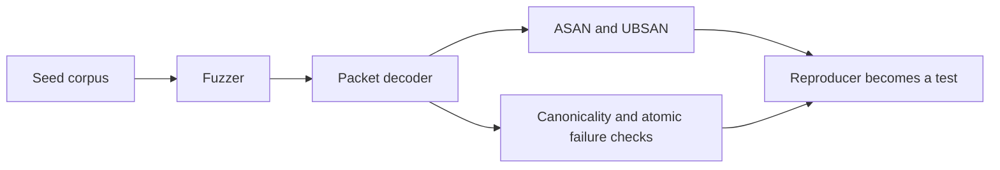

# Fuzzing and sanitizers

## Coverage boundary

The binary buffer and control packet decoder require deterministic unit tests,
malformed-input tests, golden vectors, ASAN coverage, and UBSAN coverage. A
dedicated fuzz target becomes mandatory at the external-traffic boundary.

```mermaid
flowchart LR
    Corpus[Seed corpus] --> Mutator[Fuzzer]
    Mutator --> Decoder[Packet decoder]
    Decoder --> Sanitizers[ASAN and UBSAN]
    Decoder --> Invariants[Canonicality and atomic failure checks]
    Sanitizers --> Regression[Reproducer becomes a test]
    Invariants --> Regression
```

## Activation point

The packet-security gate must be complete before an external transport can deliver untrusted bytes to gameplay logic. Fuzzing becomes mandatory at that boundary.

## Fuzz target requirements

- run without `SceneTree`, rendering, SDL, or network initialization;
- decode bounded byte spans directly;
- exercise header inspection, packet decoding, handshake payloads, and canonical scalar codecs;
- apply strict per-input resource limits;
- preserve output objects on failure;
- expose stable reproducer files.

## Initial corpus

The corpus should include:

- every golden vector;
- empty and one-byte inputs;
- truncated headers and payloads;
- oversized length declarations;
- non-zero reserved fields;
- invalid precision and packet types;
- non-canonical varints;
- noncanonical quiet/signaling NaN payloads in both scalar widths;
- ULEB128 overflow, truncated continuation, and narrow-field overflow;
- invalid padding;
- capability and identity mismatches;
- previously discovered regressions.

## Priority invariants

- no out-of-bounds access;
- no integer overflow in size calculations;
- no allocation before validated limits;
- no partial output mutation on error;
- no acceptance of non-canonical encodings;
- deterministic result for identical input.

Suite 2 candidate self-tests currently exercise these invariants under combined
ASAN and UBSAN in both precisions. They reduce risk before the dedicated fuzzer
exists, but they do not replace the packet-security fuzz gate.

The integrated Godot ASAN gate keeps LeakSanitizer enabled. One exact
Godot 4.7.1 SDL joypad function rule is allowed only because the same allocation
set was reproduced with an exact-commit binary that did not contain
TickSynchronizer. A SCons-built unrelated leak must remain fatal before the
rule can be used. This external engine rule does not apply to standalone
candidate code, and no suppression may match module or benchmark sources.
