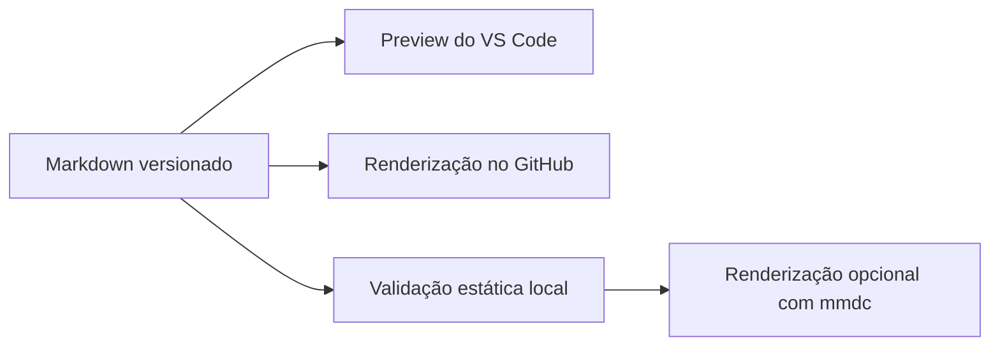

# Diagramas Mermaid na documentação

## Objetivo

A documentação usa blocos Markdown cercados com o identificador de linguagem
`mermaid`. A primeira linha interna declara o tipo do diagrama, como
`flowchart LR` ou `sequenceDiagram`.

O formato permanece legível como texto, é versionável no Git e é renderizado
nativamente pelo GitHub e pelo preview Markdown das versões atuais do VS Code.

## Subconjunto adotado

Para reduzir diferenças entre renderizadores, o projeto usa inicialmente apenas:

- `flowchart` para arquitetura, pipelines e decisões;
- `sequenceDiagram` para interações temporais;
- `stateDiagram-v2` para máquinas de estado;
- `classDiagram` para relações estruturais entre tipos.

Tipos Mermaid mais novos podem ser adotados depois de confirmada a renderização
nas versões mínimas de GitHub e VS Code suportadas pelo projeto.



## Convenções

- Um diagrama deve complementar o texto, nunca substituí-lo.
- Identificadores internos usam ASCII; rótulos podem usar português.
- Diagramas devem permanecer pequenos o suficiente para leitura no GitHub.
- Não usar URLs, scripts, HTML ou conteúdo externo dentro do Mermaid.
- Alterações arquiteturais devem atualizar texto e diagrama no mesmo commit.
- Evitar temas ou diretivas específicas do renderer para manter portabilidade.

## Validação

A verificação padrão é:

```bash
./scripts/verify_mermaid_diagrams.py
```

Ela confirma:

- fechamento correto dos blocos;
- tipo de diagrama pertencente ao subconjunto aprovado;
- quantidade mínima de diagramas versionados.

Quando o Mermaid CLI estiver instalado, também é possível renderizar cada bloco:

```bash
./scripts/verify_mermaid_diagrams.py --render-if-available
```

A validação é integrada a `verify_source_consistency.sh`.

## Compatibilidade

O GitHub renderiza blocos `mermaid` diretamente em arquivos Markdown. O VS Code
atual também renderiza Mermaid no preview integrado. Em versões antigas do VS
Code, pode ser necessária a extensão `Markdown Preview Mermaid Support`; essa
extensão não é recomendada por padrão no repositório porque o suporte já faz
parte do editor atual.


## Referências

- [Markdown no VS Code](https://code.visualstudio.com/docs/languages/markdown)
- [Diagramas Mermaid no GitHub](https://docs.github.com/en/get-started/writing-on-github/working-with-advanced-formatting/creating-diagrams)
- [Referência de sintaxe Mermaid](https://mermaid.js.org/intro/syntax-reference.html)
