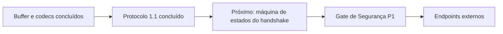

# Estado atual do projeto

Atualizado em: 2026-07-30



## Baseline

- Godot `4.7.1-stable` no commit `a13da4feb8d8aefc283c3763d33a2f170a18d541`.
- Engine sem alterações.
- Módulo externo por `custom_modules=../tick_synchronizer`.
- SCons e C++17.
- `double` como padrão; `single` suportada e testada.
- Código próprio organizado sob `src/`; glue de registro permanece na raiz.

## Marco concluído e commitado

A fundação do buffer, o envelope de controle 1.1 e a negociação estrita de
compatibilidade foram aprovados em `single` e `double`:

```text
98 test cases passed
25723 assertions passed
TICKSYNCHRONIZER_PROTOCOL_SMOKE_TEST_OK
TICKSYNCHRONIZER_SMOKE_TEST_OK
```

Editor, `template_debug` e `template_release` foram aprovados nas duas
precisões. O commit lógico da identidade e negociação do handshake foi concluído.

## Organização e documentação

- fontes C++ em `src/public`, `src/protocol` e `src/internal`;
- `register_types.h/.cpp`, `SCsub` e `config.py` na raiz por integração Godot;
- diagramas Mermaid versionados nas páginas arquiteturais;
- configuração Markdown compartilhável em `.vscode/`;
- validação Mermaid integrada ao preflight de consistência.

## Política v0.x

Versões minor diferentes continuam incompatíveis. Capabilities não permitem
aceitar uma versão diferente. Identidade, precisão e requisitos são estritos.

## Sanitizers

- ASAN completo aprovado na fundação em `single` e `double`;
- UBSAN aprovado nos testes C++ do módulo;
- smoke UBSAN completo da engine adiado para o Gate P1 devido a SDL/HID;
- Gate P1 permanece obrigatório antes de endpoints externos.

## Próximo lote funcional

Implementar a máquina de estados pura do handshake e os eventos necessários à
futura `SyncSession`, ainda sem transporte externo.
