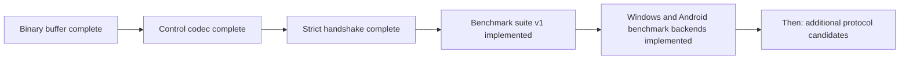

# Current project state



## Baseline

- Godot `4.7.1-stable`.
- C++17; SCons is the only compilation system for the module and standalone Linux, Windows, and Android benchmarks.
- The complete wire revision 2 Godot matrix is validated on Linux x86_64 in
  both precisions.
- `single` and `double` supported.
- external and in-tree module layouts supported.
- MIT license, Copyright (c) 2026 Malkverbena.

## Version contract

```text
script_api=5
api=4
wire=0
wire_revision=2
benchmark_suite=1
wire_stable=no
exact_build_match=yes
```

## Implemented

- five public Godot classes and 41 documented methods;
- canonical `PackedByteArray` bitstream;
- fixed integer, canonical varint/ZigZag, `float32`, and `float64` codecs;
- sticky errors, atomic failure semantics, equality, hashing, and resource limits;
- 40-byte control envelope;
- HELLO v4, HELLO_ACK v4, and structured disconnect payloads;
- pure handshake evaluator and pure handshake state machine;
- exact canonical Godot version, module, game, schema, capability, precision,
  API, and wire compatibility checks;
- diagnostic Godot commit comparison with a structured warning on mismatch;
- 140 C++ test cases in the current source;
- standalone deterministic benchmark suite version 1;
- fixed-width reference candidate and seven datasets;
- cross-platform provenance report schema 3;
- native CPU topology discovery and directed L3-domain selection for multi-CCD qualification;
- precision-separated report comparison with unambiguous report identities;
- quick native Linux qualification in both precisions with requested and applied affinity;
- extracted Linux execution-only package qualification without source or build tools;
- quick Windows x86_64 qualification across distinct L3 domains;
- quick Android ARM64 qualification across multiple device and core classes.

## Current Godot validation baseline

The current wire revision 2 source passed the complete normal matrix in both
`double` and `single` precision:

- editor build with `tests=yes`;
- 140/140 TickSynchronizer C++ tests;
- 66,999/66,999 assertions;
- all required GDScript smoke markers;
- `template_debug`;
- `template_release`.

The module-focused sanitizer matrix also passed in both precisions with 140
tests and 66,999 assertions. Sanitized editor smoke remains excluded only by
the accepted external SDL/HIDAPI diagnostic described below.

## Known external sanitizer issue

The current revision 2 TickSynchronizer C++ matrix passes under the accepted
module-focused ASAN and UBSAN profiles in both precisions. The full sanitized
Godot editor smoke remains blocked by an UBSAN diagnostic in bundled SDL/HIDAPI
initialization. The stack does not enter TickSynchronizer. Normal smoke tests
remain mandatory and pass in both precisions.

## Current benchmark status

The available quick platform matrix is complete under report schema 3:

- Linux x86_64 covered distinct L3 domains;
- Windows x86_64 covered distinct L3 domains with native topology recorded;
- Android ARM64 covered recent and older devices across exposed efficiency,
  performance, and prime core classes under controlled power settings.

Every selected run passed the native self-test, seven datasets, schema 3
validation, requested affinity, and the malformed corpus with 27 rejected and
zero accepted packets. Linux, Windows, and Android share one SCons compilation
graph and the same methodology. Execution-only deployment packages keep
compilers, SCons, SDKs, Git, and project sources off test machines.

These reports remain preliminary because they were built from a dirty source
tree and record `official=no`. A second Windows x86_64 machine is deferred
until one becomes available. Clean-tree official runs and archival remain
pending.

The production realtime wire protocol remains undecided.

## Next logical work unit

1. review the complete source diff and create one logical commit only
   after all applicable gates are accepted;
2. regenerate clean-tree Linux, Windows, and Android artifacts and official
   affinity-pinned reports;
3. qualify a second Windows x86_64 machine when it becomes available;
4. keep the varint candidate deferred until the current qualification gate is
   explicitly closed;
5. decide separately whether macOS should be promoted from deferred platform
   work, with an ADR before implementation.
