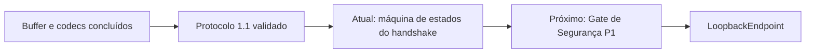

# Estado atual do projeto

Atualizado em: 2026-07-30



## Baseline

- Godot `4.7.1-stable` no commit `a13da4feb8d8aefc283c3763d33a2f170a18d541`.
- Engine sem alterações.
- Módulo externo por `custom_modules=../tick_synchronizer`.
- SCons e C++17.
- `double` como padrão; `single` suportada e testada.
- Código próprio organizado sob `src/`; glue de registro permanece na raiz.

## Marco validado e commitado

A fundação do buffer, o envelope de controle 1.1 e a negociação estrita de
compatibilidade foram aprovados em `single` e `double`:

```text
98 test cases passed
25723 assertions passed
TICKSYNCHRONIZER_PROTOCOL_SMOKE_TEST_OK
TICKSYNCHRONIZER_SMOKE_TEST_OK
```

Editor, `template_debug` e `template_release` foram aprovados nas duas
precisões. A migração para `src/` e a documentação Mermaid também foram
validadas e commitadas.

## Lote atual aguardando validação no Godot

Foi implementada a máquina de estados pura do handshake:

- papéis `INITIATOR` e `RESPONDER`;
- estados explícitos de `IDLE` a `CLOSED`;
- `HELLO`, `HELLO_ACK` e `DISCONNECT_REASON` como ações declarativas;
- correlação de `session_id`, nonce, sequence e tick;
- rejeição de mensagens fora de ordem e duplicatas;
- cancelamento local e disconnect remoto;
- resultado estabelecido imutável para a futura sessão;
- conversão pura de ação para `ProtocolPacket`;
- 29 novos testes, elevando a suíte esperada para 127 casos.

A validação local C++17 passou em `single`, `double`, ASAN e UBSAN contra uma
interface mínima. A compilação real na árvore do Godot ainda deve ser executada.

## Política v0.x

Versões minor diferentes continuam incompatíveis. Capabilities não permitem
aceitar uma versão diferente. Identidade, precisão e requisitos são estritos.

Duplicatas de `HELLO` e `HELLO_ACK` são fatais nesta revisão. Retransmissão,
timeout e idempotência serão definidos junto aos requisitos de endpoint.

## Sanitizers

- ASAN completo aprovado na fundação em `single` e `double`;
- UBSAN aprovado nos testes C++ do módulo;
- smoke UBSAN completo da engine adiado para o Gate P1 devido a SDL/HID;
- Gate P1 permanece obrigatório antes de endpoints externos.

## Próximo lote funcional

Depois da validação e commit da máquina de estados, executar o Gate de Segurança
P1 com harness isolado, fuzzing versionado e corpus de packets. Somente depois
iniciar o primeiro endpoint de desenvolvimento: `LoopbackEndpoint`.
