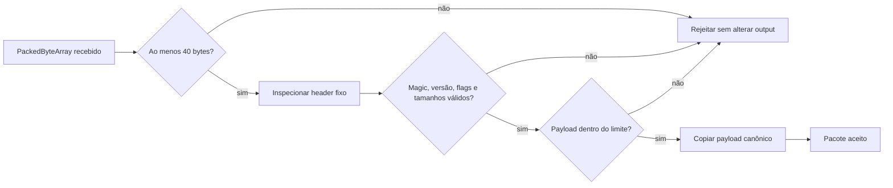
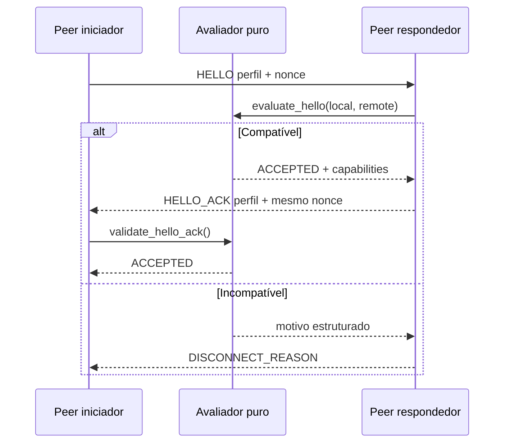
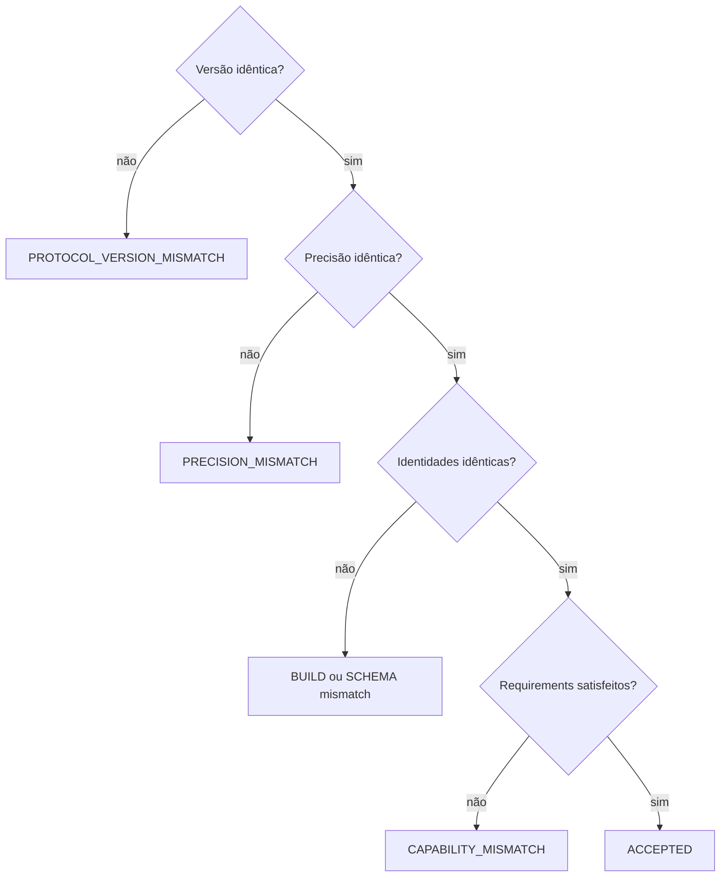

# Protocolo experimental 1.1

## Estado

O protocolo permanece interno, independente de transporte e baseado em
`PackedByteArray`. Nenhum endpoint externo entrega bytes ao decoder nesta fase.

Arquivos principais:

```text
src/protocol/tick_synchronizer_packet_codec.h/.cpp
src/protocol/tick_synchronizer_handshake.h/.cpp
```

## Política v0.x

A compatibilidade é estrita. Os dois peers precisam usar:

- `protocol_major` e `protocol_minor` idênticos;
- mesma precisão;
- mesmo commit do Godot;
- mesmo `module_build_id`;
- mesmo `game_build_id`;
- mesmo `schema_compatibility_id`;
- capabilities obrigatórias satisfeitas nas duas direções.

Capabilities não relaxam a versão durante v0.x.

## Envelope de controle

```text
magic:          TSYN
protocol_major: 1
protocol_minor: 1
header_size:    40 bytes
```

| Offset | Tipo | Campo |
|---:|---|---|
| 0 | `u32` | magic `0x4E595354` |
| 4 | `u8` | protocol major |
| 5 | `u8` | protocol minor |
| 6 | `u8` | packet type |
| 7 | `u8` | header size |
| 8 | `u16` | flags, zero nesta revisão |
| 10 | `u16` | reservado, zero |
| 12 | `u64` | session ID |
| 20 | `u32` | sequence |
| 24 | `u64` | tick |
| 32 | `u32` | payload bytes |
| 36 | `u32` | payload bits |

Todos os inteiros são little-endian e escritos campo a campo.



`inspect_control_header()` lê somente os 40 bytes fixos. Ele exige tamanho
mínimo e magic válido, mas não aceita o pacote nem valida a versão. Sua única
finalidade é permitir um diagnóstico estruturado de versão incompatível sem
copiar payload ou retornar um pacote parcialmente aceito.

## Identidades

### Godot commit

20 bytes contendo o SHA-1 binário exato da baseline do Godot.

### Module build ID

20 bytes. Para uma árvore limpa, é o Git HEAD exato do TickSynchronizer. Para
uma árvore suja, `scripts/compute_module_build_id.py` calcula um fingerprint
determinístico de 20 bytes usando HEAD, diff binário e arquivos não ignorados.

### Game build ID

16 bytes opacos fornecidos pela aplicação. Devem mudar quando o código ou os
dados de gameplay incompatíveis mudarem.

### Schema compatibility ID

16 bytes opacos fornecidos pela aplicação nesta fase. Quando schemas canônicos
forem implementados, este campo será formalmente redefinido ou substituído por
um hash de sua representação canônica.

IDs totalmente zerados são handshakes malformados.

## Capabilities

Cada perfil transporta duas máscaras `u64`:

```text
supported_capabilities
required_capabilities
```

É obrigatório que `required` seja subconjunto de `supported` no próprio perfil.
A conexão só é aceita quando:

```text
local.required  subset remote.supported
remote.required subset local.supported
```

O resultado negociado é a interseção das máscaras suportadas. Bits opcionais
desconhecidos podem ser ignorados; um bit desconhecido marcado como obrigatório
provoca `CAPABILITY_MISMATCH`.

Capabilities atuais:

| Bit | Nome |
|---:|---|
| 0 | `CONTROL_PACKET_V1` |
| 1 | `STRICT_COMPATIBILITY` |
| 2 | `LOGICAL_PAYLOAD_BITS` |

## HELLO v2

Tamanho fixo: 100 bytes.

| Offset | Tamanho | Campo |
|---:|---:|---|
| 0 | 1 | payload version = 2 |
| 1 | 1 | precision |
| 2 | 2 | reservado |
| 4 | 8 | hello nonce, diferente de zero |
| 12 | 20 | Godot commit |
| 32 | 20 | module build ID |
| 52 | 16 | game build ID |
| 68 | 16 | schema compatibility ID |
| 84 | 8 | supported capabilities |
| 92 | 8 | required capabilities |

## HELLO_ACK v2

Tamanho fixo: 108 bytes. Repete o perfil do responder para permitir um
handshake client/server sem depender de um segundo `HELLO` simétrico.

| Offset | Tamanho | Campo |
|---:|---:|---|
| 0 | 1 | payload version = 2 |
| 1 | 1 | precisão do responder/aceita |
| 2 | 2 | reservado |
| 4 | 8 | nonce do HELLO recebido |
| 12 | 88 | perfil de compatibilidade do responder |
| 100 | 8 | capabilities negociadas |

O ACK é aceito somente quando o nonce corresponde e a máscara negociada é
exatamente a interseção calculada localmente.



## DISCONNECT_REASON

Tamanho fixo: 32 bytes.

Além das versões, precisões e peer ID, transporta:

- `identity_field`, indicando qual identidade divergiu;
- `detail_code`, para classificação estrutural;
- `detail_mask`, usado principalmente para capabilities ausentes.

Razões atuais:

```text
PROTOCOL_VERSION_MISMATCH
PRECISION_MISMATCH
CAPABILITY_MISMATCH
GODOT_COMMIT_MISMATCH
MODULE_BUILD_MISMATCH
GAME_BUILD_MISMATCH
SCHEMA_MISMATCH
MALFORMED_HANDSHAKE
HELLO_NONCE_MISMATCH
MALFORMED_PACKET
PAYLOAD_TOO_LARGE
UNSUPPORTED_PACKET_TYPE
```

Mensagens humanas e localização pertencem à futura camada de sessão.

## Avaliador puro

`ProtocolHandshakeEvaluator` não possui transporte, Node, singleton ou estado
global. Ele:

- valida perfis;
- compara identidade e precisão em ordem determinística;
- negocia capabilities;
- produz ACK ou disconnect de forma atômica;
- valida correlação e conteúdo do ACK.

A futura sessão será responsável pela máquina de estados e pelos timeouts.



## Limites e canonicalidade

- limite padrão: 64 KiB por pacote;
- máximo configurável: 1 MiB;
- nenhum payload é copiado antes de validar os tamanhos;
- `payload_size_bytes == ceil(payload_bit_size / 8)`;
- padding final deve ser zero;
- trailing data e truncamento são rejeitados;
- outputs permanecem inalterados em qualquer falha.

## Golden vectors

- `control_hello_v1.bin`: formato legado 1.0, preservado para inspeção e rejeição estrita;
- `control_hello_v2.bin`: formato atual 1.1, 140 bytes.

## Itens adiados

- máquina de estados da sessão;
- timeouts e retransmissão;
- PING/PONG e ECHO;
- janela de sequência/replay;
- cabeçalho realtime compacto;
- endpoints externos;
- schemas canônicos;
- compressão, autenticação e criptografia.
