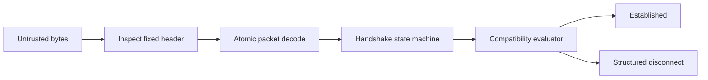
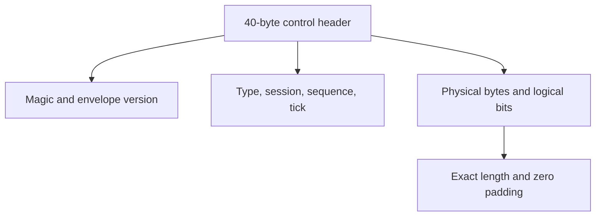
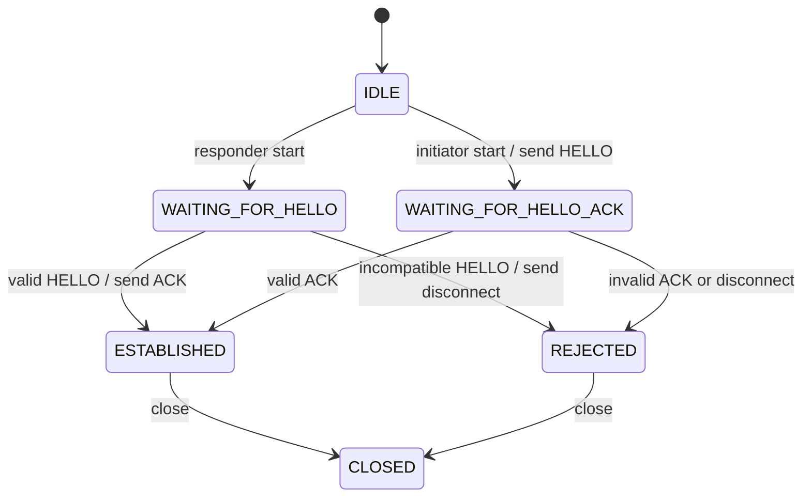
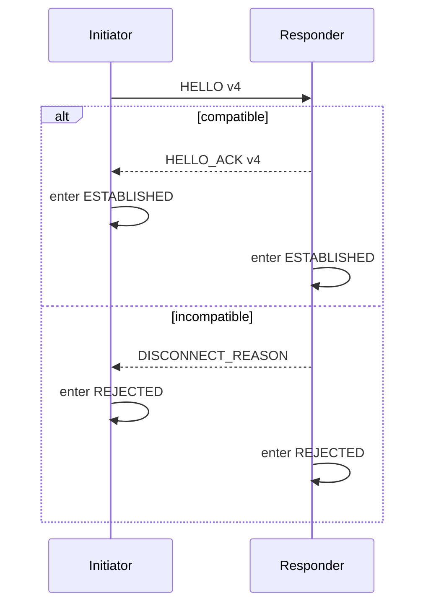

# Experimental wire protocol 0 revision 2

## Status

The current control protocol is experimental. It exists to validate identity, compatibility, packet safety, and handshake ordering before gameplay traffic is implemented.

## Version layers

Do not conflate these values:

- public module API: 4;
- experimental wire protocol: 0;
- experimental wire revision: 2;
- control envelope major/minor: 1.1;
- benchmark suite: 1, never transmitted.

## Control envelope

The fixed control header is 40 bytes and contains:

- magic `TSYN`;
- envelope major/minor;
- packet type;
- header size;
- zero-required flags and reserved fields;
- session ID;
- sequence;
- tick;
- physical payload size;
- logical payload bit size.

All integers are explicit little-endian. Physical payload size must equal `ceil(payload_bit_size / 8)`, and unused padding bits must be zero.

## Compatibility profile

The v4 compatibility profile includes:

1. API version;
2. wire protocol version;
3. wire protocol revision;
4. build precision;
5. canonical complete Godot version;
6. Godot commit SHA-1 for diagnostics;
7. module build ID;
8. game build ID;
9. schema compatibility ID;
10. supported capabilities;
11. required capabilities.

The Godot version is a 32-byte, zero-terminated, zero-padded ASCII field. The
canonical form is `major.minor.patch-status`, for example `4.7.1-stable`. It
deliberately excludes build labels and the Git commit. Characters are limited
to letters, digits, `.`, `-`, `_`, and `+`; at most 31 visible bytes are
available.

The benchmark suite version is intentionally absent from the wire format.

## Identity rules

- The canonical complete Godot version must match exactly.
- A Godot commit mismatch does not reject the peer. It sets the structured
  `GODOT_COMMIT_MISMATCH` warning after all fatal checks pass.
- Module build ID must match exactly during wire version 0.
- Game build and schema IDs are opaque fixed-size identifiers and must match.
- Required capabilities must be supported in both directions.
- Unknown optional capabilities may be ignored.
- Precision mismatch produces `PRECISION_MISMATCH`.

## HELLO v4

HELLO carries the compatibility profile and a correlation nonce. The initiator sends it before any gameplay packet.

HELLO has a fixed size of 144 bytes:

| Offset | Size | Field |
|---:|---:|---|
| 0 | 1 | payload version = 4 |
| 1 | 1 | precision |
| 2 | 2 | zero-required reserved field |
| 4 | 8 | nonzero HELLO nonce |
| 12 | 4 | public API version |
| 16 | 4 | wire protocol version |
| 20 | 4 | experimental wire revision |
| 24 | 32 | canonical complete Godot version |
| 56 | 20 | diagnostic Godot commit SHA-1 |
| 76 | 20 | exact module build ID |
| 96 | 16 | exact game build ID |
| 112 | 16 | exact schema compatibility ID |
| 128 | 8 | supported capabilities |
| 136 | 8 | required capabilities |

## HELLO_ACK v4

HELLO_ACK returns the responder profile, echoes the nonce, and reports acceptance. The initiator validates both compatibility and nonce before entering `ESTABLISHED`.

HELLO_ACK has a fixed size of 152 bytes. Bytes 0 through 143 use the HELLO
layout with the echoed nonce and responder profile; bytes 144 through 151 carry
the exact negotiated capability intersection.

## DISCONNECT_REASON

Structured disconnects provide the reason and relevant observed/expected values without weakening atomic packet decoding.

## Pure evaluator

`ProtocolHandshakeEvaluator` compares profiles and constructs deterministic ACK or disconnect payloads. It has no global state, transport dependency, clock, `Node`, or `SceneTree` dependency.

## State machine

The state machine receives already-decoded control packets and returns declarative actions. It does not send network data itself.

## Error precedence

Compatibility checks follow a deterministic order so diagnostics are stable:

1. profile structure;
2. public API;
3. wire protocol version;
4. experimental wire revision;
5. exact module build identity;
6. precision;
7. exact canonical Godot version;
8. exact game build;
9. exact schema identity;
10. capabilities;
11. diagnostic Godot commit warning.

The commit comparison is diagnostic rather than a compatibility gate. A
same-version custom or patched Godot build can therefore connect, so session
integration must log the warning and preserve both commit values for incident
diagnostics. Exact module and game build checks still reject incompatible peers.

## Golden vectors

Versioned golden packets protect exact envelope and handshake bytes. Any intentional incompatible layout change requires a wire-revision or wire-version review and new golden files.

## Realtime packet format

The 40-byte control envelope is deliberately optimized for auditability rather than realtime overhead. The production gameplay packet format will be selected after benchmark comparisons and may use a different compact header.

## Deferred items

- gameplay packet types;
- snapshots, inputs, acknowledgements, and tick baselines;
- session transport integration;
- protocol minor-version flexibility;
- compression;
- cryptography;
- production schema negotiation.
