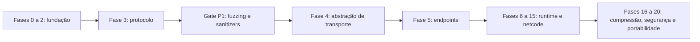

# Roadmap — TickSynchronizer

## Decisões confirmadas

- [x] Godot 4 exclusivamente.
- [x] Desenvolvimento fixado em `Godot 4.7.1-stable`, sem patches na engine.
- [x] Commit do Godot fixado por baseline.
- [x] Build exclusivo por SCons.
- [x] Módulo mantido fora da árvore do Godot.
- [x] Detecção por `custom_modules=../tick_synchronizer`.
- [x] `precision=double` como padrão operacional; `single` também suportada e testada.
- [x] Sem CMake.
- [x] Sem núcleo externo genérico.
- [x] Runtime seguindo padrões internos do engine.
- [x] `PackedByteArray` como buffer canônico.
- [x] Codec binário próprio.
- [x] Little-endian explícito.
- [x] Uma sessão lógica por `TickSynchronizer`.
- [x] Vários endpoints por sessão.
- [x] `SyncTransportEndpoint` como abstração de transporte.
- [x] Autoridade flexível e configurável.
- [x] Métricas ENet e métricas próprias.
- [x] Nomes removidos do wire format em release.
- [x] Linux, Windows e Android no escopo inicial.
- [x] macOS e iOS adiados.
- [x] Web fora do escopo.
- [x] Criptografia adiada.
- [x] Compressão decidida por benchmark.
- [x] Documentação XML após estabilização da API.
- [x] Código C++ organizado sob `src/`, preservando glue Godot na raiz.
- [x] Diagramas Mermaid versionados e preview Markdown reproduzível no VS Code.

## Política de compatibilidade v0.x

Durante a fase experimental, cliente e servidor devem usar:

- mesma release e mesmo commit fixado do Godot `4.7.1-stable`;
- mesmo `protocol_major`;
- mesmo hash de schema;
- mesmo `module_build_id`;
- mesmo `game_build_id`.

O handshake rejeitará incompatibilidades.

---

# Fase 0 — Repositório e baseline

## Objetivos

Criar um ambiente reproduzível antes de escrever o runtime.

## Checklist

- [ ] Criar o repositório GitHub.
- [x] Adicionar `README.md` na raiz.
- [x] Adicionar `documentation/ROADMAP.md`.
- [x] Escolher nome definitivo: `TickSynchronizer`.
- [ ] Escolher licença.
- [x] Preservar atribuição ao projeto original.
- [x] Definir namespace C++: `tick_synchronizer`.
- [x] Definir prefixos de classes públicas: `TickSynchronizer`.
- [x] Definir política de branches.
- [x] Definir padrão de commits.
- [ ] Criar templates de issue e PR.
- [x] Fixar Godot `4.7.1-stable` e seu commit exato.
- [x] Adicionar arquivos `GODOT_VERSION` e `GODOT_COMMIT`.
- [x] Criar script de verificação da baseline do Godot.
- [x] Definir GCC para builds normais Linux; ASAN com Clang + LLD e UBSAN com GCC + LLD no perfil sanitizado.
- [x] Desabilitar `detect_invalid_pointer_pairs` no perfil ASAN de aceitação devido à ordenação por endereço de `StringName` no Godot 4.7.1; manter opção diagnóstica explícita.
- [x] Definir builds de editor, template debug e template release.
- [ ] Criar CI Linux mínima.
- [x] Documentar atualização da baseline.

## Critério de conclusão

O repositório identifica e reproduz o mesmo source do Godot.

---

# Fase 1 — Esqueleto SCons

## Checklist

- [x] Criar `SCsub`.
- [x] Organizar o módulo como repositório externo.
- [x] Documentar `custom_modules=../tick_synchronizer`.
- [x] Documentar `precision=double`.
- [x] Criar `config.py`.
- [x] Criar `register_types.h/.cpp`.
- [x] Separar fontes em `src/public`, `src/protocol` e `src/internal`.
- [x] Versionar `.vscode/` para documentação Markdown reproduzível.
- [x] Integrar validação estática dos diagramas Mermaid.
- [x] Criar `TickSynchronizer`.
- [x] Criar `TickSynchronizerSettings`.
- [x] Criar `TickSynchronizerBuffer`.
- [x] Criar `TickSynchronizerObject`.
- [x] Criar `TickSynchronizerSchema`.
- [x] Registrar classes no `ClassDB`.
- [x] Inicializar no nível `SCENE`.
- [ ] Usar `TOOLS_ENABLED` para editor.
- [ ] Usar `DEBUG_ENABLED` para debug pesado.
- [x] Evitar singleton obrigatório.
- [x] Validar criação/destruição repetidas.
- [x] Compilar editor Linux.
- [x] Compilar template debug Linux.
- [x] Compilar template release Linux.
- [x] Criar smoke test.
- [x] Executar teste de lifecycle.

## Problemas cobertos

- [ ] Lifecycle indefinido.
- [ ] Chamadas virtuais durante destrutores.
- [ ] Dependência de singleton de debugger.
- [ ] Mistura de fontes de teste no build normal.
- [ ] Divergência CMake/SCons.

## Critério de conclusão

Módulo vazio carrega sem warnings próprios, leaks ou crashes.

---

# Fase 2 — `PackedByteArray`, bitstream e varints — concluída

## Checklist

- [x] Armazenamento canônico em `PackedByteArray`.
- [x] Reserva de capacidade.
- [x] Cursor de escrita.
- [x] Cursor de leitura.
- [x] Estado de erro.
- [x] Limite máximo de pacote.
- [x] Limite máximo de campo.
- [x] `write_bits`.
- [x] `read_bits`.
- [x] `write/read_u8`.
- [x] `write/read_u16`.
- [x] `write/read_u32`.
- [x] `write/read_u64`.
- [x] varuint.
- [x] zigzag varint.
- [x] float32 explícito.
- [x] float64 explícito.
- [x] little-endian.
- [x] bit order LSB-first.
- [x] Proibir `memcpy` de structs.
- [x] Golden vectors.
- [x] Round-trip tests.
- [x] Buffer truncado.
- [x] Overflow.
- [x] Varint malformado.
- [x] Igualdade e hash.
- [x] ASAN completo aprovado em `single` e `double`: 47 testes C++ e smoke test GDScript.
- [x] UBSAN aprovado no escopo do módulo em `single` e `double`: 47 testes C++ e 18.091 assertions.
- [x] Diagnósticos UBSAN restantes classificados como externos ao módulo e ocorrendo no setup SDL/HID do Godot.

## Validação não bloqueante adiada

- [ ] Resolver ou isolar o smoke test completo do Godot sob UBSAN antes de aceitar pacotes externos não confiáveis.
- [ ] Reavaliar as supressões e o perfil sanitizado no **Gate de Segurança P1**, após existir um decoder real para fuzzing.

Essa pendência não bloqueia a conclusão da fundação do buffer. O histórico e a justificativa estão no ADR 0021.

## Problemas antigos resolvidos

- [ ] `GdDataBuffer` com ponteiro nulo.
- [ ] Comparação usando `sizeof` incorreto.
- [ ] Vetores serializados incorretamente.
- [ ] Condição invertida em `read_variant`.
- [ ] Dependência de layout nativo.
- [ ] Cópia byte a byte entre containers.

## Critério de conclusão

- Golden vectors e round-trips aprovados nas duas precisões no Linux.
- ASAN completo aprovado nas duas precisões.
- UBSAN dos testes C++ do módulo aprovado nas duas precisões.
- A validação cruzada Windows permanece no marco de portabilidade.

**Status:** concluída para iniciar o protocolo experimental.

---

# Fase 3 — Protocolo experimental

## Checklist

- [x] Magic `TSYN`.
- [x] Cabeçalho de controle fixo de 40 bytes.
- [x] Versão estrita `1.0` no primeiro lote, atualizada para `1.1` ao alterar o handshake.
- [x] `HELLO`, `HELLO_ACK` e `DISCONNECT_REASON`.
- [x] Payload bit length canônico e limites antes de alocação.
- [x] Inspeção segura do header sem aceitar pacote incompatível.
- [x] Commit exato do Godot no handshake.
- [x] Module build ID determinístico.
- [x] Game build ID opaco.
- [x] Schema compatibility ID opaco até a fase de schemas.
- [x] Capabilities suportadas e obrigatórias.
- [x] Negociação bidirecional de requirements.
- [x] Nonce e correlação de `HELLO_ACK`.
- [x] Avaliador puro de compatibilidade.
- [x] Rejeições estruturadas de precisão, identidade, schema e capabilities.
- [x] Golden vectors `control_hello_v1.bin` e `control_hello_v2.bin`.
- [x] Testes de pacote desconhecido, truncado, trailing, oversized e padding.
- [ ] Máquina de estados pura do handshake.
- [ ] Política para HELLO duplicado e ACK inesperado.
- [ ] Timeouts e cancelamento.
- [ ] `PING/PONG`.
- [ ] `ACK` genérico.
- [ ] `ECHO_REQUEST/RESPONSE`.
- [ ] Cabeçalho realtime compacto.
- [ ] Política de sequência, duplicados, reordenação e replay window.
- [ ] Agregação de mensagens.
- [ ] MTU configurável por endpoint.
- [ ] Harness versionado do decoder para fuzzing no Gate P1.

## Estado

O protocolo 1.1, incluindo identidade estrita, capabilities e avaliador puro
do handshake, foi validado e commitado com 98 testes e 25.723 assertions nas
duas precisões. O próximo lote implementará a máquina de estados pura do
handshake.

## Critério de conclusão funcional da fase

A máquina de estados do handshake completa round-trip, rejeita mensagens fora de
ordem e fornece decisões puras para a futura sessão. Pacotes inválidos ou acima
dos limites não alteram estado parcialmente.

---

# Gate de Segurança P1 — antes de dados externos não confiáveis

## Momento de ativação

Este gate é executado **depois que o packet decoder mínimo existir** e **antes
de qualquer endpoint externo entregar bytes de rede ao protocolo**. Até esse
ponto, insistir no smoke test completo da engine sob UBSAN tem baixo retorno,
pois os diagnósticos atuais estão em SDL/HID e não exercitam o decoder.

## Checklist obrigatório

- [ ] ASAN completo em `double` e `single` com todos os testes do packet codec.
- [ ] UBSAN dos testes C++ do packet codec em `double` e `single`.
- [ ] Fuzz target isolado para header, handshake e payload length.
- [ ] Corpus com pacotes válidos, truncados, overlong, oversized e tipos desconhecidos.
- [ ] Regressão automática para todo crash, OOB ou UB encontrado.
- [ ] Nenhuma alocação antes da validação dos limites declarados.
- [ ] Nenhum diagnóstico sanitizado não suprimido dentro de `tick_synchronizer/`.
- [ ] Reavaliar o smoke test completo do Godot sob UBSAN.
- [ ] Se SDL/HID continuar bloqueando o smoke da engine, isolar subsistemas não relacionados por opção oficial de build ou substituir o gate por um harness do módulo que não inicialize esses subsistemas.
- [ ] Registrar em ADR qualquer supressão ainda necessária, limitada por check e arquivo externo.

## Critério de conclusão

A Fase 4 só pode aceitar tráfego de processos ou máquinas externas depois que
este gate estiver aprovado. Loopback com dados gerados internamente pode ser
usado antes disso apenas para desenvolvimento funcional controlado.

---

# Fase 4 — `SyncTransportEndpoint`

## Checklist

- [ ] Contrato de lifecycle.
- [ ] Endpoint config.
- [ ] Capabilities.
- [ ] Send options.
- [ ] Received packet.
- [ ] Canais.
- [ ] Modos de transferência.
- [ ] Source/target peer.
- [ ] Route ID.
- [ ] Polling.
- [ ] Erros.
- [ ] Métricas.
- [ ] Thread model.
- [ ] Ownership.
- [ ] Shutdown idempotente.
- [ ] Sem callback após shutdown.
- [ ] Sem virtual call em destrutor.
- [ ] Endpoint factory.
- [ ] Capability negotiation.
- [ ] Teste de conformidade comum.

## Critério de conclusão

O mesmo protocolo funciona sem alteração em dois endpoints.

---

# Fase 5 — Endpoints candidatos

## Loopback

- [ ] Fila bidirecional.
- [ ] Latência.
- [ ] Jitter.
- [ ] Perda.
- [ ] Duplicação.
- [ ] Reordenação.
- [ ] Corrupção.
- [ ] Limite de banda.
- [ ] Burst loss.
- [ ] Seed determinística.

## SceneMultiplayer RPC

- [ ] Um único `PackedByteArray`.
- [ ] Reliable/unreliable.
- [ ] Canais.
- [ ] Dispatch.
- [ ] Cópias.
- [ ] Source peer.
- [ ] Teste de coexistência.

## SceneMultiplayer raw

- [ ] `send_bytes()`.
- [ ] Consumo de raw packet.
- [ ] Canal e modo.
- [ ] Overhead.
- [ ] Coexistência com SceneMultiplayer.

## MultiplayerPeer

- [ ] `put_packet()`.
- [ ] `get_packet()`.
- [ ] Target peer.
- [ ] Canal.
- [ ] Modo.
- [ ] Poll.
- [ ] Compartilhamento de peer.

## ENet direto

- [ ] Servidor.
- [ ] Cliente.
- [ ] Poll de eventos.
- [ ] Send/receive.
- [ ] Canais.
- [ ] Reliable.
- [ ] Unreliable ordered.
- [ ] Unsequenced experimental.
- [ ] Host metrics.
- [ ] Peer metrics.
- [ ] Bandwidth limits.
- [ ] Disconnect.
- [ ] IPv4.
- [ ] IPv6.
- [ ] Mesh básica.

## Critério de conclusão

Todos os endpoints passam na mesma suíte de conformidade.

---

# Fase 6 — Métricas e telemetria

## Checklist

- [ ] `SyncMetricsAccumulator`.
- [ ] Métricas por sessão.
- [ ] Por endpoint.
- [ ] Por peer.
- [ ] Por rota.
- [ ] Bytes.
- [ ] Pacotes.
- [ ] RTT próprio.
- [ ] RTT ENet.
- [ ] Perda ENet.
- [ ] Jitter próprio.
- [ ] Perda própria.
- [ ] Duplicados.
- [ ] Fora de ordem.
- [ ] Expirados.
- [ ] Encode/decode.
- [ ] Poll.
- [ ] Dispatch.
- [ ] Alocações quando mensuráveis.
- [ ] EWMA.
- [ ] Janelas móveis.
- [ ] Histogramas.
- [ ] p50/p95/p99.
- [ ] Snapshot imutável.
- [ ] Sem alocação no hot path.
- [ ] Consolidação ~10 Hz.
- [ ] UI ~2–4 Hz.

## Critério de conclusão

Relatório separa transporte, protocolo e simulação.

---

# Fase 7 — Profiler e debugger básicos

## Checklist

- [ ] Registrar profiler `network_sync`.
- [ ] Toggle.
- [ ] Tick.
- [ ] Frame data.
- [ ] Custom monitors em `Performance`.
- [ ] Ring buffer.
- [ ] Níveis de log.
- [ ] Packet inspector.
- [ ] JSON.
- [ ] CSV.
- [ ] Formato binário.
- [ ] Nomes apenas em debug/tools.
- [ ] Manifesto externo.
- [ ] Medir overhead do profiler.
- [ ] Painel mínimo do editor.

## Critério de conclusão

Editor exibe RTT, jitter, bytes, pacotes e tempos sem distorcer significativamente o benchmark.

---

# Fase 8 — Benchmark comparativo

## Payloads

- [ ] 8 bytes.
- [ ] 16 bytes.
- [ ] 32 bytes.
- [ ] 64 bytes.
- [ ] 128 bytes.
- [ ] 256 bytes.
- [ ] 512 bytes.
- [ ] 1024 bytes.
- [ ] 1200 bytes.
- [ ] Aleatório.
- [ ] Repetitivo.
- [ ] Input sintético.
- [ ] Snapshot sintético.
- [ ] Trace real futuro.

## Modos

- [ ] Reliable.
- [ ] Unreliable ordered.
- [ ] Unreliable.
- [ ] Canais separados.
- [ ] 10 Hz.
- [ ] 20 Hz.
- [ ] 30 Hz.
- [ ] 60 Hz.
- [ ] 120 Hz experimental.

## Escala

- [ ] 1 peer.
- [ ] 2 peers.
- [ ] 4 peers.
- [ ] 8 peers.
- [ ] 16 peers.
- [ ] Mesh parcial.
- [ ] Full mesh pequeno.

## Rede

- [ ] Latência.
- [ ] Jitter.
- [ ] Perda.
- [ ] Reordenação.
- [ ] Duplicação.
- [ ] Burst loss.

## Plataformas

- [ ] Linux ↔ Linux.
- [ ] Windows ↔ Linux.
- [ ] Android ↔ Linux.

## Metodologia

- [ ] Release build.
- [ ] Debug separado.
- [ ] Warm-up.
- [ ] Seed fixa.
- [ ] Duração mínima.
- [ ] Repetições.
- [ ] Média.
- [ ] Mediana.
- [ ] p95.
- [ ] p99.
- [ ] Desvio.
- [ ] Hardware.
- [ ] Compiler.
- [ ] Flags.
- [ ] Commits.
- [ ] pcap opcional.
- [ ] Markdown report.
- [ ] CSV.
- [ ] Gráficos externos.

## Matriz de decisão

- [ ] Banda.
- [ ] CPU.
- [ ] Latência.
- [ ] Jitter.
- [ ] Estabilidade.
- [ ] Cópias.
- [ ] Alocações.
- [ ] Mesh.
- [ ] Métricas.
- [ ] Integração.
- [ ] Manutenção.
- [ ] Segurança futura.

## Critério de conclusão

Escolha documentada em ADR com dados reproduzíveis.

---

# Fase 9 — Registry, objetos e schemas

- [ ] `TickSynchronizerSchema`.
- [ ] IDs estáveis.
- [ ] Hash de schema.
- [ ] Manifesto debug.
- [ ] Manifesto release.
- [ ] `TickSynchronizerObject`.
- [ ] `ObjectID`.
- [ ] Registro.
- [ ] Remoção.
- [ ] Destruição.
- [ ] Authority peer.
- [ ] Property IDs.
- [ ] Tipos.
- [ ] Quantização.
- [ ] Tolerância.
- [ ] Rewind policy.
- [ ] Replication mode.
- [ ] Frequência.
- [ ] Relevância.
- [ ] Validação no handshake.
- [ ] IDs preservados entre builds.

## Critério de conclusão

Schema mismatch é detectado antes da simulação.

---

# Fase 10 — Simulação offline

- [ ] `SyncSession`.
- [ ] `SyncClock`.
- [ ] `SyncOfflineMode`.
- [ ] Tick configurável.
- [ ] Subticks.
- [ ] Inputs gravados.
- [ ] Simulação.
- [ ] Snapshot.
- [ ] Restore.
- [ ] Reapply.
- [ ] Efeitos visuais separados.
- [ ] Efeitos irreversíveis separados.
- [ ] Ordem estável.
- [ ] RNG de sessão.
- [ ] State hash.
- [ ] Replay offline.

## Critério de conclusão

Mesmo replay produz mesmo hash no mesmo build.

---

# Fase 11 — Cliente-servidor básico

- [ ] `SyncServerMode`.
- [ ] `SyncClientMode`.
- [ ] Input batch.
- [ ] ACK de input.
- [ ] Full snapshot.
- [ ] Delta snapshot.
- [ ] Spawn.
- [ ] Despawn.
- [ ] Authority validation.
- [ ] Connect/disconnect.
- [ ] Full resync.
- [ ] Rate limits.
- [ ] Múltiplos clientes.
- [ ] Cliente atrasado.
- [ ] Reconnect.

## Critério de conclusão

Estado autoritativo corrige cliente de teste.

---

# Fase 12 — Prediction, rollback e reconciliation

- [ ] Histórico de inputs.
- [ ] Histórico de snapshots.
- [ ] Snapshot previsto.
- [ ] Snapshot autoritativo.
- [ ] Tolerância.
- [ ] Divergência.
- [ ] Rollback.
- [ ] Reapply.
- [ ] Confirmação.
- [ ] Descarte de histórico.
- [ ] Limite de rewind.
- [ ] Correção visual.
- [ ] Procedimentos agendados.
- [ ] Efeitos não duplicados.
- [ ] Métricas de rollback.
- [ ] Snapshot diff.
- [ ] Replay da divergência.

## Critério de conclusão

Recupera de latência, perda e divergência sem corrupção.

---

# Fase 13 — Relevância e frequência

- [ ] Sync groups.
- [ ] Relevância por peer.
- [ ] Prioridade.
- [ ] Frequência por objeto.
- [ ] Frequência por propriedade.
- [ ] Frequência por peer.
- [ ] On-change.
- [ ] Always.
- [ ] Trickled.
- [ ] Orçamento de bytes.
- [ ] Distância.
- [ ] Histerese.
- [ ] Starvation prevention.
- [ ] Métricas de omissão.
- [ ] Métricas de atraso por prioridade.

## Critério de conclusão

Objetos prioritários permanecem dentro do orçamento.

---

# Fase 14 — Mesh e múltiplos endpoints

- [ ] `SyncTopologyManager`.
- [ ] Tabela de rotas.
- [ ] Route ID.
- [ ] Endpoint primário.
- [ ] Endpoint reserva.
- [ ] Relay.
- [ ] Full mesh.
- [ ] Partial mesh.
- [ ] Mesh híbrida.
- [ ] Descoberta de rota.
- [ ] Mudança de rota.
- [ ] Dedupe entre rotas.
- [ ] Sequence namespace.
- [ ] Métricas por rota.
- [ ] Authority central.
- [ ] Authority por objeto.
- [ ] Authority por região.
- [ ] Custom policy.
- [ ] Transferência.
- [ ] Revogação.
- [ ] Peer desconectado.
- [ ] Host migration futura.
- [ ] Conflitos.

## Critério de conclusão

Uma sessão usa múltiplos endpoints sem duplicar eventos.

---

# Fase 15 — Determinismo avançado

- [ ] Auditoria de não determinismo.
- [ ] RNG com seed.
- [ ] Ordem estável.
- [ ] Scheduler determinístico.
- [ ] Fixed-point experimental.
- [ ] Quantização interna.
- [ ] Deterministic islands.
- [ ] Colisão cinemática própria.
- [ ] State hash por objeto.
- [ ] State hash global.
- [ ] Checkpoints.
- [ ] Golden replays cross-platform.
- [ ] Windows ↔ Linux.
- [ ] Android ↔ Linux.
- [ ] Avaliar física padrão.
- [ ] Documentar limites.
- [ ] Avaliar lockstep opcional.

## Critério de conclusão

Partes declaradas determinísticas geram hashes idênticos nas plataformas suportadas.

---

# Fase 16 — Compressão

- [ ] Backend none.
- [ ] FastLZ.
- [ ] Range Coder se aplicável.
- [ ] Zstd.
- [ ] Threshold.
- [ ] Minimum savings.
- [ ] Original size.
- [ ] Max decompressed size.
- [ ] Compression bomb protection.
- [ ] CPU benchmark.
- [ ] Tamanho benchmark.
- [ ] Inputs.
- [ ] Snapshots.
- [ ] Full resync.
- [ ] Seleção por packet type.
- [ ] Capability negotiation.
- [ ] Cross-platform.

## Critério de conclusão

Compressão só é usada onde há ganho medido.

---

# Fase 17 — Criptografia futura

## Pré-condições

- [ ] Correções no `cripter`.
- [ ] Testes criptográficos.
- [ ] API estável.
- [ ] Backend mbedTLS disponível.

## Checklist

- [ ] `SyncSecurityBackend`.
- [ ] Backend none.
- [ ] AES-GCM.
- [ ] ChaCha20-Poly1305 opcional.
- [ ] HKDF.
- [ ] Chaves por link.
- [ ] Session keys.
- [ ] Nonce único.
- [ ] Sequence nonce.
- [ ] AAD.
- [ ] Replay window.
- [ ] Key rotation.
- [ ] Auth failure metrics.
- [ ] Zeroização.
- [ ] Test vectors.
- [ ] Negative tests.
- [ ] Tag errada.
- [ ] AAD errado.
- [ ] Ciphertext alterado.
- [ ] Nonce repetido.
- [ ] Mesh.
- [ ] Cipher negotiation.
- [ ] Auditoria futura.

## Correções esperadas no `cripter`

- [ ] `mbedtls_gcm_auth_decrypt`.
- [ ] Chaves como `PackedByteArray`.
- [ ] Encrypt/decrypt separados.
- [ ] Streaming GCM corrigido.
- [ ] Buffers CBC corrigidos.
- [ ] PBKDF2 corrigido.
- [ ] Lifecycle corrigido.
- [ ] Curva ECC corrigida.
- [ ] Escrita de chave pública corrigida.
- [ ] Bindings de assinatura corrigidos.
- [ ] CI multiplataforma.
- [ ] Vetores conhecidos.

## Critério de conclusão

Pacotes adulterados são rejeitados antes do codec de jogo.

---

# Fase 18 — Windows e Android

## Windows

- [ ] MSVC.
- [ ] Clang-cl opcional.
- [ ] Editor.
- [ ] Template debug.
- [ ] Template release.
- [ ] Testes unitários.
- [ ] Cliente.
- [ ] Servidor.
- [ ] Windows ↔ Linux.

## Android

- [ ] NDK.
- [ ] ARM64.
- [ ] Template debug.
- [ ] Template release.
- [ ] Endian/alignment.
- [ ] Lifecycle mobile.
- [ ] Android ↔ Linux.
- [ ] Mudança de rede.
- [ ] Suspensão/resume.
- [ ] Energia.
- [ ] Thermal throttling.

## Critério de conclusão

Golden vectors e sessão funcionam entre Windows/Android e Linux.

---

# Fase 19 — Apple futura

## macOS

- [ ] ARM64.
- [ ] x86-64 se necessário.
- [ ] Universal binary.
- [ ] Editor.
- [ ] Templates.
- [ ] Testes.

## iOS

- [ ] ARM64.
- [ ] Template debug.
- [ ] Template release.
- [ ] Lifecycle.
- [ ] Suspensão/resume.
- [ ] Rede móvel.
- [ ] Teste com servidor Linux.

---

# Fase 20 — Editor, documentação e estabilidade

- [ ] Congelar API pública.
- [ ] Revisar nomes.
- [ ] Revisar sinais.
- [ ] Revisar enums.
- [ ] Criar `doc_classes`.
- [ ] Documentação XML.
- [ ] Inspector de schemas.
- [ ] Dock de métricas.
- [ ] Packet inspector.
- [ ] Snapshot diff viewer.
- [ ] Benchmark UI opcional.
- [ ] Manual de compilação.
- [ ] Manual de uso.
- [ ] Manual do protocolo.
- [ ] Manual de autoridade.
- [ ] Manual de mesh.
- [ ] Manual de benchmark.
- [ ] Manual de depuração.
- [ ] Exemplo 2D.
- [ ] Exemplo 3D.
- [ ] Exemplo client-server.
- [ ] Exemplo mesh.
- [ ] Exemplo múltiplas sessões.
- [ ] Migration guide.
- [ ] API stability policy.
- [ ] Semantic versioning.
- [ ] Release checklist.

---

# Problemas consolidados

## Herdados

- [ ] Núcleo e Godot em versões incompatíveis.
- [ ] Interfaces abstratas dessincronizadas.
- [ ] Overrides incompatíveis.
- [ ] Classe abstrata registrada.
- [ ] Debugger singleton obsoleto.
- [ ] Callback de impressão incompatível.
- [ ] Script Python executado durante import.
- [ ] Gerador de debugger chamado incorretamente.
- [ ] Buffer com ponteiro nulo.
- [ ] Vector2 ignorado.
- [ ] Condição de `read_variant` invertida.
- [ ] Comparação de buffer incorreta.
- [ ] Recursão infinita.
- [ ] Processamento interno desligado incorretamente.
- [ ] Destrutor acessando manager destruído.
- [ ] Documentação divergente.
- [ ] Exemplo divergente.
- [ ] Classes inexistentes documentadas.
- [ ] Bindings antigos.
- [ ] Godot 3 misturado com Godot 4.
- [ ] CMake e SCons diferentes.
- [ ] Caminhos rígidos.
- [ ] Flags Clang no GCC.
- [ ] Métricas acopladas a ENet.
- [ ] Cópias byte a byte.
- [ ] NodePath como identidade frágil.
- [ ] RPC administrativa permissiva.
- [ ] Erros de conexão ignorados.
- [ ] Sem protocolo versionado.
- [ ] Sem hash de schema.
- [ ] Sem limites de decoder.
- [ ] Sem replay window.
- [ ] Sem benchmark sistemático.

## Arquiteturais novos

- [ ] `master` mutável.
- [ ] Mudanças de API interna.
- [ ] Baseline por commit.
- [ ] Política de compatibilidade.
- [ ] Lifecycle multi-endpoint.
- [ ] Namespace de peers.
- [ ] Rotas.
- [ ] Deduplicação entre rotas.
- [ ] Authority policy.
- [ ] Conflito de autoridade.
- [ ] Host migration.
- [ ] IDs determinísticos.
- [ ] Manifesto.
- [ ] Cabeçalho compacto.
- [ ] MTU.
- [ ] Fragmentação.
- [ ] Agregação.
- [ ] Rate limits.
- [ ] Thread model.
- [ ] Pools/alocadores.
- [ ] Frequências.
- [ ] Tolerâncias.
- [ ] Correção visual.
- [ ] Resync policy.
- [ ] Limites de histórico.
- [ ] Segurança por link.
- [ ] Compatibilidade futura.

## Determinismo

- [ ] Ponto flutuante.
- [ ] Física.
- [ ] Ordem de iteração.
- [ ] RNG.
- [ ] Tempo do sistema.
- [ ] Side effects em replay.
- [ ] Scripts não determinísticos.
- [ ] Callbacks com side effects.
- [ ] Multithreading.
- [ ] Compiladores.
- [ ] `real_t`.
- [ ] Assets diferentes.
- [ ] Frame rate variável.

## Segurança

- [ ] Autoridade falsa.
- [ ] IDs falsificados.
- [ ] Replay.
- [ ] Spoof.
- [ ] Oversized packets.
- [ ] Varints malformados.
- [ ] Compression bombs.
- [ ] CPU amplification.
- [ ] Flood.
- [ ] Handshake abuse.
- [ ] Schema mismatch.
- [ ] Route injection.
- [ ] Authority transfer fraud.
- [ ] Nonce reuse.
- [ ] Key leakage.
- [ ] Downgrade.

## Benchmark

- [ ] Comparar debug com release.
- [ ] Payload não representativo.
- [ ] Warm-up insuficiente.
- [ ] Poucas repetições.
- [ ] Misturar codec e transporte.
- [ ] Ignorar p95/p99.
- [ ] Ignorar alocações.
- [ ] Não registrar hardware.
- [ ] Não registrar flags.
- [ ] Canais diferentes entre endpoints.
- [ ] Captura externa alterando resultado.
- [ ] Profiler alterando resultado.
- [ ] Latência unilateral sem relógios sincronizados.
- [ ] Thermal throttling Android.

---

# Primeira entrega — v0.1 Transport Lab

## Incluído

- [ ] módulo SCons;
- [ ] `TickSynchronizer`;
- [ ] `TickSynchronizerSettings`;
- [ ] `TickSynchronizerBuffer`;
- [ ] bit writer/reader;
- [ ] varint;
- [ ] handshake;
- [ ] ping/pong;
- [ ] echo;
- [ ] `SyncTransportEndpoint`;
- [ ] loopback;
- [ ] RPC endpoint;
- [ ] raw endpoint;
- [ ] MultiplayerPeer endpoint;
- [ ] ENet direct endpoint;
- [ ] métricas básicas;
- [ ] profiler básico;
- [ ] benchmark headless;
- [ ] CSV/JSON;
- [ ] golden vectors;
- [ ] testes unitários;
- [ ] projeto de teste.

## Não incluído

- [ ] schemas de jogo;
- [ ] objetos sincronizados;
- [ ] snapshots de jogo;
- [ ] prediction;
- [ ] rollback;
- [ ] reconciliation;
- [ ] relevância;
- [ ] compressão;
- [ ] criptografia;
- [ ] Apple;
- [ ] documentação XML final.

## Critério de sucesso

A v0.1 produz uma comparação reproduzível dos endpoints em Linux, Windows e Android usando o mesmo protocolo e os mesmos payloads.
