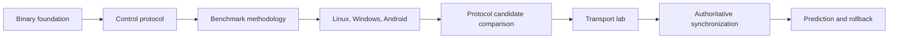
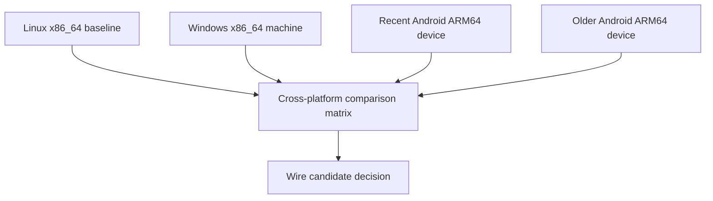

# TickSynchronizer roadmap

## Confirmed decisions

- Godot `4.7.1-stable`, no engine modifications.
- C++17; SCons is the only compilation system for the module and every standalone benchmark target.
- external custom-module and in-tree module layouts are both supported.
- `PackedByteArray` is the canonical Godot byte container.
- little-endian integers and LSB-first bit fields are explicit.
- `single` and `double` builds are supported, but peers must match.
- API, wire, wire revision, and benchmark suite versions are independent.
- exact module build, game build, schema, and canonical complete Godot version
  matching are required during experimental wire version 0; the Godot commit
  is diagnostic and warns on mismatch.
- protocol choice is benchmark-driven and cross-platform.
- logical changes are committed only when complete.

## Phase 0 — Repository and engine baseline — complete

- independent module repository;
- Godot version and exact commit files;
- engine cleanliness checks;
- MIT license and contribution policy;
- project-wide English language policy.

## Phase 1 — SCons module skeleton — complete

- conventional Godot module glue;
- public placeholder classes;
- class reference XML;
- external and in-tree layout compatibility;
- editor and template builds.

## Phase 2 — Binary buffer and scalar codecs — complete

- canonical bitstream;
- fixed integers;
- aligned canonical varints and ZigZag;
- explicit IEEE 754 `float32` and `float64`;
- sticky errors and atomic operations;
- resource limits, equality, hashing, and golden vectors;
- normal and sanitizer test coverage.

## Phase 3 — Experimental control protocol — complete for current scope

- 40-byte control envelope;
- HELLO v4 and HELLO_ACK v4;
- structured disconnects;
- compatibility profile;
- pure evaluator and state machine;
- exact API, wire, module build, precision, canonical Godot version, game,
  schema, and capability checks;
- structured diagnostic warning for a Godot commit mismatch.

## Phase 4 — Benchmark methodology — active

- deterministic standalone suite implemented;
- fixed-width reference candidate implemented;
- seven datasets and malformed corpus implemented;
- report schema 3 and cross-platform provenance implemented;
- one SCons compilation graph implemented for Linux, Windows, and Android;
- execution-only deployment packages implemented for machines without development environments;
- native Windows and Linux topology discovery implemented for directed L3-domain and multi-CCD runs;
- benchmark comparison separated by precision with explicit report identity;
- quick native Linux qualification completed in both precisions with verified affinity;
- extracted Linux execution-only package qualification completed;
- rebuilt quick Windows x86_64 multi-domain qualification completed in both precisions with native topology;
- quick Android ARM64 qualification completed on recent and older devices across multiple core classes under controlled power settings;
- qualified Android device/core and Windows OS/CCD comparison reports generated;
- official clean-tree Linux rebuild, execution, and archival pending;
- official clean-tree Windows and Android rebuild, execution, and archival pending;
- second Windows x86_64 machine deferred until available.

Current quick reports remain preliminary because the source tree is dirty;
official evidence begins only after the logical source commit and clean
rebuild.

### Deferred candidates after platform qualification

1. `reference_fixed_width` — implemented baseline;
2. `varint_zigzag_fixed_float` — deferred until Linux, Windows, and Android qualification is complete;
3. delta plus varint;
4. masks and bit packing;
5. quantized fields;
6. hybrid candidate.

## Security Gate P1 — before external untrusted traffic

- isolated packet fuzz target;
- ASAN and UBSAN for packet decoder and candidates;
- invalid-input corpus and regression retention;
- bounded allocation verification;
- reevaluation of the Godot SDL/HID UBSAN smoke blocker;
- no external endpoint completion before this gate passes.

## Phase 5 — Transport endpoint abstraction

- define `SyncTransportEndpoint` contract;
- peer, channel, reliability, receive event, and metrics model;
- no snapshot or rollback knowledge in endpoints;
- loopback endpoint first.

## Phase 6 — Transport lab

Evaluate under identical protocol workloads:

- loopback;
- SceneMultiplayer RPC;
- SceneMultiplayer raw bytes;
- MultiplayerPeer integration;
- direct ENet where justified.

Selection must use latency, overhead, allocation, reliability behavior, debuggability, and portability evidence.

## Phase 7 — Metrics and debugging

- per-peer bytes and packets;
- queue depth and drop reasons;
- RTT, jitter, loss, retransmission, and channel metrics;
- codec timing and snapshot size;
- basic profiler and debugger views.

## Phase 8 — Registry, objects, and schemas

- stable object identity;
- property schemas and explicit field codecs;
- compatibility IDs;
- deterministic registration and canonical ordering;
- bounded resource budgets.

## Phase 9 — Offline simulation

- fixed tick loop;
- input history;
- deterministic state capture;
- snapshot comparison;
- rollback-safe side-effect model;
- no network dependency.

## Phase 10 — Authoritative client/server synchronization

- connection and session lifecycle;
- input submission and acknowledgement;
- authoritative snapshots;
- baseline management;
- disconnect and recovery policy.

## Phase 11 — Prediction, rollback, and reconciliation

- predicted input execution;
- authoritative correction;
- rewind and resimulation;
- bounded history;
- deterministic validation and metrics.

## Phase 12 — Relevance and update frequency

- per-peer relevance;
- update classes and budgets;
- interest management;
- graceful overload behavior.

## Phase 13 — Advanced topologies

Mesh and hybrid authority remain deferred until the authoritative server model is stable, measured, and secure.

## Phase 14 — Compression

Compression is deferred until real snapshot distributions exist. Any codec must be benchmarked for size, CPU, latency, memory, and malformed-input behavior.

## Phase 15 — Cryptography

Prerequisites:

- stable packet boundaries and replay model;
- nonce and key lifecycle design;
- corrected reusable mbedTLS-based backend;
- authenticated encryption, not custom cryptography;
- benchmark and fuzz coverage.

## Phase 16 — Platform expansion

- Windows x86_64;
- Android ARM64 across flagship and older mid-range devices;
- later macOS and iOS when core behavior is stable.

## First public milestone — v0.1 Transport Lab

Included:

- validated binary and control foundations;
- benchmark-selected protocol candidate;
- loopback and at least one Godot transport endpoint;
- metrics sufficient to compare transports;
- authoritative handshake and bounded packet decoder;
- Linux, Windows, and Android benchmark evidence.

Not included:

- mesh authority;
- compression or encryption;
- full prediction and rollback;
- Apple platforms;
- production editor tooling.
