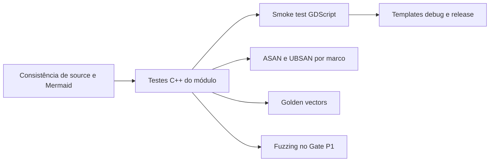

# Estratégia de testes




## 1. Preflight de consistência

```bash
./scripts/verify_source_consistency.sh
```

Confirma que API do buffer, bindings, XML, smoke test, headers de teste,
layout `src/`, configuração `.vscode/` e blocos Mermaid pertencem à mesma
revisão. O pipeline principal executa esse preflight antes do SCons.

## 2. Testes C++ internos

```bash
./scripts/build_and_validate.sh --mode quick --precision double
```

O filtro padrão é `*TickSynchronizer*`. O pipeline exige pelo menos 127 casos.

Distribuição atual:

- 6 de fundação das classes;
- 1 da baseline C++17;
- 9 do bitstream;
- 5 de inteiros fixos e alinhamento;
- 9 de varints;
- 7 de floats;
- 10 de limites, identidade e estresse;
- 28 do packet codec;
- 23 da negociação de compatibilidade;
- 29 da máquina de estados do handshake.

## 3. Smoke test GDScript

Executado automaticamente pelo editor nos modos `quick`, `editor` e `all`.

Marcadores obrigatórios:

```text
TICKSYNCHRONIZER_BUILD_PRECISION=<single|double>
TICKSYNCHRONIZER_BUFFER_SMOKE_TEST_OK
TICKSYNCHRONIZER_INTEGER_CODEC_SMOKE_TEST_OK
TICKSYNCHRONIZER_FLOAT_CODEC_SMOKE_TEST_OK
TICKSYNCHRONIZER_RESOURCE_LIMIT_SMOKE_TEST_OK
TICKSYNCHRONIZER_PROTOCOL_SMOKE_TEST_OK
TICKSYNCHRONIZER_SMOKE_TEST_OK
```

## 4. Templates

```bash
./scripts/build_and_validate.sh --mode templates --precision double
```

Valida existência, precisão, tamanho, metadados e SHA-256. Em builds normais
também executa `--version`; em builds sanitizados valida ELF e dependências.

## 5. Validação normal completa

```bash
./scripts/build_and_validate.sh --mode all --precision double
./scripts/build_and_validate.sh --mode all --precision single
```

## 6. Sanitizers

O runner suporta:

```bash
./scripts/run_sanitized_tests.sh double
```

| Passagem | Compilador/linker | Sanitizer |
|---|---|---|
| 1 | Clang + LLD | ASAN |
| 2 | GCC + LLD | UBSAN |

### Estado aceito da fundação do buffer

- ASAN completo aprovado em `double` e `single`, incluindo smoke GDScript.
- UBSAN dos 47 testes C++ da fundação aprovado em `double` e `single`.
- Smoke UBSAN da engine bloqueado em `thirdparty/sdl/thread/SDL_thread.c`
  durante inicialização SDL/HID, depois da suíte do módulo.

O smoke UBSAN completo da engine não é gate para a Fase 2. Ele volta a ser
avaliado no **Gate de Segurança P1**, quando existir um packet decoder que
processe entrada não confiável.

### Gate de Segurança P1

Antes de endpoints externos entregarem bytes ao protocolo, exigir:

- ASAN e UBSAN do packet codec nas duas precisões;
- fuzz target isolado do decoder;
- corpus de pacotes truncados, oversized, overlong e desconhecidos;
- zero diagnósticos dentro do TickSynchronizer;
- reavaliação do smoke UBSAN da engine ou isolamento oficial de SDL/HID.

O modo combinado ASAN+UBSAN continua apenas diagnóstico. Não ampliar supressões
para silenciar diagnósticos de terceiros sem um ADR específico.

## 7. Matriz por frequência

| Configuração | Frequência |
|---|---|
| Linux editor/templates `double` | Toda alteração funcional completa |
| Linux editor/templates `single` | Marcos de codec/protocolo e releases |
| ASAN completo | Fechamento de codec, parser, protocolo e releases |
| UBSAN dos testes C++ do módulo | Fechamento de codec, parser, protocolo e releases |
| Fuzzing do decoder | Obrigatório no Gate P1 e depois em regressões de parser |
| Smoke completo da engine sob UBSAN | Gate P1; antes de tráfego externo ou |
|  | substituído por harness isolado documentado |
| Windows | Antes de concluir marcos portáveis |
| Android | Antes de concluir marcos de transporte/runtime |

## 8. Golden vectors

Os vetores em `tests/golden/` cobrem:

- LSB-first;
- little-endian;
- inteiros fixos;
- varints;
- IEEE 754.

O protocolo já adiciona `control_hello_v1.bin` e `control_hello_v2.bin`. Truncamentos e entradas
malformadas são gerados diretamente nos testes para preservar a causa de cada falha.
A suíte distingue payloads parciais canônicos de declarações físicas não
canônicas e cobre identidade, nonce, capabilities, ACK negociado, ordem de
mensagens, duplicatas, cancelamento e estados terminais.

## 9. Política de falhas

- zero testes nunca é sucesso;
- falha de leitura/escrita não pode alterar estado parcialmente;
- hash não substitui igualdade;
- logs completos ficam em `build_reports/`;
- não desabilitar testes sem justificativa;
- supressões devem ser limitadas por check e arquivo externo;
- diagnóstico em código do TickSynchronizer nunca pode ser classificado como
  bloqueio externo.
