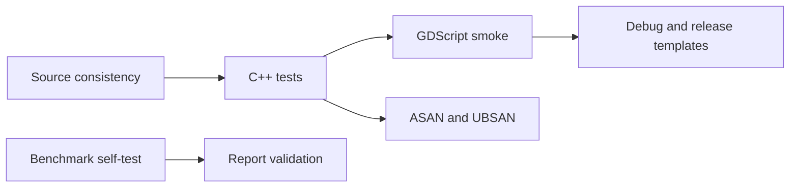
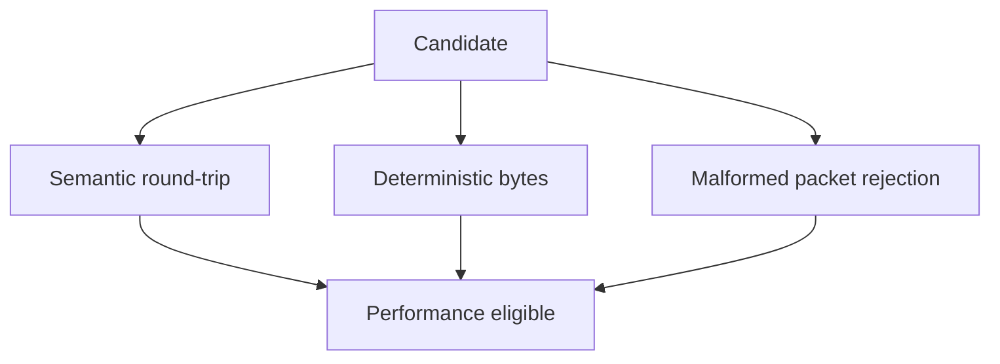

# Testing strategy



## 1. Source consistency

`verify_source_consistency.sh` checks bindings, XML, public declarations, test counts, manifests, version constants, protocol contracts, benchmark infrastructure, English-language policy, file-purpose comments, and Mermaid blocks.

```bash
./scripts/verify_source_consistency.sh
```

## 2. C++ tests

Godot's doctest runner executes cases filtered by `*TickSynchronizer*`. The current minimum is 140 cases.

Coverage includes:

- public class registration and diagnostics;
- bitstream behavior and atomic errors;
- integer, varint, ZigZag, and floating-point codecs;
- resource limits, equality, and hashing;
- packet headers and payloads;
- compatibility evaluator;
- handshake state transitions and error precedence;
- golden vectors.

## 3. GDScript smoke test

The smoke project validates bindings and representative runtime behavior through the editor. It is not a replacement for C++ tests; it catches integration and ClassDB failures.

## 4. Template builds

Both `template_debug` and `template_release` are compiled to detect editor-only dependencies and registration mistakes.

## 5. Full normal validation

```bash
./scripts/build_and_validate.sh --mode all --precision double --jobs 45
./scripts/build_and_validate.sh --mode all --precision single --jobs 45
```

The current wire revision 2 source passes this matrix in both precisions with
140 tests, 66,999 assertions, all required smoke markers, `template_debug`, and
`template_release`.

## 6. Sanitizers

```bash
./scripts/run_sanitized_tests.sh double --jobs 45 --no-smoke
./scripts/run_sanitized_tests.sh single --jobs 45 --no-smoke
```

ASAN and UBSAN passes are separated to keep toolchain behavior diagnosable. Suppressions are narrow, version-specific, and stored in external files.

The known SDL/HIDAPI UBSAN diagnostic is outside TickSynchronizer. Any report that enters module code remains a release blocker.

The current module-focused sanitizer matrix passes all 140 tests and 66,999
assertions in both precisions under the accepted `--no-smoke` profile.

## 7. Benchmark correctness



Benchmark self-tests and report validation are correctness gates, not only performance tools.

The first qualification gate after build-system changes is Linux in both precisions:

```bash
./scripts/build_protocol_benchmarks.sh --precision all --jobs 45 --clean-first
./scripts/run_protocol_benchmarks.sh --list-cpus
read -r -p "Linux logical CPU: " LINUX_CPU
./scripts/run_protocol_benchmarks.sh \
    --precision all --quick --cpu "$LINUX_CPU" --no-build
```

The generated reports must use schema 3 and record `affinity_requested=yes` and `affinity_applied=yes`. Windows and Android builds or device runs begin only after this Linux gate passes.

Execution-only packages validate the same binaries without a development environment on the test machine:

```bash
./scripts/build_protocol_benchmarks.sh --precision all --jobs 45 --export-package
./scripts/build_protocol_benchmarks_android.sh --precision all --jobs 45 --export-package
```

The Windows cross-build exports its deployment package automatically. Package runners never rebuild; official eligibility comes from clean source provenance embedded at compilation and native affinity verified at execution.

## 8. Golden vectors

Golden vectors are versioned byte-level fixtures. They protect canonical encoding across compilers, architectures, and precision builds. Malformed cases are generated directly when preserving the exact reason for failure is more important than storing a binary file.

## 9. Failure policy

- zero discovered tests is never success;
- failed operations must preserve atomic state;
- a hash never replaces equality;
- invalid external data must be rejected before allocation or mutation;
- tests may not be disabled without a documented reason;
- a sanitizer finding in TickSynchronizer is never suppressed merely to pass a gate.
- an I/O or filesystem error invalidates the affected build or run; do not
  classify it as a code failure, and never reuse its generated artifacts.
