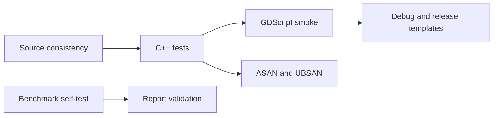
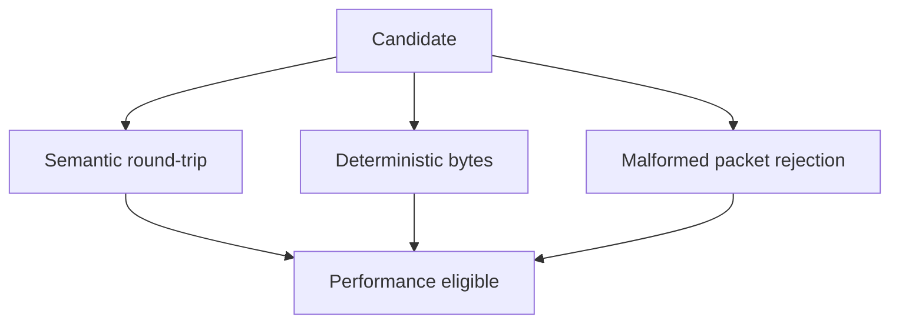

# Testing strategy


```mermaid
flowchart LR
    Consistency[Source consistency] --> Unit[C++ tests]
    Unit --> Smoke[GDScript smoke]
    Smoke --> Templates[Debug and release templates]
    Unit --> Sanitizers[ASAN and UBSAN]
    Bench[Benchmark self-test] --> Reports[Report validation]
```

## 1. Source consistency

`verify_source_consistency.sh` checks bindings, XML, public declarations, test
counts, manifests, version constants, protocol contracts, benchmark
infrastructure, documentation structure, language policy, and file-purpose
comments. It also rejects unsupported C++ features after stripping comments and
literals: module-linked sources follow the Godot subset, while standalone
benchmark sources remain exception-free and RTTI-free.

Generated `.godot/` cache directories are excluded from the source inventory at
any depth. Project-owned inputs such as `tests/smoke_project/project.godot`
remain covered by `FILE_MANIFEST.txt` and `SHA256SUMS.txt`.

```bash
./scripts/verify_source_consistency.sh
```

## 2. C++ tests

Godot's doctest runner executes cases filtered by `*TickSynchronizer*`.
Version-bound test and assertion counts are recorded in
[`development/VALIDATION.md`](development/VALIDATION.md).

Coverage includes:

- public class registration and diagnostics;
- bitstream behavior and atomic errors;
- integer, varint, ZigZag, and floating-point codecs;
- resource limits, equality, and hashing;
- packet headers and payloads;
- compatibility evaluator;
- handshake state transitions and error precedence;
- golden vectors.

## 3. GDScript smoke test

The smoke project validates bindings and representative runtime behavior through the editor. It is not a replacement for C++ tests; it catches integration and ClassDB failures.

## 4. Template builds

Both `template_debug` and `template_release` are compiled to detect editor-only dependencies and registration mistakes.

## 5. Full normal validation

```bash
./scripts/build_and_validate.sh --mode all --precision double --jobs 45
./scripts/build_and_validate.sh --mode all --precision single --jobs 45
```

An accepted source state must pass this matrix in both precisions. The current
results are recorded separately in
[`development/VALIDATION.md`](development/VALIDATION.md).

## 6. Sanitizers

```bash
./scripts/run_sanitized_tests.sh all --jobs 45
```

ASAN and UBSAN passes are separated to keep toolchain behavior diagnosable.
The accepted profile runs the real GDScript smoke; `--no-smoke` is diagnostic
only.

The ASAN pass explicitly keeps `detect_leaks=1`. Godot 4.7.1 uses exactly one
function-specific LSAN rule for SDL joypad/UDEV allocations reproduced with an
exact-commit editor that did not contain TickSynchronizer:

```text
leak:JoypadSDL::initialize
```

Once per uninterrupted acceptance batch, `verify_lsan_suppressions.sh` rejects
any rule-set change, builds an unrelated 4,096-byte leak through SCons, and
requires LeakSanitizer to report it with a fatal status. Before every later
ASAN pass in the same batch, it rechecks the exact static rule without
rebuilding the identical probe. Disabling the reviewed rule is diagnostic only
and does not disable leak detection.

The Godot 4.7.1 UBSAN file accepts exactly three reviewed
category-and-source pairs. The SDL TLS bounds and GDScript VM alignment
diagnostics were each reproduced with an exact-commit editor that did not
contain TickSynchronizer. The existing test-setup rule remains version locked.

Before each UBSAN pass, `verify_sanitizer_suppressions.sh` rejects any change
to the exact rule set, builds unrelated C++17 bounds and alignment probes
through SCons, and requires both diagnostics to remain fatal. Any report from
another source location, including module code, remains a release blocker.

## 7. Benchmark correctness


```mermaid
flowchart TB
    Candidate[Candidate] --> RoundTrip[Semantic round-trip]
    Candidate --> Determinism[Deterministic bytes]
    Candidate --> Invalid[Malformed packet rejection]
    RoundTrip --> Eligible[Performance eligible]
    Determinism --> Eligible
    Invalid --> Eligible
```

Benchmark self-tests and report validation are correctness gates, not only performance tools.

The first qualification gate after build-system changes is Linux in both precisions:

```bash
./scripts/build_protocol_benchmarks.sh --precision all --jobs 45 --clean-first
./scripts/run_protocol_benchmarks.sh --list-cpus
read -r -p "Linux logical CPU: " LINUX_CPU
./scripts/run_protocol_benchmarks.sh \
    --precision all --quick --cpu "$LINUX_CPU" --no-build
```

The generated reports must use schema 3 and record `affinity_requested=yes` and
`affinity_applied=yes`. Windows and Android builds or device runs begin only
after this Linux gate passes and may proceed concurrently on independent
hosts. macOS uses the exact scheduler-managed sentinel from ADR 0032, but ADR
0036 defers all native Mac work to the final blocking portability gate.

Private execution-only packages validate the same binaries without a development environment on the qualification machine:

```bash
./scripts/build_protocol_benchmarks.sh --precision all --jobs 45 --export-package
./scripts/build_protocol_benchmarks_android.sh --precision all --jobs 45 --export-package
./scripts/build_protocol_benchmarks_macos.sh --precision all --clean-first
```

The Windows cross-build and macOS Universal 2 build export deployment packages
automatically. Package runners never rebuild; official eligibility comes from
clean source provenance embedded at compilation and the exact platform CPU
execution policy verified at runtime. Generated binaries and packages remain
outside Git and public releases.

## 8. Golden vectors

Golden vectors are versioned byte-level fixtures. They protect canonical encoding across compilers, architectures, and precision builds. Malformed cases are generated directly when preserving the exact reason for failure is more important than storing a binary file.

## 9. Failure policy

- zero discovered tests is never success;
- failed operations must preserve atomic state;
- a hash never replaces equality;
- invalid external data must be rejected before allocation or mutation;
- tests may not be disabled without a documented reason;
- a sanitizer finding in TickSynchronizer is never suppressed merely to pass a gate.
- LeakSanitizer must remain enabled during an accepted ASAN pass;
- an I/O or filesystem error invalidates the affected build or run; do not
  classify it as a code failure, and never reuse its generated artifacts.
