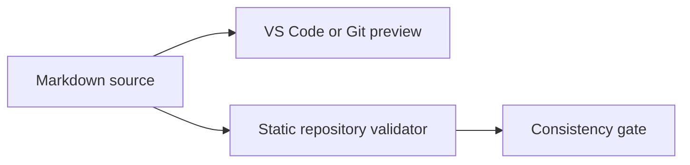

# VS Code configuration

## Current state

The repository versions portable Markdown settings under `.vscode/`:

- `extensions.json` recommends `markdownlint`;
- `settings.json` contains repository-safe Markdown configuration.

Machine-specific paths, compiler locations, credentials, and personal workspace state must not be committed.

## Markdown diagrams

Current VS Code versions and Git hosting render embedded Mermaid code blocks. Diagrams remain plain text inside the technical documents, and the repository validates only the supported diagram types.



The project intentionally does not provide a general Mermaid usage guide. Tool tutorials are outside the module scope; diagrams should be used only when they improve project-specific technical communication.

## Local checks

```bash
python3 scripts/verify_mermaid_diagrams.py documentation README.md
./scripts/verify_source_consistency.sh
```

## Future C++ workspace configuration

Tasks, launch profiles, and compile-database integration may be added later. They must support both the external custom-module layout and the conventional `godot/modules/tick_synchronizer` layout without committing machine-specific absolute paths.
