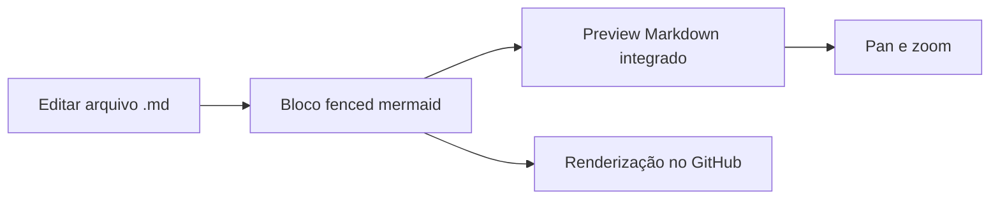

# VS Code — Markdown e Mermaid

## Estado atual

A configuração compartilhável do VS Code agora é versionada em `.vscode/`:

```text
.vscode/
├── extensions.json
└── settings.json
```

Ela contém apenas preferências reproduzíveis de Markdown. Configurações pessoais,
paths locais e credenciais não devem ser adicionados.

## Mermaid

Nas versões atuais do VS Code, o preview Markdown integrado renderiza blocos
Mermaid sem extensão adicional. Abra um arquivo `.md` e use:

```text
Ctrl+Shift+V  — abrir o preview
Ctrl+K V      — abrir o preview ao lado
```



Não é necessário reduzir a segurança do preview ou permitir scripts. Mermaid é
renderizado pelo recurso interno do VS Code.

## Versões antigas

O suporte integrado entrou no VS Code 1.121. Em uma versão anterior:

1. prefira atualizar o VS Code;
2. somente quando a atualização não for possível, instale a extensão
   `Markdown Preview Mermaid Support`;
3. não mantenha simultaneamente múltiplas extensões de preview Mermaid, pois elas
   podem disputar o mesmo preview ou produzir diferenças em relação ao GitHub.

## Extensões recomendadas

O repositório recomenda apenas `markdownlint` para consistência textual. As regras compatíveis com a documentação existente ficam em `.markdownlint.json`. Mermaid não aparece em `.vscode/extensions.json` porque já é nativo no editor atual.

## Verificação local

```bash
./scripts/verify_mermaid_diagrams.py
```

Se `mmdc` estiver instalado:

```bash
./scripts/verify_mermaid_diagrams.py --render-if-available
```

## Próxima configuração do VS Code

Tasks de build, IntelliSense C++ e debug continuam sendo um lote separado. Elas
devem usar a topologia real em que `godot/` e `tick_synchronizer/` são diretórios
irmãos e nunca devem fixar caminhos absolutos da máquina do desenvolvedor.
