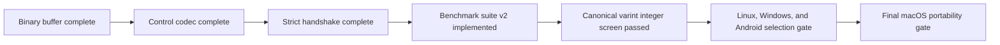

# Current project state



## Baseline

- Godot `4.7.1-stable`.
- C++17; SCons is the only compilation system for the module and standalone Linux, Windows, Android, and macOS benchmarks.
- The complete wire revision 2 Godot matrix is validated on Linux x86_64 in
  both precisions.
- `single` and `double` supported.
- external and in-tree module layouts supported.
- MIT license, Copyright (c) 2026 Malkverbena.

## Version contract

```text
script_api=5
api=4
wire=0
wire_revision=2
benchmark_suite=2
wire_stable=no
exact_build_match=yes
```

## Implemented

- five public Godot classes and 41 documented methods;
- canonical `PackedByteArray` bitstream;
- fixed integer, canonical varint/ZigZag, `float32`, and `float64` codecs;
- sticky errors, atomic failure semantics, equality, hashing, and resource limits;
- 40-byte control envelope;
- HELLO v4, HELLO_ACK v4, and structured disconnect payloads;
- pure handshake evaluator and pure handshake state machine;
- exact canonical Godot version, module, game, schema, capability, precision,
  API, and wire compatibility checks;
- diagnostic Godot commit comparison with a structured warning on mismatch;
- 140 C++ test cases in the current source;
- standalone deterministic benchmark suite version 2;
- fixed-width reference and canonical ULEB128/ZigZag candidates;
- eight datasets with explicit gameplay integer profiles and exact boundary coverage;
- canonical IEEE scalar conversion, NaN encoding, and noncanonical-NaN rejection;
- candidate-independent semantic hashes, exact malformed error categories, and
  atomic decode-failure checks;
- paired candidate analyzer with predeclared workload gates;
- cross-platform provenance report schema 3;
- native CPU topology discovery and directed L3-domain selection for multi-CCD qualification;
- precision-separated report comparison with unambiguous report identities;
- quick native Linux qualification in both precisions with requested and applied affinity;
- extracted Linux execution-only package qualification without source or build tools;
- quick Windows x86_64 qualification across distinct L3 domains;
- quick Android ARM64 qualification across multiple device and core classes;
- local macOS Apple Clang thin builds, Universal 2 packaging, and an
  execution-only standard-system-tools runner.
- macOS source guards that preserve the Apple C++ driver identity and require
  compatible `lipo` architecture-verification operand ordering;
- Godot C++ policy enforcement for module-linked source and tests;
- exception-free and RTTI-free standalone benchmark compilation with explicit
  failure propagation;
- exact Godot 4.7.1 LSAN policy with leak detection forced on and a
  SCons-built fatal unrelated-leak control;
- source-only public GitHub distribution, with Apple tooling and generated
  macOS artifacts excluded.
- privacy-safe benchmark compiler and executable provenance with report and
  deployment-package leakage guards.

## Current Godot validation baseline

The current wire revision 2 source, including the C++ policy refactor, passed
the complete normal matrix in both `double` and `single` precision:

- editor build with `tests=yes`;
- 140/140 TickSynchronizer C++ tests;
- 66,999/66,999 assertions;
- all required GDScript smoke markers;
- `template_debug`;
- `template_release`.

The current suite 2 source passed the complete split ASAN and UBSAN matrix in
both precisions. All four sanitized editor passes completed 140/140
TickSynchronizer tests, 66,999/66,999 assertions, and every required GDScript
smoke marker. The exact Godot `4.7.1-stable` source remained clean at commit
`a13da4feb8d8aefc283c3763d33a2f170a18d541`, and the module source hashes were
unchanged across the batch.

Both ASAN passes kept `detect_leaks=1` and reported exactly the reviewed
6,991-byte, 172-allocation `JoypadSDL::initialize` suppression total. The one
full unrelated 4,096-byte LSAN control remained visible and fatal with status
23, and the exact static rule was rechecked before the later ASAN pass. Both
UBSAN passes completed under the exact three-rule policy after the independent
bounds and alignment controls remained fatal. No sanitizer report entered
TickSynchronizer. The exact no-module reproduction remains closed decision
evidence under ADR 0038 and was not repeated.

The exception-free and RTTI-free standalone benchmark was rebuilt through
SCons in both precisions. Both candidates passed suite 2 self-tests with all
eight datasets and 952 valid messages. The fixed-width candidate rejected 21
malformed packets and the varint candidate rejected 25, including
noncanonical scalar and integer encodings, with exact error categories and
atomic output.

Standalone ASAN plus UBSAN self-tests also pass for both candidates and both
precisions. A separate two-million-sample binary64-to-binary32 cross-check
matched the platform IEEE conversion for every sampled value after applying the
documented NaN and overflow rules.

## External Godot LSAN policy

The accepted Godot 4.7.1 LSAN policy contains exactly one function-specific
rule for the SDL joypad/UDEV allocation set reproduced without
TickSynchronizer:

```text
leak:JoypadSDL::initialize
```

The ASAN wrapper forces `detect_leaks=1`. Once per uninterrupted acceptance
batch, a dedicated guard rejects any policy change and requires an unrelated
SCons-built 4,096-byte leak to remain visible and fatal with LSAN status 23.
The exact static rule is rechecked before every later applicable pass. No
TickSynchronizer or broad library/source pattern is allowed.

## External Godot UBSAN policy

The accepted Godot 4.7.1 UBSAN policy contains exactly three reviewed
category-and-source pairs. The SDL TLS bounds and GDScript VM alignment
diagnostics were reproduced with an exact-commit editor that did not contain
TickSynchronizer; the existing test-setup rule remains version locked.

Before every UBSAN pass that uses the file, a dedicated guard rejects any rule
set change and requires unrelated C++17 bounds and alignment probes built
through SCons to remain fatal. Every other source location, including every
TickSynchronizer file, remains blocking.

## Current benchmark status

Earlier suite 1 Linux, Windows, Android, and partial Mac results remain
infrastructure evidence only. They cannot be compared numerically with suite 2
or used to select candidate 2.

The final available suite 2 Linux diagnostic used GCC 13.3, verified logical
CPU 0 affinity, 15 measured rounds, and 50 ms minimum samples. Both precision
pairs passed every predeclared screen:

| Precision | Workload bytes | Size ratio | Weighted encode | Weighted decode |
|---|---:|---:|---:|---:|
| `double` | 480,120 -> 344,785 | 0.718x | 0.825x | 0.974x |
| `single` | 340,344 -> 205,009 | 0.602x | 0.806x | 0.985x |

All workload datasets became smaller. The geometric-mean ratios are 0.658x for
size, 0.815x for encode latency, and 0.979x for decode latency. These are
preliminary dirty-tree reports and record `official=no`; they screen the
integer primitive but do not close the clean-tree cross-platform gate.

Linux, Windows, Android, and macOS continue to share one SCons compilation
graph and report schema 3. Execution-only deployment packages keep compilers,
SCons, SDKs, Git, and project sources off private qualification machines.
Public GitHub distribution is source-only.

Physical Intel Mac evidence now confirms the `single`-precision `x86_64` and
`arm64` thin links, Universal 2 structural validation, the suite self-test, and
the native `x86_64` self-test. The build used the actual Apple C++ driver after
the source stopped collapsing the `clang++` symlink to `clang`; the Mac probe
also led to a compatible input-before-option `lipo` verification order. Both
regressions are now covered by source-consistency controls.

This remains historical suite 1 partial build evidence, not a suite 2 candidate
report. Under ADR 0036, all current Mac tests are intentionally deferred. The
final both-precision export, native candidate pairs, report validation, and
Gatekeeper observation form the blocking final portability gate.

Canonical ULEB128/ZigZag is the screened integer primitive. The production
realtime wire protocol remains undecided, and wire version 0 revision 2 is
unchanged.

## Next logical work unit

1. use the accepted logical source commit as the clean qualification baseline;
2. from that clean commit, build Linux, Windows, and Android suite 2 packages
   concurrently and verify every execution-only manifest;
3. execute the 16 matched selection pairs on the documented Linux, Windows,
   and Android identities, running different hosts concurrently but each
   candidate pair serially on one identity;
4. archive hashes and run the candidate analyzer without preliminary overrides;
5. in parallel with external qualification, define and implement a
   privacy-safe real snapshot capture format and loss/reorder scenario inputs;
6. design the next isolated stateful candidate only after representative traces,
   recovery policy, and numeric error budgets exist;
7. return to the Mac only in final development for the two native suite 2 pairs,
   Universal 2 checks, execution-only validation, and Gatekeeper observation.
