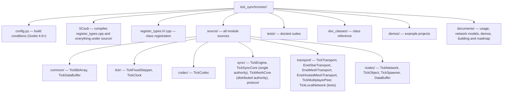

# Building

The module is compiled as part of the engine using `custom_modules`:

```sh
cd /path/to/godot
scons platform=linuxbsd target=editor custom_modules=/path/to/tick_synchronizer precision=single
scons platform=linuxbsd target=editor custom_modules=/path/to/tick_synchronizer precision=double
```

Double-precision binaries get a `.double` suffix. Servers and clients must use the same precision.

Tests (doctest, built with `tests=yes`):

```sh
bin/godot.linuxbsd.editor.x86_64 --headless --test --test-case="*TickSynchronizer*"
```

Run them on a release template too: it's the build games ship, and some defects only show there (a release build has
no padding around its allocations, for example).

```sh
scons platform=linuxbsd target=template_release tests=yes custom_modules=/path/to/tick_synchronizer
bin/godot.linuxbsd.template_release.x86_64 --headless --test --test-case="*TickSynchronizer*"
```

### Fuzzing and chaos campaigns

`tests/test_tick_fuzz.h` holds longer campaigns, left out of the pattern above: recorded traffic sent again with
mutations by an impostor, a distributed mesh under link drops, restarts and role changes, and bare ENet endpoints
against the transports. They are meant for a build with the sanitizers:

```sh
scons platform=linuxbsd target=editor tests=yes custom_modules=/path/to/tick_synchronizer use_asan=yes use_ubsan=yes debug_symbols=yes
TICK_FUZZ_SEEDS=6 TICK_FUZZ_STEPS=1500 ASAN_OPTIONS=detect_leaks=0 \
    bin/godot.linuxbsd.editor.x86_64.san --headless --test --test-case="*TickSyncFuzz*"
```

`TICK_FUZZ_SEEDS` is the number of seeds (3 by default), `TICK_FUZZ_SEED` the first one (1) and `TICK_FUZZ_STEPS` the
steps of 1/60 s per seed (600). The two campaigns where a node of a distributed mesh misbehaves fail on some seeds:
that mesh trusts its nodes.

## Requirements

| Requirement | Value |
|---|---|
| Godot | **4.6 or newer** (the module disables itself on older versions) |
| Build system | **SCons only** (the module is compiled together with the engine) |
| Language | C++17, no exceptions (engine flags) |
| Precision | Both `precision=single` and `precision=double` builds are supported and tested |
| Transport | ENet, optionally encrypted with DTLS (star and players' mesh) |
| Platforms | Portable to every platform supported by Godot; validated on **linuxbsd, android and windows** |

Every peer of a network must run the same version of the module and the same precision build: a peer of another
version is refused when it joins. GDExtension support is planned for a later version.

## Layout


