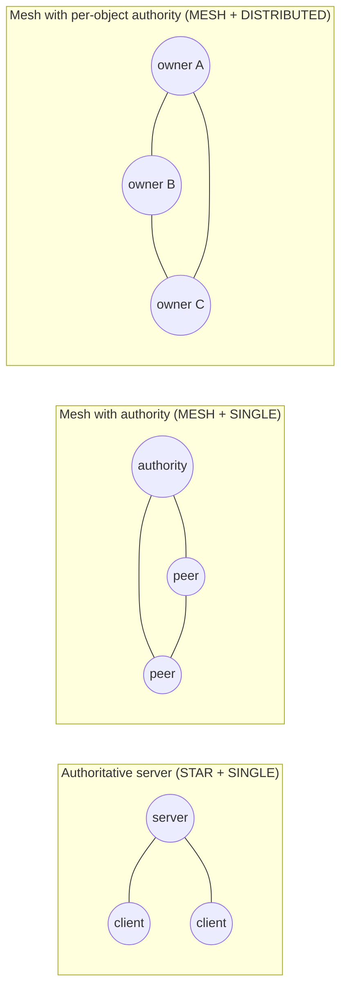

# Network models

A network is configured by its transport (the topology), its authority mode and how much it trusts its peers. The
same game code runs in every configuration:

| Model | Transport | Source of truth | Typical use |
|---|---|---|---|
| **Authoritative server** | `EnetStarTransport` | One server for every object | Server ↔ players |
| **Mesh with authority** | `EnetMeshTransport` (servers, fixed ids) or `EnetHostedMeshTransport` (players, through a host) | One configurable node for every object; inputs travel peer-to-peer | Server clusters, or peer-to-peer games with a host |
| **Mesh with per-object authority** | `EnetMeshTransport` | Each object's owner (by default, whoever spawned it), with authority transfer through a registry node | Clusters of trusted servers that split the simulation |

A process can join several networks at once (for example a star with its clients and a mesh with other
servers). How a game combines them, and which node owns which objects, is up to the game. The module
provides the mechanisms: authority assignment and transfer, orphaned-authority signals, and a clock master and a
registry node that the game chooses and that move by themselves when their node leaves.

Per-object authority has no prediction and trusts every node, so it is meant for servers the game controls. Games
between players use a mesh with one authority (the host), where every player predicts its own objects.

The module does **not** rely on deterministic simulation. There is always a single source of truth per object,
so physics engines that are not deterministic across platforms (such as Jolt or GodotPhysics) are fine.

See [usage.md](usage.md) for how each model is set up, and [demos.md](demos.md) for runnable examples.
